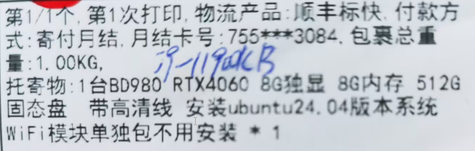
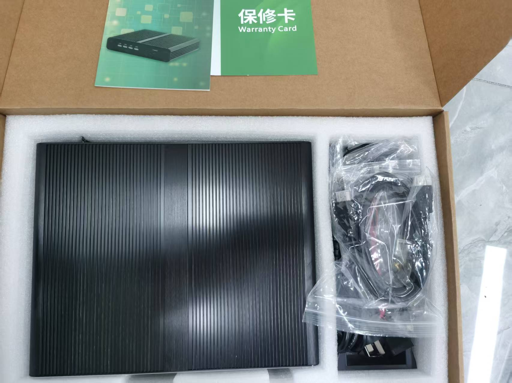
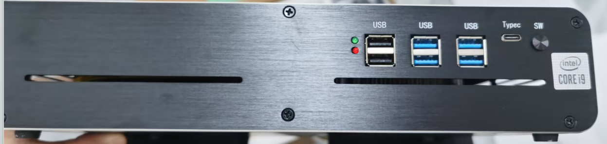
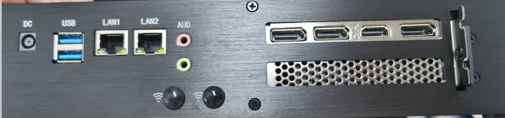
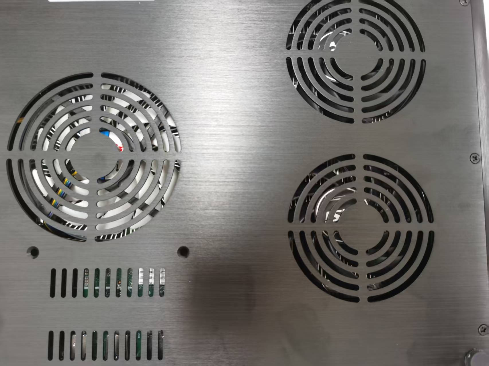
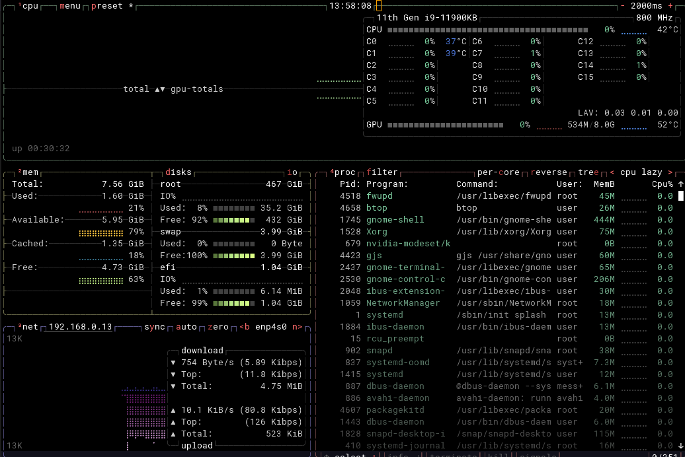
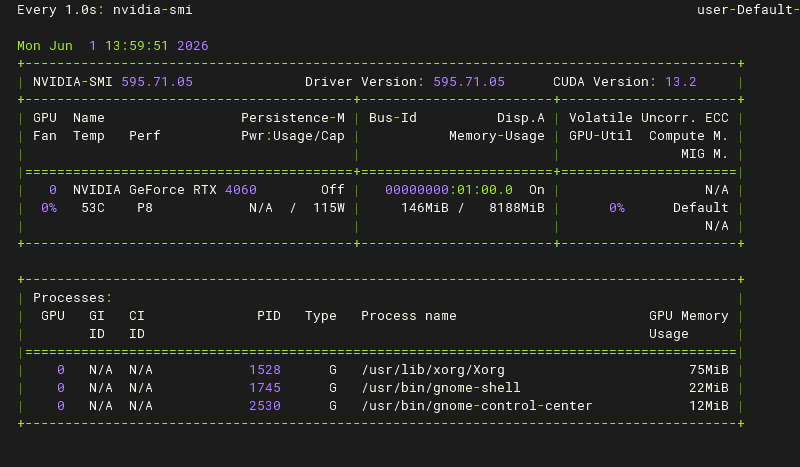

想购买一个可以用来做yolo推理的边缘盒子，因为模型较多并且视频推理要流畅，所以考虑上独立显卡。

权衡利弊之后，选择了i9-11900KB+RTX4060的搭配。

# 硬件

快递介绍

  

 拆箱

 

 前

 

 后

 

底 

      

# 软件

## 远程ssh

通过ssh来捣鼓更方便。

ssh默认安装了，sshd还没有，所以

```bash
sudo apt update
sudo apt install openssh-server
```

然后在本地windows电脑上使用ssh客户端连上即可（我使用的是WindTerm）

## btop

`btop` 是一个现代化的、图形化的命令行系统监控工具，可以看作是经典 `top` 命令的“高颜值”增强版。

它会以清晰、彩色的图表和仪表盘形式，实时展示 CPU、内存、磁盘、网络和进程的详细信息。

```bash
sudo apt  install btop
```

 

## 显卡驱动

默认已经提前安装好

 

## cuda安装

请按照以下步骤操作：

### 步骤1：添加 NVIDIA 官方 CUDA 仓库

```bash
# 下载官方密钥环包
wget https://developer.download.nvidia.com/compute/cuda/repos/ubuntu2404/x86_64/cuda-keyring_1.1-1_all.deb

# 安装密钥环
sudo dpkg -i cuda-keyring_1.1-1_all.deb

# 更新软件源
sudo apt update
```

### 步骤2：安装 CUDA 12.6 工具包

```bash
# 安装 CUDA 12.6
sudo apt install cuda-toolkit-12-6
```

### 步骤3：配置环境变量

```bash
# 编辑 .bashrc
echo 'export PATH=/usr/local/cuda-12.6/bin:$PATH' >> ~/.bashrc
echo 'export LD_LIBRARY_PATH=/usr/local/cuda-12.6/lib64:$LD_LIBRARY_PATH' >> ~/.bashrc

# 使配置生效
source ~/.bashrc
```

### 步骤4：验证安装

```bash
# 检查 nvcc 版本
nvcc --version

# 应该看到类似输出：
# Cuda compilation tools, release 12.6, V12.6.77
```

```
$ nvcc --version
nvcc: NVIDIA (R) Cuda compiler driver
Copyright (c) 2005-2024 NVIDIA Corporation
Built on Tue_Oct_29_23:50:19_PDT_2024
Cuda compilation tools, release 12.6, V12.6.85
Build cuda_12.6.r12.6/compiler.35059454_0
```

## Miniconda

以下是核心的安装步骤，请按顺序在终端中执行。

**第 1 步：下载安装脚本**

建议先切换到家目录，方便管理文件。

bash

```
cd ~
wget https://repo.anaconda.com/miniconda/Miniconda3-latest-Linux-x86_64.sh -O miniconda.sh
```


**第 2 步：运行安装程序**

推荐使用静默安装模式，可以自动接受许可协议并指定安装路径，无需手动干预。

bash

```
bash miniconda.sh -b -p $HOME/miniconda3
```


- `-b`：静默模式，自动接受许可协议。
- `-p`：指定安装目录。这里安装到当前用户的家目录下，可以避免权限问题。

**第 3 步：初始化 Conda**

这一步会将 conda 命令添加到你的系统路径中，并修改 `~/.bashrc` 配置文件。

bash

```
~/miniconda3/bin/conda init
```


**第 4 步：使配置生效**

`conda init` 命令修改了 `~/.bashrc` 文件，需要重新加载这个文件或重启终端。

bash

```
source ~/.bashrc
```


执行后，你会看到终端提示符前面出现了 `(base)` 字样，这表示你已经成功进入了 conda 的基础环境。

**第 5 步：验证安装**

最后，运行以下命令检查 conda 是否安装成功。

bash

```
conda --version
```


如果命令返回了版本号（例如 `conda 25.3.1`），就说明安装成功了。

**配置国内镜像源**
为 conda 配置国内镜像源可以大幅提升下载速度和成功率。推荐使用以下命令添加清华源：

```bash
conda config --add channels https://mirrors.tuna.tsinghua.edu.cn/anaconda/pkgs/main/
conda config --add channels https://mirrors.tuna.tsinghua.edu.cn/anaconda/pkgs/free/
```

---

以及pip 镜像源

```
pip config set global.index-url https://mirrors.tuna.tsinghua.edu.cn/simple
```

国内主流 PyPI 镜像源

| 镜像源       | 地址                                                | 特点                                     |
| :----------- | :-------------------------------------------------- | :--------------------------------------- |
| **清华大学** | https://pypi.tuna.tsinghua.edu.cn/simple            | 学术机构首选，同步延迟<5分钟，支持IPv6   |
| **阿里云**   | https://mirrors.aliyun.com/pypi/simple/             | 企业级高并发，CDN加速，适合大规模部署    |
| **腾讯云**   | https://mirrors.cloud.tencent.com/pypi/simple       | 华南地区优先，与TKE容器服务深度集成      |
| **中科大**   | https://pypi.mirrors.ustc.edu.cn/simple             | 提供历史版本查询，适合需要回滚依赖的场景 |
| **豆瓣**     | https://pypi.douban.com/simple                      | 个人开发者快速测试                       |
| **华为云**   | https://repo.huaweicloud.com/repository/pypi/simple | 企业级支持，适合大规模部署               |

## yolo

因为是 NVIDIA GPU：

首先

```
pip install torch torchvision torchaudio --index-url https://download.pytorch.org/whl/cu121
```

然后直接用官方 ultralytics：

```
pip install ultralytics
```

验证 GPU：

```
python -c "import torch; print(torch.cuda.is_available())"
```

输出 `True` 才行。

### 确认 YOLO 命令可用

安装完 ultralytics 后，会有 `yolo` 命令：

```
yolo version
```

如果能输出版本号，说明 OK。

# 验机

## 一、开箱 & 外观检查（第一步必须做）

目的：确认不是二手 / 磕碰 / 改配机

### 1.1 外观

- 机身是否有划痕、掉漆、螺丝拧动痕迹
- 散热孔是否有灰尘（新机一般很干净）
- 接口（USB/HDMI/网口）是否有插拔痕迹

### 1.2 配件

- 电源适配器型号是否匹配（重点看输出功率）
- 是否带高品质 HDMI/DP 线
- 是否有说明书/保修卡（有些厂商会偷减）

------

## 二、首次启动检查（关键节点）

### 2.1 开机速度

- 是否 10–30 秒内进系统（SSD正常范围）
- 是否卡 BIOS 或反复重启

### 2.2 BIOS 检查（非常重要）

开机按：

- `DEL / F2`

检查：

- CPU 是否是：BD980（或你买的型号）
- 内存容量是否一致（比如 16G / 32G）
- SSD 容量是否一致（512G）
- 是否识别 RTX 4060

👉 如果 BIOS 信息不对 = 直接问题机

------

## 三、系统基础信息核验（Ubuntu 24.04）

打开终端执行：

### 3.1 CPU / 内存 / 架构

```bash
lscpu
free -h
```

检查：

- CPU 核心数是否符合规格
- 内存是否“实际可用容量”

查看内存条型号

```bash
sudo dmidecode -t memory
```

测试结果

```
$ sudo dmidecode -t memory
# dmidecode 3.5
Getting SMBIOS data from sysfs.
SMBIOS 3.3.0 present.

Handle 0x003A, DMI type 16, 23 bytes
Physical Memory Array
        Location: System Board Or Motherboard
        Use: System Memory
        Error Correction Type: None
        Maximum Capacity: 128 GB
        Error Information Handle: Not Provided
        Number Of Devices: 4

Handle 0x003C, DMI type 17, 92 bytes
Memory Device
        Array Handle: 0x003A
        Error Information Handle: Not Provided
        Total Width: Unknown
        Data Width: Unknown
        Size: No Module Installed
        Form Factor: Unknown
        Set: None
        Locator: Controller0-ChannelA-DIMM1
        Bank Locator: BANK 0
        Type: Unknown
        Type Detail: None

Handle 0x003D, DMI type 17, 92 bytes
Memory Device
        Array Handle: 0x003A
        Error Information Handle: Not Provided
        Total Width: Unknown
        Data Width: Unknown
        Size: No Module Installed
        Form Factor: Unknown
        Set: None
        Locator: Controller1-ChannelA-DIMM0
        Bank Locator: BANK 0
        Type: Unknown
        Type Detail: None

Handle 0x003E, DMI type 17, 92 bytes
Memory Device
        Array Handle: 0x003A
        Error Information Handle: Not Provided
        Total Width: Unknown
        Data Width: Unknown
        Size: No Module Installed
        Form Factor: Unknown
        Set: None
        Locator: Controller1-ChannelA-DIMM1
        Bank Locator: BANK 0
        Type: Unknown
        Type Detail: None

Handle 0x0040, DMI type 17, 92 bytes
Memory Device
        Array Handle: 0x003A
        Error Information Handle: Not Provided
        Total Width: 64 bits
        Data Width: 64 bits
        Size: 8 GB
        Form Factor: SODIMM
        Set: None
        Locator: Controller0-ChannelA-DIMM0
        Bank Locator: BANK 0
        Type: DDR4
        Type Detail: Synchronous
        Speed: 2400 MT/s
        Manufacturer: Kingston
        Serial Number: 8B29C900
        Asset Tag: 9876543210
        Part Number: CBD24D4S7S8K1A-8    
        Rank: 1
        Configured Memory Speed: 2400 MT/s
        Minimum Voltage: 1.2 V
        Maximum Voltage: 1.2 V
        Configured Voltage: 1.2 V
        Memory Technology: DRAM
        Memory Operating Mode Capability: Volatile memory
        Firmware Version: Not Specified
        Module Manufacturer ID: Bank 2, Hex 0x98
        Module Product ID: Unknown
        Memory Subsystem Controller Manufacturer ID: Unknown
        Memory Subsystem Controller Product ID: Unknown
        Non-Volatile Size: None
        Volatile Size: 8 GB
        Cache Size: None
        Logical Size: None
```

| 项目                   | 内容                  |
| :--------------------- | :-------------------- |
| **型号 (Part Number)** | **CBD24D4S7S8K1A-8**  |
| **制造商**             | Kingston (金士顿)     |
| **容量**               | 8 GB                  |
| **类型**               | DDR4                  |
| **速度**               | 2400 MT/s             |
| **外形规格**           | SODIMM (笔记本内存条) |
| **电压**               | 1.2 V (标准DDR4电压)  |

------

### 3.2 GPU 是否识别 RTX 4060

```bash
nvidia-smi
```

重点看：

- 是否显示 RTX 4060 8GB
- 显存是否正确
- 驱动版本是否正常

👉 如果提示 command not found 或 No device
= 驱动没装好 or 假卡风险

#### 检验GPU是满血还是阉割版

```
nvidia-smi -q -d POWER
```

```
==============NVSMI LOG==============

Timestamp                                              : Tue Jun  2 09:04:09 2026
Driver Version                                         : 595.71.05
CUDA Version                                           : 13.2

Attached GPUs                                          : 1
GPU 00000000:01:00.0
    GPU Power Readings
        Average Power Draw                             : N/A
        Instantaneous Power Draw                       : N/A
        Current Power Limit                            : 115.00 W
        Requested Power Limit                          : 115.00 W
        Default Power Limit                            : 115.00 W
        Min Power Limit                                : 90.00 W
        Max Power Limit                                : 115.00 W
    Power Samples
        Duration                                       : 116.99 sec
        Number of Samples                              : 119
        Max                                            : 52.34 W
        Min                                            : 50.16 W
        Avg                                            : 50.68 W
    GPU Memory Power Readings 
        Average Power Draw                             : N/A
        Instantaneous Power Draw                       : N/A
    Module Power Readings
        Average Power Draw                             : N/A
        Instantaneous Power Draw                       : N/A
        Current Power Limit                            : N/A
        Requested Power Limit                          : N/A
        Default Power Limit                            : N/A
        Min Power Limit                                : N/A
        Max Power Limit                                : N/A
    EDPp Multiplier                                    : N/A
```

关键数据：

```
Current Power Limit    : 115.00 W
Default Power Limit    : 115.00 W
Max Power Limit        : 115.00 W
```

说明：

- 功耗墙 = 115W
- 默认功耗 = 115W
- 最大允许功耗 = 115W

这符合标准桌面版 RTX 4060 的规格。

------

### 3.3 硬盘真实性

```bash
lsblk
df -h
```

再安装检测工具：

```bash
sudo apt install smartmontools -y
sudo smartctl -a /dev/nvme0n1
```

重点看：

- SSD 是否 512GB
- 通电次数（Power_On_Hours）
- 是否有“翻新盘迹象”

#### 结果

```
$ sudo smartctl -a /dev/nvme0n1
smartctl 7.4 2023-08-01 r5530 [x86_64-linux-6.17.0-35-generic] (local build)
Copyright (C) 2002-23, Bruce Allen, Christian Franke, www.smartmontools.org

=== START OF INFORMATION SECTION ===
Model Number:                       Great Wall GW3300 512GB
Serial Number:                      FF202503170576
Firmware Version:                   VC400618
PCI Vendor/Subsystem ID:            0x10ec
IEEE OUI Identifier:                0x00e04c
Controller ID:                      1
NVMe Version:                       1.4
Number of Namespaces:               1
Namespace 1 Size/Capacity:          512,110,190,592 [512 GB]
Namespace 1 Formatted LBA Size:     512
Namespace 1 IEEE EUI-64:            00e04c 7c5e0259f9
Local Time is:                      Mon Jun  1 14:21:05 2026 CST
Firmware Updates (0x14):            2 Slots, no Reset required
Optional Admin Commands (0x0017):   Security Format Frmw_DL Self_Test
Optional NVM Commands (0x005e):     Wr_Unc DS_Mngmt Wr_Zero Sav/Sel_Feat Timestmp
Log Page Attributes (0x02):         Cmd_Eff_Lg
Maximum Data Transfer Size:         32 Pages
Warning  Comp. Temp. Threshold:     100 Celsius
Critical Comp. Temp. Threshold:     110 Celsius

Supported Power States
St Op     Max   Active     Idle   RL RT WL WT  Ent_Lat  Ex_Lat
 0 +     8.00W       -        -    0  0  0  0   230000   50000
 1 +     4.00W       -        -    1  1  1  1     4000   50000
 2 +     3.00W       -        -    2  2  2  2     4000  250000
 3 -   0.0300W       -        -    3  3  3  3     5000   10000
 4 -   0.0050W       -        -    4  4  4  4    54000   45000

Supported LBA Sizes (NSID 0x1)
Id Fmt  Data  Metadt  Rel_Perf
 0 +     512       0         0

=== START OF SMART DATA SECTION ===
SMART overall-health self-assessment test result: PASSED

SMART/Health Information (NVMe Log 0x02)
Critical Warning:                   0x00
Temperature:                        40 Celsius
Available Spare:                    100%
Available Spare Threshold:          32%
Percentage Used:                    0%
Data Units Read:                    211,895 [108 GB]
Data Units Written:                 257,014 [131 GB]
Host Read Commands:                 5,781,632
Host Write Commands:                6,688,699
Controller Busy Time:               0
Power Cycles:                       36
Power On Hours:                     1
Unsafe Shutdowns:                   18
Media and Data Integrity Errors:    0
Error Information Log Entries:      0
Warning  Comp. Temperature Time:    0
Critical Comp. Temperature Time:    0

Error Information (NVMe Log 0x01, 8 of 8 entries)
No Errors Logged

Read Self-test Log failed: Invalid Field in Command (0x002)
```

长城的，其他没什么问题

---

#### 重点看哪些参数

输出会很长，你重点看这些👇

**通电时间**（是否二手关键）

```
Power_On_Hours
```

参考：

- 新盘：0 ~ 20小时（正常测试）
- 小于100小时：正常新机
- 几百~几千小时：可疑（翻新/二手）

**通电次数**

```
Power_Cycle_Count
```

- 新机一般：< 50
- 很高（几百+）：不正常

**健康度**（最重要）

NVMe一般看：

```
Percentage Used
```

或：

```
Wear_Leveling_Count
```

判断：

- 0~5%：全新
- 10%：已经用过一段时间
- 30%：明显旧盘

**是否有坏块 / 错误**

重点找：

```
Reallocated_Sector_Ct
Current_Pending_Sector
Uncorrectable_Error_Count
```

标准：

- 全部 = 0 ✔（正常）
- 只要不是0 ❌（有问题）

**一条更“快的验机命令”**（推荐）

如果你不想看太多，可以直接用：

```
sudo smartctl -H /dev/nvme0n1
```

输出类似：

```
SMART overall-health self-assessment test result: PASSED
```

👉 只要看到 PASSED = 基本健康

------

## 四、性能 & 压力测试（核心验机）

### 4.1 CPU 压力测试

```bash
sudo apt install stress-ng -y
stress-ng --cpu 8 --timeout 300s
```

观察：

- 是否死机
- 是否降频严重
- 风扇是否异常

#### 选择建议

| 需求         | 推荐命令                        |
| :----------- | :------------------------------ |
| 快速功能验证 | `--cpu 16 --timeout 60s`        |
| 散热系统测试 | `--cpu 8 --timeout 300s`        |
| 24小时稳定性 | `--cpu 8 --timeout 86400s`      |
| 发现最大功耗 | `--cpu $(nproc) --timeout 120s` |

**总结**：16核60秒测试爆发力，8核300秒测试耐力。选择哪个取决于你的测试目标。

---

测试结果

```bash
$ stress-ng --cpu $(nproc) --timeout 120s
stress-ng: info:  [8793] setting to a 2 mins, 0 secs run per stressor
stress-ng: info:  [8793] dispatching hogs: 16 cpu
stress-ng: info:  [8793] skipped: 0
stress-ng: info:  [8793] passed: 16: cpu (16)
stress-ng: info:  [8793] failed: 0
stress-ng: info:  [8793] metrics untrustworthy: 0
stress-ng: info:  [8793] successful run completed in 2 mins, 0.01 secs
```


------

### 4.2 GPU 压力测试

> 需要在Linux的图形界面上运行

```bash
sudo apt install glmark2 -y
glmark2
```

测试结果

```bash
$ glmark2
=======================================================
    glmark2 2023.01
=======================================================
    OpenGL Information
    GL_VENDOR:      NVIDIA Corporation
    GL_RENDERER:    NVIDIA GeForce RTX 4060/PCIe/SSE2
    GL_VERSION:     4.6.0 NVIDIA 595.71.05
    Surface Config: buf=32 r=8 g=8 b=8 a=8 depth=24 stencil=0 samples=0
    Surface Size:   800x600 windowed
=======================================================
[build] use-vbo=false: FPS: 4676 FrameTime: 0.214 ms
[build] use-vbo=true: FPS: 9290 FrameTime: 0.108 ms
[texture] texture-filter=nearest: FPS: 9349 FrameTime: 0.107 ms
[texture] texture-filter=linear: FPS: 9481 FrameTime: 0.105 ms
[texture] texture-filter=mipmap: FPS: 9484 FrameTime: 0.105 ms
[shading] shading=gouraud: FPS: 9112 FrameTime: 0.110 ms
[shading] shading=blinn-phong-inf: FPS: 9099 FrameTime: 0.110 ms
[shading] shading=phong: FPS: 9008 FrameTime: 0.111 ms
[shading] shading=cel: FPS: 8994 FrameTime: 0.111 ms
[bump] bump-render=high-poly: FPS: 8523 FrameTime: 0.117 ms
[bump] bump-render=normals: FPS: 9556 FrameTime: 0.105 ms
[bump] bump-render=height: FPS: 9570 FrameTime: 0.104 ms
[effect2d] kernel=0,1,0;1,-4,1;0,1,0;: FPS: 9171 FrameTime: 0.109 ms
[effect2d] kernel=1,1,1,1,1;1,1,1,1,1;1,1,1,1,1;: FPS: 8442 FrameTime: 0.118 ms
[pulsar] light=false:quads=5:texture=false: FPS: 9366 FrameTime: 0.107 ms
[desktop] blur-radius=5:effect=blur:passes=1:separable=true:windows=4: FPS: 5979 FrameTime: 0.167 ms
[desktop] effect=shadow:windows=4: FPS: 8167 FrameTime: 0.122 ms
[buffer] columns=200:interleave=false:update-dispersion=0.9:update-fraction=0.5:update-method=map: FPS: 1702 FrameTime: 0.588 ms
[buffer] columns=200:interleave=false:update-dispersion=0.9:update-fraction=0.5:update-method=subdata: FPS: 2915 FrameTime: 0.343 ms
[buffer] columns=200:interleave=true:update-dispersion=0.9:update-fraction=0.5:update-method=map: FPS: 1997 FrameTime: 0.501 ms
[ideas] speed=duration: FPS: 8816 FrameTime: 0.113 ms
[jellyfish] <default>: FPS: 8399 FrameTime: 0.119 ms
[terrain] <default>: FPS: 2100 FrameTime: 0.476 ms
[shadow] <default>: FPS: 7996 FrameTime: 0.125 ms
[refract] <default>: FPS: 4256 FrameTime: 0.235 ms
[conditionals] fragment-steps=0:vertex-steps=0: FPS: 9216 FrameTime: 0.109 ms
[conditionals] fragment-steps=5:vertex-steps=0: FPS: 9198 FrameTime: 0.109 ms
[conditionals] fragment-steps=0:vertex-steps=5: FPS: 9215 FrameTime: 0.109 ms
[function] fragment-complexity=low:fragment-steps=5: FPS: 9225 FrameTime: 0.108 ms
[function] fragment-complexity=medium:fragment-steps=5: FPS: 9176 FrameTime: 0.109 ms
[loop] fragment-loop=false:fragment-steps=5:vertex-steps=5: FPS: 9205 FrameTime: 0.109 ms
[loop] fragment-steps=5:fragment-uniform=false:vertex-steps=5: FPS: 9203 FrameTime: 0.109 ms
[loop] fragment-steps=5:fragment-uniform=true:vertex-steps=5: FPS: 9171 FrameTime: 0.109 ms
=======================================================
                                  glmark2 Score: 7849 
=======================================================

```

---

或者更高级的：

```bash
sudo apt install gpu-burn -y
gpu-burn 300
```

检查：

- 是否花屏
- 是否掉驱动
- 是否黑屏重启

测试结果
```
$ gpu-burn 300
Using compare file: /usr/share/gpu-burn/compare.ptx
Burning for 300 seconds.
GPU 0: NVIDIA GeForce RTX 4060 (UUID: GPU-b7095f92-0c71-50e6-70d1-8b57614d5dab)
Initialized device 0 with 7798 MB of memory (7325 MB available, using 6593 MB of it), using FLOATS
Results are 268435456 bytes each, thus performing 23 iterations
10.7%  proc'd: 207 (7096 Gflop/s)   errors: 0   temps: 82 C 
	Summary at:   2026年 06月 01日 星期一 15:07:09 CST

21.3%  proc'd: 414 (7081 Gflop/s)   errors: 0   temps: 82 C 
	Summary at:   2026年 06月 01日 星期一 15:07:41 CST

31.7%  proc'd: 598 (7058 Gflop/s)   errors: 0   temps: 83 C 
	Summary at:   2026年 06月 01日 星期一 15:08:12 CST

43.0%  proc'd: 828 (7066 Gflop/s)   errors: 0   temps: 84 C 
	Summary at:   2026年 06月 01日 星期一 15:08:46 CST

53.3%  proc'd: 1012 (6928 Gflop/s)   errors: 0   temps: 84 C 
	Summary at:   2026年 06月 01日 星期一 15:09:17 CST

64.7%  proc'd: 1242 (7047 Gflop/s)   errors: 0   temps: 85 C 
	Summary at:   2026年 06月 01日 星期一 15:09:51 CST

75.0%  proc'd: 1426 (7025 Gflop/s)   errors: 0   temps: 85 C 
	Summary at:   2026年 06月 01日 星期一 15:10:22 CST

86.0%  proc'd: 1656 (7021 Gflop/s)   errors: 0   temps: 86 C 
	Summary at:   2026年 06月 01日 星期一 15:10:55 CST

96.7%  proc'd: 1840 (6894 Gflop/s)   errors: 0   temps: 86 C 
	Summary at:   2026年 06月 01日 星期一 15:11:27 CST

100.0%  proc'd: 1932 (6979 Gflop/s)   errors: 0   temps: 87 C 
Killing processes with SIGTERM (soft kill)
Freed memory for dev 0
Uninitted cublas
done

Tested 1 GPUs:
	GPU 0: OK

```

------

## 4.3 温度监控（非常关键）

```bash
sudo apt install lm-sensors -y
sensors
```

正常范围：

- CPU：< 85℃
- GPU：< 83℃
- mini主机满载一般会比较热，但不能过热关机

```
$ sensors
coretemp-isa-0000
Adapter: ISA adapter
Package id 0:  +52.0°C  (high = +100.0°C, crit = +100.0°C)
Core 0:        +49.0°C  (high = +100.0°C, crit = +100.0°C)
Core 1:        +48.0°C  (high = +100.0°C, crit = +100.0°C)
Core 2:        +48.0°C  (high = +100.0°C, crit = +100.0°C)
Core 3:        +48.0°C  (high = +100.0°C, crit = +100.0°C)
Core 4:        +50.0°C  (high = +100.0°C, crit = +100.0°C)
Core 5:        +47.0°C  (high = +100.0°C, crit = +100.0°C)
Core 6:        +52.0°C  (high = +100.0°C, crit = +100.0°C)
Core 7:        +48.0°C  (high = +100.0°C, crit = +100.0°C)

acpitz-acpi-0
Adapter: ACPI interface
temp1:        +27.8°C  

nvme-pci-0200
Adapter: PCI adapter
Composite:    +39.9°C  (low  =  -0.1°C, high = +99.8°C)
                       (crit = +109.8°C)
```

------

## 五、存储速度测试（SSD是否被缩水）

```bash
sudo apt install hdparm -y
sudo hdparm -Tt /dev/nvme0n1
```

测试结果

```
$ sudo hdparm -Tt /dev/nvme0n1

/dev/nvme0n1:
 Timing cached reads:   48878 MB in  2.00 seconds = 24500.03 MB/sec
 Timing buffered disk reads: 7292 MB in  3.00 seconds = 2430.46 MB/sec
```

或者：

```bash
sudo apt install fio -y
fio --name=randwrite --ioengine=libaio --rw=randwrite --bs=4k --size=2G --numjobs=4 --time_based --runtime=60 --group_reporting
```

参考：

- NVMe SSD：1500MB/s ~ 7000MB/s
- SATA SSD：400~550MB/s

测试结果

```
$ fio --name=randwrite --ioengine=libaio --rw=randwrite --bs=4k --size=2G --numjobs=4 --time_based --runtime=60 --group_reporting
randwrite: (g=0): rw=randwrite, bs=(R) 4096B-4096B, (W) 4096B-4096B, (T) 4096B-4096B, ioengine=libaio, iodepth=1
...
fio-3.36
Starting 4 processes
randwrite: Laying out IO file (1 file / 2048MiB)
randwrite: Laying out IO file (1 file / 2048MiB)
randwrite: Laying out IO file (1 file / 2048MiB)
randwrite: Laying out IO file (1 file / 2048MiB)
Jobs: 4 (f=4): [w(4)][100.0%][w=1638MiB/s][w=419k IOPS][eta 00m:00s]
randwrite: (groupid=0, jobs=4): err= 0: pid=20944: Mon Jun  1 15:17:50 2026
  write: IOPS=372k, BW=1453MiB/s (1523MB/s)(85.2GiB/60016msec); 0 zone resets
    slat (nsec): min=972, max=87818k, avg=9194.82, stdev=370351.26
    clat (nsec): min=262, max=332549, avg=365.46, stdev=465.96
     lat (nsec): min=1248, max=87823k, avg=9560.29, stdev=370451.76
    clat percentiles (nsec):
     |  1.00th=[  278],  5.00th=[  286], 10.00th=[  290], 20.00th=[  302],
     | 30.00th=[  310], 40.00th=[  314], 50.00th=[  322], 60.00th=[  330],
     | 70.00th=[  342], 80.00th=[  354], 90.00th=[  430], 95.00th=[  524],
     | 99.00th=[ 1144], 99.50th=[ 1192], 99.90th=[ 2832], 99.95th=[ 6368],
     | 99.99th=[16320]
   bw (  MiB/s): min=  165, max= 3065, per=100.00%, avg=1463.40, stdev=109.71, samples=473
   iops        : min=42278, max=784840, avg=374630.29, stdev=28084.51, samples=473
  lat (nsec)   : 500=93.90%, 750=3.38%, 1000=0.30%
  lat (usec)   : 2=2.29%, 4=0.04%, 10=0.06%, 20=0.02%, 50=0.01%
  lat (usec)   : 100=0.01%, 250=0.01%, 500=0.01%
  cpu          : usr=5.35%, sys=24.69%, ctx=96353, majf=0, minf=56
  IO depths    : 1=100.0%, 2=0.0%, 4=0.0%, 8=0.0%, 16=0.0%, 32=0.0%, >=64=0.0%
     submit    : 0=0.0%, 4=100.0%, 8=0.0%, 16=0.0%, 32=0.0%, 64=0.0%, >=64=0.0%
     complete  : 0=0.0%, 4=100.0%, 8=0.0%, 16=0.0%, 32=0.0%, 64=0.0%, >=64=0.0%
     issued rwts: total=0,22322366,0,0 short=0,0,0,0 dropped=0,0,0,0
     latency   : target=0, window=0, percentile=100.00%, depth=1

Run status group 0 (all jobs):
  WRITE: bw=1453MiB/s (1523MB/s), 1453MiB/s-1453MiB/s (1523MB/s-1523MB/s), io=85.2GiB (91.4GB), run=60016-60016msec

Disk stats (read/write):
  nvme0n1: ios=135/14428345, sectors=1616/176364008, merge=0/38777, ticks=136/321996861, in_queue=321997015, util=65.87%
```

------

## 六、接口与外设测试

逐个测试：

### USB

- 插U盘
- USB3 是否能跑高速

### HDMI/DP

- 是否支持 4K 输出
- 是否花屏

### 网口

```bash
ethtool eth0
```

检查是否 1Gbps / 2.5Gbps

### WiFi / 蓝牙

- 是否能搜到 5G WiFi
- 蓝牙是否正常配对

------

## 七、系统稳定性测试（长时间）

建议：

### 连续运行测试（2~6小时）

- GPU + CPU 同时跑
- 看是否：
  - 死机
  - 重启
  - 黑屏
  - 风扇异常

------

## 八、隐藏问题排查（非常重要）

### 8.1 是否改配 / 翻新机

重点看：

```bash
sudo dmidecode -t system
```

- 主板型号是否一致
- BIOS 日期是否异常

------

### 8.2 电源是否虚标

如果一跑压力测试就关机：

- 电源功率不足
- 或劣质电源

