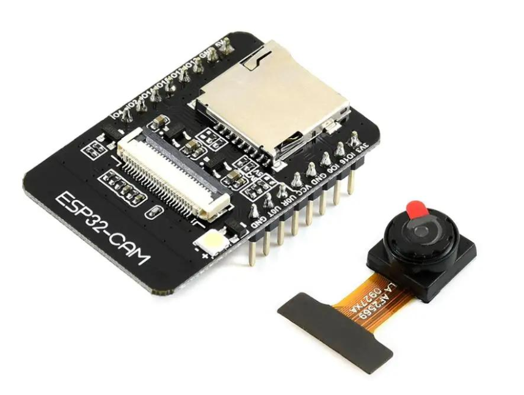
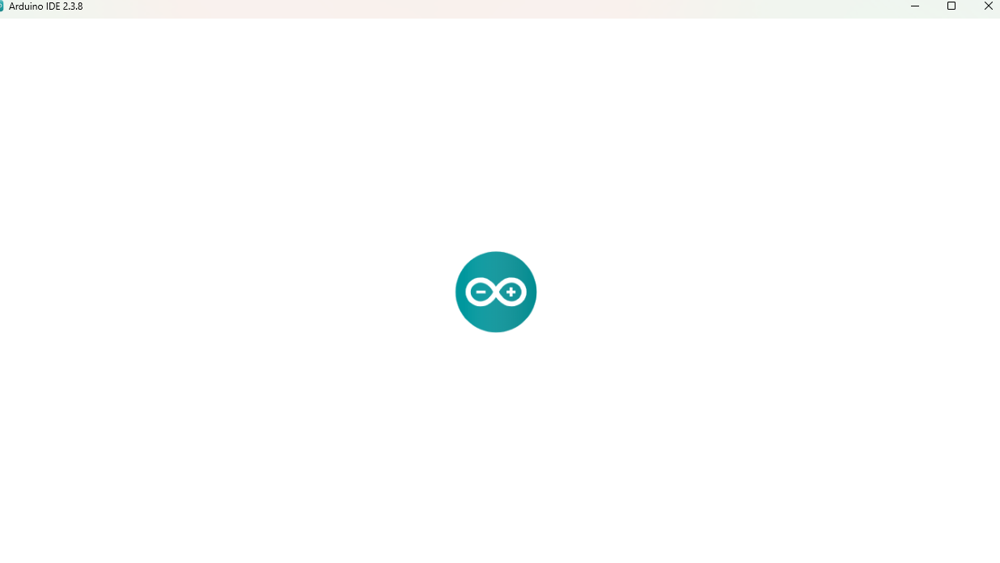
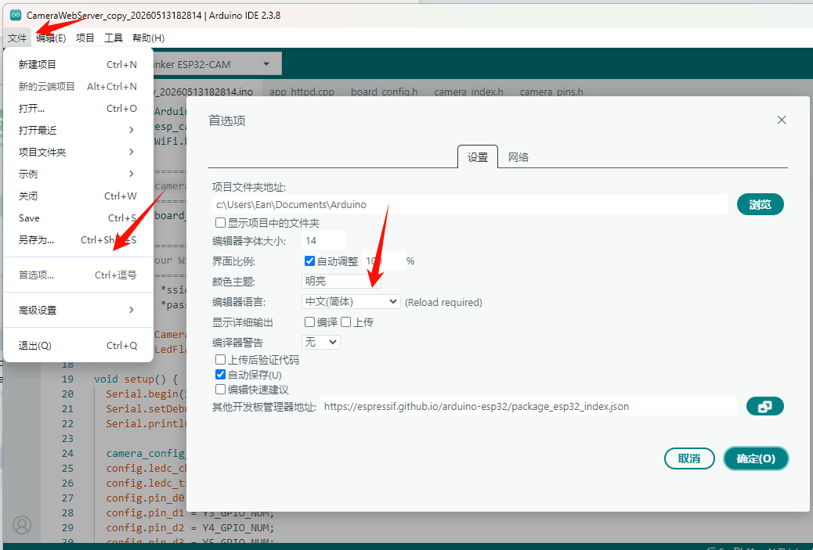
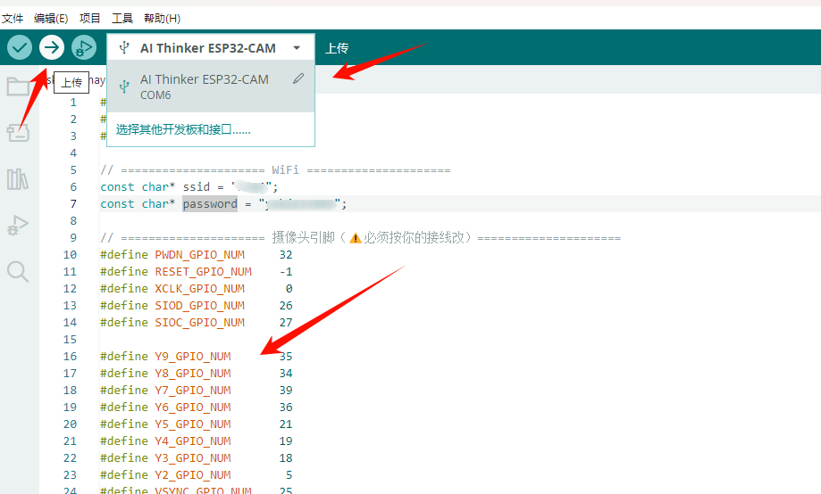
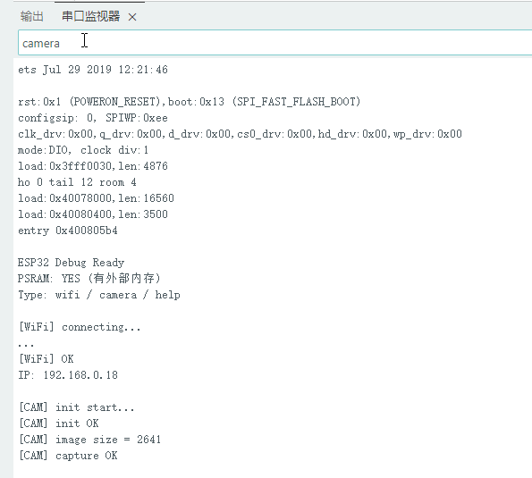
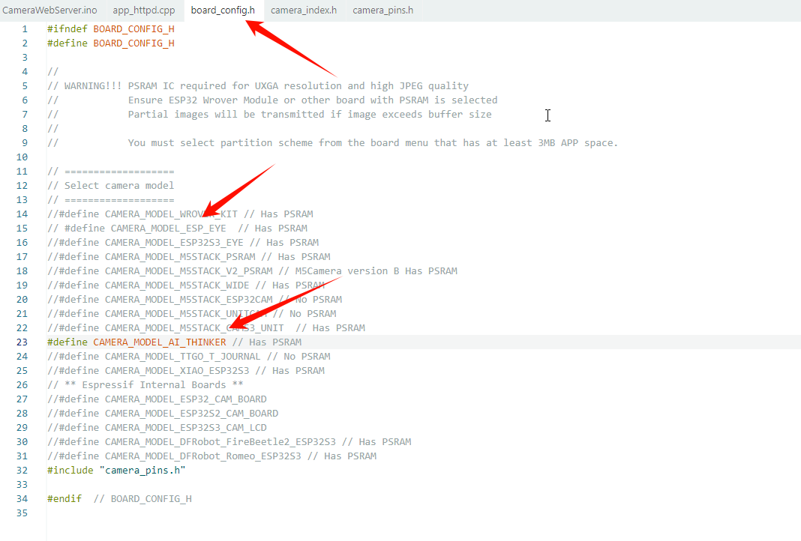
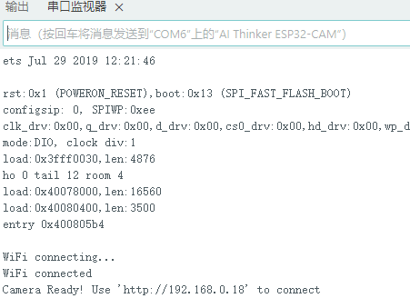
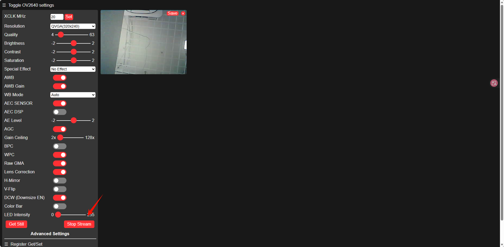

我的博客网站：[Ean7的技术博客](https://ean7.top/)

# 简介

## 硬件

 

### ESP32-CAM 

是一种带摄像头的小型 Wi-Fi/蓝牙开发板，本质上是：

- ESP32 微控制器（MCU）
- - 摄像头模块（通常是 OV2640）
- - 无线通信
- - GPIO 扩展接口

它非常便宜、体积小，常用于：

- 视频监控
- AI视觉识别
- 远程拍照
- 物联网摄像头
- 小车视觉
- 人脸识别
- RTSP/HTTP 视频流
- 智能门铃
- 工业设备图像采集

###  OV2640 

是一颗经典的 CMOS 摄像头传感器，ESP32-CAM 上最常见。

它主打：

- 低成本
- 低功耗
- 小体积
- 内置 JPEG 压缩

很多 ESP32-CAM、Arduino 摄像头模块都在用它。

## 特点

### ESP32-CAM 常用设置

ESP32-CAM 实际常用：

| 分辨率    | 推荐用途   |
| --------- | ---------- |
| 320×240   | AI检测     |
| 640×480   | 视频流     |
| 800×600   | 抓拍       |
| 1024×768  | 静态图     |
| 1600×1200 | 高质量照片 |

因为 ESP32 内存有限：

高分辨率会：

- 掉帧
- 卡顿
- Wi-Fi 不稳定
- 容易崩溃

------

### OV2640 最大帧率

官方会因模式不同而变化。

大致：

| 分辨率 | FPS        |
| ------ | ---------- |
| QQVGA  | 60fps+     |
| QVGA   | 30fps      |
| VGA    | 20fps 左右 |
| UXGA   | 很低       |

ESP32-CAM 实际：

一般：

- VGA：10~20fps
- UXGA：几 fps

因为瓶颈不只是传感器，还有：

- ESP32 内存
- JPEG编码
- Wi-Fi传输

------

### 最大特点：硬件 JPEG

OV2640 最大优势之一：

### 内置 JPEG 压缩

这对 ESP32 非常重要。

否则 ESP32 根本扛不住原始 RGB 视频流。

因此：

ESP32-CAM 的 MJPEG 视频流其实很常见。

------

### 图像质量

属于：“能用型”

特点：

- 白天效果还行
- 夜晚一般
- 动态范围差
- 暗光噪点明显

不适合：

- 工业精密视觉
- 高质量摄影
- OCR精度要求高

# 快速开始

## 安装

[Arduino IDE](https://www.arduino.cc/en/software?utm_source=chatgpt.com)

注意：首次打开软件如果一直卡在下方的页面，请开魔法

 

------

## 添加 ESP32 开发板

首先设置为中文界面

 

然后

```
文件
→ 首选项
→ 其他开发板管理器网址
```

输入

```
https://espressif.github.io/arduino-esp32/package_esp32_index.json
https://raw.githubusercontent.com/espressif/arduino-esp32/gh-pages/package_esp32_index.json
```

然后：

```
工具
→ 开发板
→ 开发板管理器
→ 搜索 ESP32
→ 安装 Espressif Systems版的
```

# 快速验证

 

插上开发板后，新建一个项目，指定开发板和接口，拷贝下面测试代码后上传（修改其中的ssid和password即可）

 ```c++
 #include <Arduino.h>
 #include <WiFi.h>
 #include "esp_camera.h"
 
 // ===================== WiFi =====================
 const char* ssid = "xxx";
 const char* password = "xxx";
 
 // ===================== 默认摄像头引脚=====================
 #define PWDN_GPIO_NUM     32
 #define RESET_GPIO_NUM    -1
 #define XCLK_GPIO_NUM      0
 #define SIOD_GPIO_NUM     26
 #define SIOC_GPIO_NUM     27
 
 #define Y9_GPIO_NUM       35
 #define Y8_GPIO_NUM       34
 #define Y7_GPIO_NUM       39
 #define Y6_GPIO_NUM       36
 #define Y5_GPIO_NUM       21
 #define Y4_GPIO_NUM       19
 #define Y3_GPIO_NUM       18
 #define Y2_GPIO_NUM        5
 #define VSYNC_GPIO_NUM    25
 #define HREF_GPIO_NUM     23
 #define PCLK_GPIO_NUM     22
 
 String cmd = "";
 
 // ===================== WiFi测试 =====================
 void testWiFi() {
   Serial.println("\n[WiFi] connecting...");
 
   WiFi.begin(ssid, password);
 
   int t = 20;
   while (WiFi.status() != WL_CONNECTED && t--) {
     delay(500);
     Serial.print(".");
   }
 
   if (WiFi.status() == WL_CONNECTED) {
     Serial.println("\n[WiFi] OK");
     Serial.print("IP: ");
     Serial.println(WiFi.localIP());
   } else {
     Serial.println("\n[WiFi] FAIL");
   }
 }
 
 // ===================== 摄像头测试 =====================
 void testCamera() {
   Serial.println("\n[CAM] init start...");
 
   camera_config_t config;
   config.ledc_channel = LEDC_CHANNEL_0;
   config.ledc_timer = LEDC_TIMER_0;
 
   config.pin_d0 = Y2_GPIO_NUM;
   config.pin_d1 = Y3_GPIO_NUM;
   config.pin_d2 = Y4_GPIO_NUM;
   config.pin_d3 = Y5_GPIO_NUM;
   config.pin_d4 = Y6_GPIO_NUM;
   config.pin_d5 = Y7_GPIO_NUM;
   config.pin_d6 = Y8_GPIO_NUM;
   config.pin_d7 = Y9_GPIO_NUM;
 
   config.pin_xclk = XCLK_GPIO_NUM;
   config.pin_pclk = PCLK_GPIO_NUM;
   config.pin_vsync = VSYNC_GPIO_NUM;
   config.pin_href = HREF_GPIO_NUM;
   config.pin_sccb_sda = SIOD_GPIO_NUM;
   config.pin_sccb_scl = SIOC_GPIO_NUM;
   config.pin_pwdn = PWDN_GPIO_NUM;
   config.pin_reset = RESET_GPIO_NUM;
 
   config.xclk_freq_hz = 20000000;
   config.pixel_format = PIXFORMAT_JPEG;
 
   config.frame_size = FRAMESIZE_QVGA; // 重要：先用低分辨率
   config.fb_count = 1;
 
   esp_err_t err = esp_camera_init(&config);
 
   if (err != ESP_OK) {
     Serial.print("[CAM] init FAIL, error = ");
     Serial.println(err);
     return;
   }
 
   Serial.println("[CAM] init OK");
 
   camera_fb_t *fb = esp_camera_fb_get();
 
   if (!fb) {
     Serial.println("[CAM] capture FAIL");
     return;
   }
 
   Serial.print("[CAM] image size = ");
   Serial.println(fb->len);
 
   esp_camera_fb_return(fb);
 
   Serial.println("[CAM] capture OK");
 }
 
 // ===================== 命令处理 =====================
 void handleCommand(String cmd) {
   cmd.trim();
 
   if (cmd == "help") {
     Serial.println("Commands:");
     Serial.println("wifi   -> test WiFi");
     Serial.println("camera -> test camera");
   }
 
   else if (cmd == "wifi") {
     testWiFi();
   }
 
   else if (cmd == "camera") {
     testCamera();
   }
 
   else {
     Serial.println("Unknown command");
   }
 }
 
 void setup() {
   Serial.begin(115200);
   delay(1000);
 
   Serial.println("\nESP32 Debug Ready");
 
   // ===================== 🔥 PSRAM检测 =====================
   if (psramFound()) {
     Serial.println("PSRAM: YES (有外部内存)");
   } else {
     Serial.println("PSRAM: NO (没有外部内存)");
   }
 
   Serial.println("Type: wifi / camera / help");
 }
 
 void loop() {
   while (Serial.available()) {
     char c = Serial.read();
 
     if (c == '\n') {
       handleCommand(cmd);
       cmd = "";
     } else {
       cmd += c;
     }
   }
 }
 ```

## 验证

工具-》串口监视器

然后

按一下 RESET 或重新插拔电源 

在输入框中输出wifi和camera进行测试，得到下面结果

 

# 官方视频流demo测试

## 打开官方 CameraWebServer 示例

路径：

```
文件
→ 示例
→ ESP32
→ Camera
→ CameraWebServer
```

## 修改 Wi-Fi 信息

找到：

```
const char *ssid = "**********";
const char *password = "**********";
```

改成：

```
const char* ssid = "你的WiFi";
const char* password = "你的密码";
```

然后在`board.config.h`中注释掉`#define CAMERA_MODEL_WROVER_KIT`,打开`\#define CAMERA_MODEL_AI_THINKER`,保存后上传

 

上传完成后reset重启一下
得到
 

打开提供的网址后，开始视频流即可
 