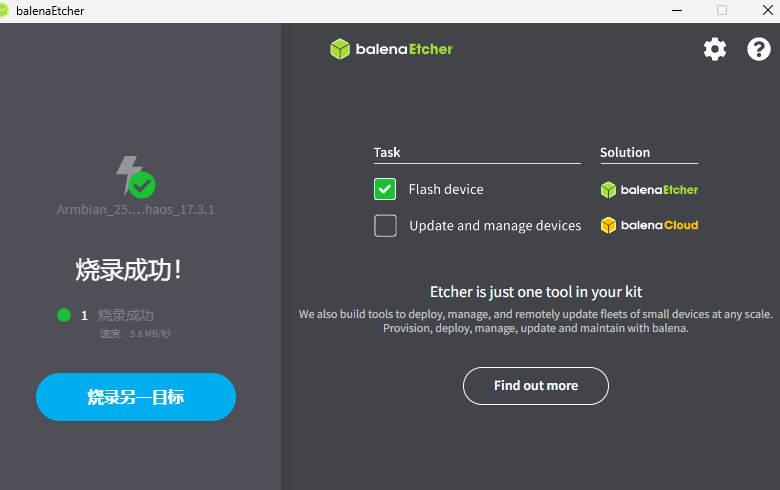
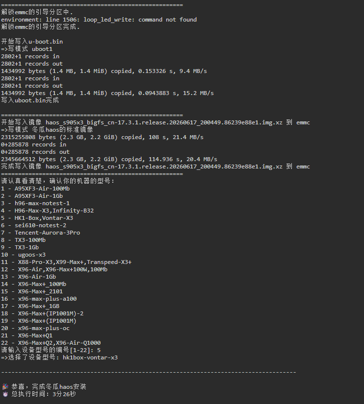
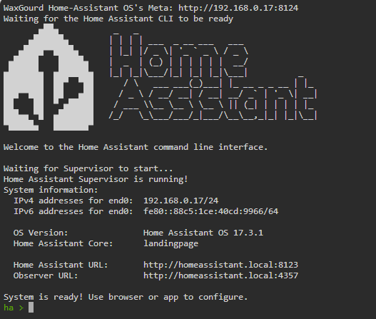
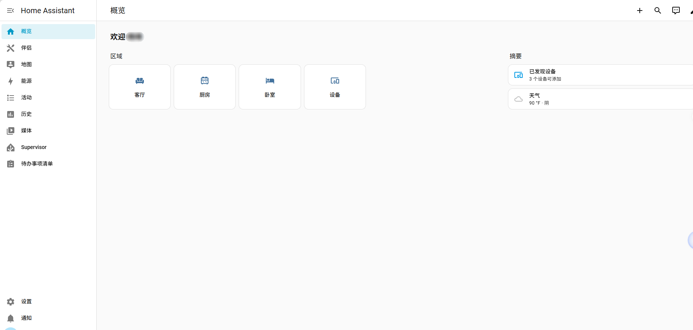

# HK1 Box (S905X3) 刷冬瓜HAOS完整教程

参考[冬瓜HAOS通刷S905X3方案教程 os17.3.1 - 冬瓜HAOS刷机区 - 『瀚思彼岸』» 智能家居技术论坛 - Powered by Discuz!](https://bbs.hassbian.com/thread-27255-1-1.html)，安装包也在里面

最近在玩home assistant，发现一个中国大佬优化后的整合包——冬瓜haos，直接上

------

## 一、准备工作

| 项目         | 说明                                                         |
| :----------- | :----------------------------------------------------------- |
| **硬件**     | HK1 Box盒子、电源适配器、网线、**USB 2.0 U盘**（兼容性最好）、电脑 |
| **下载文件** | [冬瓜HAOS S905X3 16.3.1镜像](https://fw.wghaos.com/haos/s905x3/Armbian_25.02.0_amlogic_s905x3_jammy_6.1.129_haos_16.3.1.xz) |
| **烧录工具** | balenaEtcher或者Rufus                                        |

------

## 二、制作引导U盘

 

1. 打开balenaEtcher（balenaEtcher如果烧录失败可以选择Rufus） 
2. 选择下载好的 `.xz` 文件（**无需解压**，直接选）
3. 选择你的U盘
4. 直接开始
5. 烧录完成后，电脑会出现一个名为 **`BOOT`** 的U盘分区
6. 打开 `BOOT` 分区，找到并双击运行 **`dtb_select.exe`**
7. 选择meson-sm1-hk1box-vontar-x3.dtb`后确认，然后**安全弹出U盘**

------

## 三、U盘引导启动

1. 将U盘插入HK1 Box **靠近网口的USB接口**
2. **插上网线**（必须插，全程依赖网络操作）
3. 最后**接通电源**
4. 等待约 **2-3分钟**，让盒子从U盘启动

> + 上面的方法适用于安卓系统
>
> 如果是armbian系统，所以插上U盘后需要通过ssh输入`reboot "update"`后从U盘引导重启
>
> + 因为支持TF卡，如果U盘不行可以考虑，多折腾一下

------

## 四、连接并刷入系统

1. 在电脑浏览器中输入：

   ```
   http://wghatools.local:7681
   ```

   > 如果打不开，去路由器后台找到名为 `wghatools` 的设备IP，用 `http://<该IP>:7681` 访问

2. 登录终端：

   - 用户名：`root`
   - 密码：`1234`

1. 执行刷机命令（输入 `./zwgu` 后按 `TAB` 键自动补全）：

   bash

   ```
   ./zwgusb2haos_s905x3
   ```

   

2. **仔细阅读屏幕提示**，按指引完成刷机

3. 刷完后会提示完成，**直接拔掉电源**，**拔下U盘**

 

------

## 五、启动HAOS

**全程操作在电脑浏览器完成**，盒子接不接显示器都可以

1. 重新插上电源，等待 **3-5分钟** 启动

2. 在路由器后台找到名为 **`homeassistant`** 的新设备IP

3. 浏览器访问：http://<你的HAOS_IP地址>:7681查看进程

    

   最后进入ha系统 

   ```
   http://<你的HAOS_IP地址>:8123
   ```

   

4. 开始Home Assistant初始化设置（创建账户、选择地区等）

 

------

## ⚠️ 常见问题

| 问题                               | 解决方法                                                  |
| :--------------------------------- | :-------------------------------------------------------- |
| 访问 `wghatools.local:7681` 打不开 | 用路由器里查到的IP访问，或检查电脑和盒子是否在同一局域网  |
| U盘无法引导（直接进原系统）        | 换一个USB接口；或换一个U盘（老旧的USB 2.0优盘成功率更高） |
| 刷机时报错                         | 检查网络是否通畅，确保网线插好                            |
| 刷完后无法获取IP                   | 检查网线是否插好，重启盒子再等5分钟                       |
| 首次启动HAOS卡在安装界面           | 正常现象，首次下载约1GB依赖，需等待15-60分钟              |

