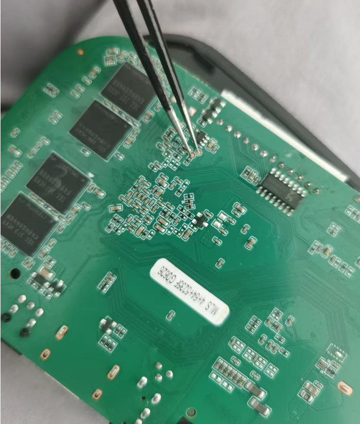
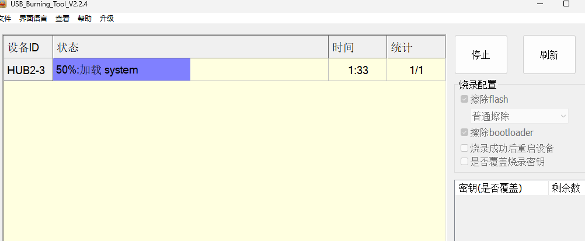
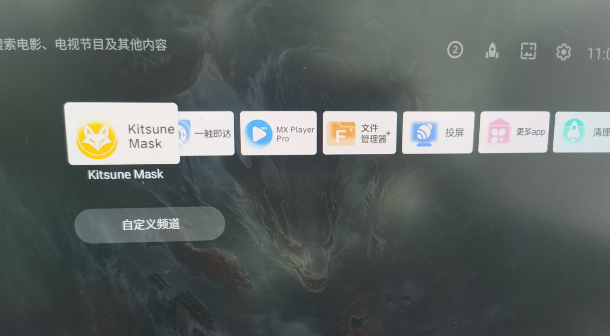

折腾来折腾去，弄成砖了，刷一个安卓TV系统试试

# 准备

从[【HK1 BOX】1000M_晶晨S905X3芯片_Slimbox 9.20-Mod ATV_中文线刷包 - 机顶盒/智能电视 数码之家](https://www.mydigit.cn/forum.php?mod=viewthread&tid=607176#lastpost)这里选了一个链接: https://pan.baidu.com/s/5cs6Je-U_6Uk2cJj7HOoarQ，在里面的路径：A《当贝纯净桌面--固件大全》（固件更全）>>>【《通刷固件包》】一包通刷多种型号>>>16《【S905X3通刷】【HK1 BOX】【适配slimBOXtv所有机型】slimBOXtv-9.17.2-通刷固件包》。

同时在《晶晨线刷刷机工具》中下载Amlogic_USB_Burning_Tool_v2.2.4，以及license。最后需要把放license在USB_Burning_Tool安装文件夹的根目录。

# 开始

参考：[教你如何使用Amlogic晶晨工具线刷附晶晨烧录工具下载_综合交流大区_ZNDS](https://www.znds.com/tv-1265404-1-1.html)

上面文章里面说的就比较详细

但是因为我顶住盒子AV孔里的复位键（Reset）没有效果。所以我才拆机短接强刷。拆机视频参考【HK1BOX 刷机变砖刷原厂固件外贸盒子刷机】 https://www.bilibili.com/video/BV1u44y1G7us/?share_source=copy_web&vd_source=4bce4b7f47af796806ae295e8e08b3a6

 

先短接，再连线，就会出现连接成功（可以不插电源线，usb线可以供电），然后这时点击开始刷机。

 

刷机成功后拔线上电重启

 

大功告成！
