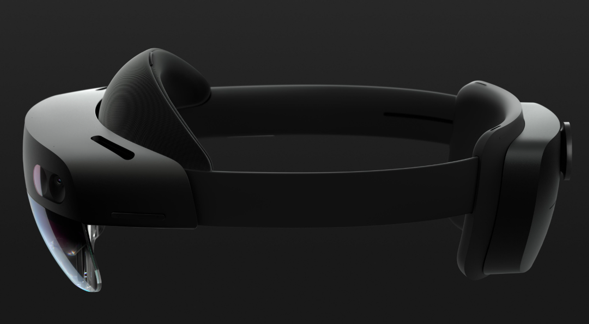
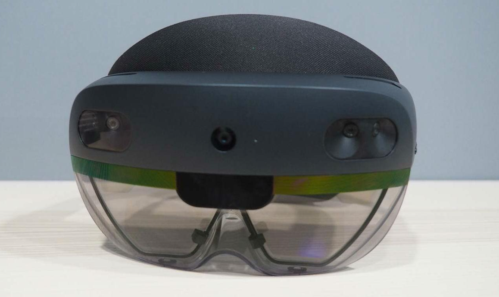

我的博客网站：[Ean7的技术博客](https://ean7.top/)

# 介绍

 

   

Microsoft HoloLens 2 是微软推出的第二代混合现实（MR）头显，主要面向工业、医疗、远程协作、数字孪生和科研领域。其核心硬件配置如下：

| 硬件       | 配置                                          |
| ---------- | --------------------------------------------- |
| 处理器     | Qualcomm Snapdragon 850                       |
| AI协处理器 | 第二代 HPU（Holographic Processing Unit 2.0） |
| GPU        | Adreno 630                                    |
| 内存       | 4GB LPDDR4x                                   |
| 存储       | 64GB UFS 2.1                                  |
| 操作系统   | Windows Holographic                           |
| 显示       | 双目全息透视波导显示                          |
| 分辨率     | 2K 3:2 Light Engine（单眼约 1440×936）        |
| 视场角 FOV | 约 52° 对角视场                               |
| 刷新率     | 60Hz                                          |
| 眼动追踪   | 支持                                          |
| 手势追踪   | 全手部 25关节追踪                             |
| 深度传感器 | Azure Kinect 深度模块                         |
| 摄像头     | 800万像素、1080P 30FPS                        |
| 麦克风     | 5麦克风阵列                                   |
| 音频       | 空间音频扬声器                                |
| 无线       | Wi-Fi 5、Bluetooth 5.0                        |
| 电池       | 约 2~3 小时主动使用                           |
| 重量       | 约 566g                                       |

微软官方重点升级包括：

- 更大的视场角（相比一代明显提升）
- 更精准的手势识别
- 眼动追踪
- 更舒适的重心设计
- 更强的空间定位与SLAM能力
- 企业级 Azure / Dynamics 365 集成 

HoloLens 2 内部实际上是“一台完整ARM电脑”，可独立运行 Unity、Unreal、UWP 应用，不依赖PC。其 HPU 2.0 专门负责：

- SLAM空间建图
- 手势识别
- 眼动追踪
- 深度融合
- 空间锚点
- 全息渲染加速

微软公布的 HPU 2.0 规格包括：

- 超过 1 TOPS AI算力
- 125MB SRAM
- 专门优化的向量处理器 

典型应用场景：

- 工业数字孪生
- 远程运维
- AR装配指导
- 医疗导航
- UE/Unity MR开发
- 机器人与CV研究
- 三维重建与点云采集 

需要注意的是：

- HoloLens 2 已于 2024 年停止生产
- 微软将继续提供安全更新至 2027 年底
- 后续暂无官方继任型号 

# 使用体验

1.佩戴挺方便和舒适的，重量也分布合理

2.在比较亮的环境下，左右镜片下有明显的彩色条纹，镜片四周有明显的反光。

3.进入菜单栏后，可以看到悬空的页面，但因为视场角受限，几乎看看能看全。而且色彩很容易失真，稍微偏一下色彩就失真了。用不了一会儿眼睛感觉很累。

4.透视效果肯定比quest3要好，但因为透过好几层玻璃，所以清晰度有降低。不过有翻盖，可以很方便翻起来

5.手势追踪有延迟，经常不能一次就点对目标位置，比quest3差很多

6.空间定位挺厉害的，没想到19年的产品就能达到这样好的效果了，看来内置算力挺高。

7.瞳孔解锁和眼动追踪挺有意思的

8.空间扫描也不错，能看到手指的光标能准确吸附在实景额度表面