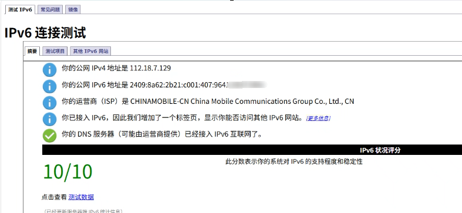
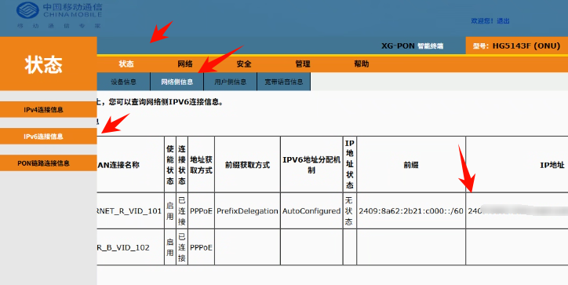
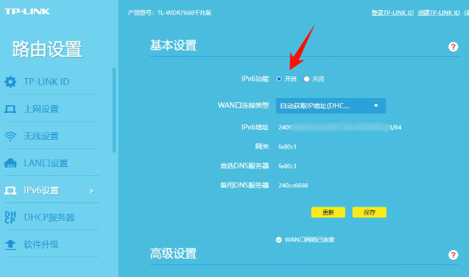
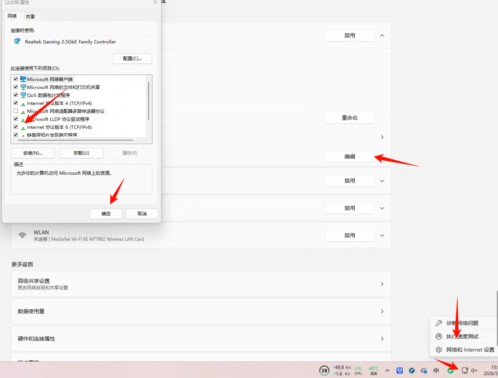
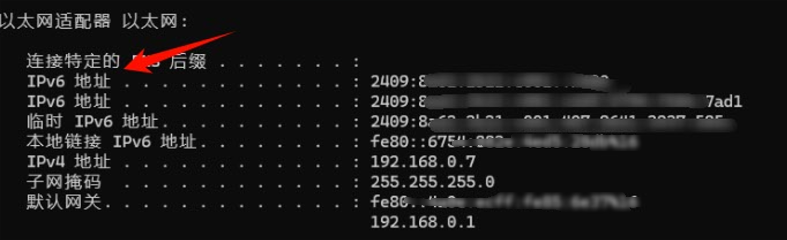
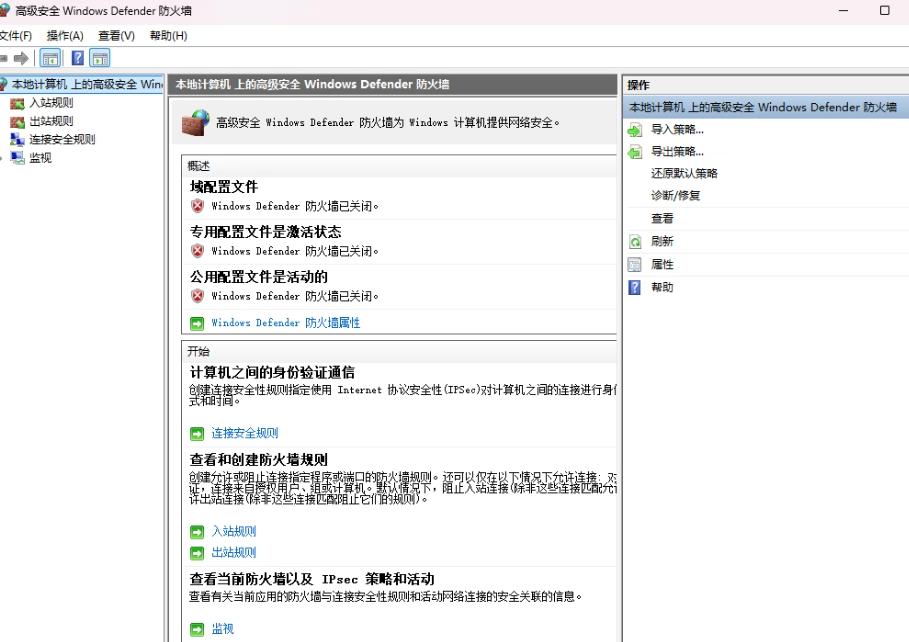
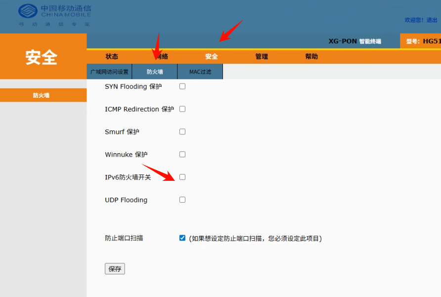

我的博客网站：[Ean7的技术博客](https://ean7.top/)


# 要求

要进行ipv6通信，首先要保证两边的设备都有ipv6地址

[IPv6 测试](https://www.test-ipv6.com/)

  

这种就是合格的（注意其中的ipv4是假的，是 CGNAT（运营商大内网））

# 说明

每个人自家的情况不一样，我是按照我家里的情况做演示，仅供参考

# 开始

我家的路由器是TL-WDR7660千兆版

光猫是

| 设备类型 | 中国移动智能家庭网关类型4 |
| -------- | ------------------------- |
| 生产厂家 | FiberHome                 |
| 设备型号 | HG5143F (ONU)             |

---

网络结构是

中国移动
   ↓
光猫
   ↓
TP-Link
   ↓
电脑 / 手机

---

首先查看运营商是否提供IPv6

  

其中ipv6是24开头的，说明是公网ip

---

然后在路由器中打开ipv6

 

---

最后开启电脑的ipv6功能

 

此时在cmd中输入ipconfig查看地址

  

采用第一个即可，比较稳定

这时候[IPv6 测试](https://www.test-ipv6.com/)就全通过了

---

# 测试

我是在手机上使用数据流量测试的，默认都有IPv6

测试的软件是Termux

可以使用ping6命令分别ping路由器的ipv6和电脑的ipv6进行测试

---

# 补充

为了提高成功率，我都是关闭了防火墙的，请谨慎操作

 

 

>
>
>终于折腾成功了！！！接下来去玩一玩其他好玩的功能（网盘，影音系统，游戏串流……哈哈😄）

# 高级

## ddns-go

为了防止ipv6经常更换，所以需要[ddns-go](https://github.com/jeessy2/ddns-go)来绑定域名

下载https://github.com/jeessy2/ddns-go/releases/download/v6.17.4/ddns-go_6.17.4_windows_x86_64.zip

用管理员权限安装为后台服务

```cmd
.\ddns-go.exe -s install
```

打开http://localhost:9876/进行配置

填上阿里云的AccessKey ID和AccessKey ，关闭ipv4,在ipv6下填入域名即可（需提前在阿里云中解析域名）
