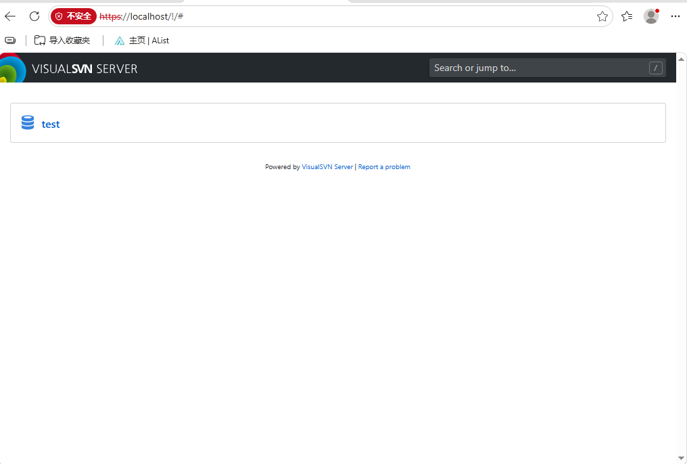

 

现在大多数互联网、开源项目已经转向 **Git + GitHub/GitLab/Gitea**，不过 SVN 在一些企业、传统行业、内部项目里仍然非常常见。Apache Subversion 目前仍在维护，并且官方定位仍是企业级集中式版本控制系统。

简单来说：

|            | SVN            | Git            |
| ---------- | -------------- | -------------- |
| 类型       | 集中式版本控制 | 分布式版本控制 |
| 流行年代   | 2000~2015      | 2010年至今     |
| 服务器依赖 | 强依赖服务器   | 本地仓库即可   |
| 分支       | 较弱           | 非常强         |
| 大文件     | 较友好         | 需要 Git LFS   |
| 学习难度   | 简单           | 稍复杂         |
| 企业老项目 | 很多           | 逐渐替代       |
| 开源项目   | 少             | 主流           |

------

## 使用场景

### 1. 传统企业软件开发

例如：

- 银行
- 工厂自动化
- 嵌入式设备公司
- 汽车行业
- 电力行业
- 政府项目

原因：

- 项目生命周期很长（10年以上）
- 不希望频繁迁移
- 权限管理简单

比如：

```
SVN服务器

/project
 ├── trunk
 ├── branches
 └── tags
```

管理员可以精确控制：

```
张三：
  /project/A 读写

李四：
  /project/B 只读
```

SVN 的路径权限控制一直是它的优势。

------

### 2. 大量二进制文件

例如：

- CAD图纸
- SolidWorks
- Altium PCB工程
- 游戏资源
- 视频素材

Git 对大文件历史管理比较吃力。

SVN：

```
机械设计/
 ├── 零件1.SLDPRT
 ├── 装配图.SLDASM
 └── 工程图.DWG
```

直接提交。

所以一些制造企业仍然喜欢 SVN。

------

### 3. 内网服务器项目

比如公司内部：

```
服务器
  |
  SVN Server
  |
----------------
工程师A
工程师B
工程师C
```

几十个人协作开发。

部署简单。

------

## SVN 软件

### 1. VisualSVN Server（Windows服务器）

VisualSVN Server

适合：

- Windows Server搭建SVN服务器

可以安装：

```
VisualSVN Server
        |
        |
   SVN Repository
        |
----------------
客户端
```

支持：

- 用户管理
- HTTPS
- AD域账号
- 权限控制

### 2. TortoiseSVN（Windows 最常用）

TortoiseSVN

特点：

- Windows 资源管理器右键集成
- 不需要命令行
- 企业里非常普及

例如：

右键：

```
项目文件夹

→ SVN Update
→ SVN Commit
→ SVN Log
→ Show Differences
```

很多老工程师都是用它。

## 安装 VisualSVN Server

下载：

[VisualSVN Server 官方网站](https://www.visualsvn.com/server/?utm_source=chatgpt.com)

下载：

```
VisualSVN Server
```

安装包：

```
VisualSVN-Server-x.x.x-x64.msi
```

运行安装程序。

### 设置存储位置

例如：

你的服务器：

```
D:\SVN
```

填写：

```
Repositories:
D:\SVN\Repositories
```

以后仓库会在：

```
D:\SVN\Repositories
```

里面。

同时设置好backup文件夹

------

### 认证方式

选择：

```
VisualSVN Server authentication
```

简单可靠。

------


>### 安装时注意
>
>如果你想一直使用 **Community 免费版**，安装时建议：
>
>- ✅ Authentication：**VisualSVN Server authentication**
>- ❌ 不要选择 **Windows Authentication（Active Directory）**
>- ❌ 不要勾选 **Enable search indexing for repositories**（全文搜索）
>
>因为根据官方安装说明，**Windows 身份验证**和**仓库全文搜索**属于需要更高许可证（或 45 天试用）的功能。如果勾选了，安装程序会提示启动 45 天试用，而不是直接使用 Community 免费版。

------

## VisualSVN Server 快速开始

### 打开管理界面

开始菜单：

```
VisualSVN Server Manager
```

打开：

类似：

```
VisualSVN Server
|
├── Repositories
|
├── Users
|
├── Groups
|
└── Jobs
```

------

### 创建用户

右键：

```
Users
```

选择：

```
Create User
```

例如：

用户名：

```
admin
```

密码：

```
********
```

创建。

------

创建：

```
developer1
developer2
```

类似。

------

### 创建 SVN 仓库

右键：

```
Repositories
```

选择：

```
Create New Repository
```

------

选择：

```
Regular FSFS repository
```

下一步。

------

名称：

例如：

```
test_Project
```

生成：

```
https://server/svn/test_Project
```

------

目录结构建议：

选择：

```
Create default structure
```

自动创建：

```
YOLO_Project
|
├── trunk
├── branches
└── tags
```

------

### 设置权限

右键：

```
test_Project
```

选择：

```
Properties
```

进入：

```
Security
```

------

添加用户：

例如：

```
developer1
```

权限：

```
Read/Write
```

管理员：

```
admin
Full Control
```

------

效果：

```
test_Project

admin       全权限
developer1 读写
guest       只读
```

------

### 测试服务器

服务器本机浏览器：

输入：

```
https://localhost/svn/
```

可以登录VisualSVN Server

 

------

局域网电脑：

输入：

```
https://服务器ip/svn/
```

------

## 客户端

TortoiseSVN 是 Windows 下最常用的 SVN 客户端，它最大的特点是**直接集成到文件资源管理器右键菜单**。典型流程是：

```
创建仓库（服务器）
        ↓
Checkout（第一次下载项目）
        ↓
修改文件
        ↓
Commit（提交修改）
        ↓
Update（同步别人修改）
```

下面按实际使用流程说明。

------

### 安装 TortoiseSVN

下载安装：

[TortoiseSVN 官方网站](https://tortoisesvn.net/?utm_source=chatgpt.com)

安装完成后：

1. 重启 Windows 资源管理器（一般重启电脑）
2. 任意文件夹右键

应该看到：

```
SVN Checkout...
SVN Update
SVN Commit...
TortoiseSVN >
```

说明安装成功。

------

### 连接 SVN 服务器

假设服务器：

```
192.168.1.100
```

仓库：

```
project
```

地址：

```
https://192.168.1.100/svn/project
```

------

### 第一次下载项目（Checkout）

例如：

你想把项目放：

```
D:\work
```

操作：

右键：

```
D:\work
```

选择：

```
SVN Checkout...
```

出现：

```
URL of repository:
```

填写：

```
https://192.168.1.100/svn/project
```

点击：

```
OK
```

------

然后输入账号：

```
Username:
admin

Password:
******
```

开始下载：

```
A   main.cpp
A   config.yaml
A   README.md

Completed
```

完成后：

```
D:\work\project
```

就是你的工作副本。

------

### 查看文件状态

> 如果不显示图标状态，参考[SVN状态图标不显示的两种解决办法_svn图标不显示-CSDN博客](https://blog.csdn.net/weixin_44541320/article/details/119418867)

SVN 会给文件加图标。

例如：

绿色 √：

```
正常
```

红色 !：

```
本地修改
```

蓝色 +：

```
新增文件
```

红色叉：

```
冲突
```

------

例如：

你修改：

```
detect.py
```

图标：

```
红色感叹号
```

表示：

```
这个文件和服务器版本不同
```

------

### 提交修改（Commit）

修改完成：

右键项目：

```
SVN Commit...
```

例如：

```
D:\work\project
```

弹出：

```
Commit message
```

填写后

下面显示：

```
[x] detect.py
[x] config.yaml
```

点击：

```
OK
```

上传：

```
Sending detect.py
Sending config.yaml

Committed revision 25
```

服务器版本：

```
24 → 25
```

### 更新服务器最新代码（Update）

别人提交了代码。

你的版本：

```
revision 25
```

服务器：

```
revision 30
```

需要：

右键：

```
SVN Update
```

结果：

```
U main.py
U config.yaml
```

表示：

Updated。

------

### 查看历史版本

右键：

```
TortoiseSVN
    |
    Show log
```

看到：

```
Revision 30
 张三
 修改摄像头参数

Revision 29
 李四
 优化算法

Revision 28
 王五
 添加报警
```

------

可以查看：

- 谁改的
- 什么时间
- 改了什么

### 恢复以前版本

例如：

现在：

```
detect.py
```

坏了。

查看：

```
Show log
```

选择：

```
Revision 20
```

右键：

```
Revert to this revision
```

恢复。

------

### 添加新文件

新建：

```
model/
   best.pt
```

SVN不会自动管理。

右键：

```
TortoiseSVN
      Add...
```

变成：

```
+ best.pt
```

然后：

```
Commit
```

提交。

------

### 删除文件

删除：

```
old.py
```

不要直接删除。

建议：

右键：

```
TortoiseSVN
      Delete
```

然后：

```
Commit
```

这样历史里面有记录。

### 解决冲突

多人修改同一个文件：

例如：

A改：

```
conf=0.5
```

B改：

```
conf=0.3
```

提交时：

```
Conflict
```

SVN生成：

```
detect.py
detect.py.mine
detect.py.r25
```

打开：

```
TortoiseSVN
 → Edit conflicts
```

选择：

- 保留我的
- 保留服务器
- 手动合并

