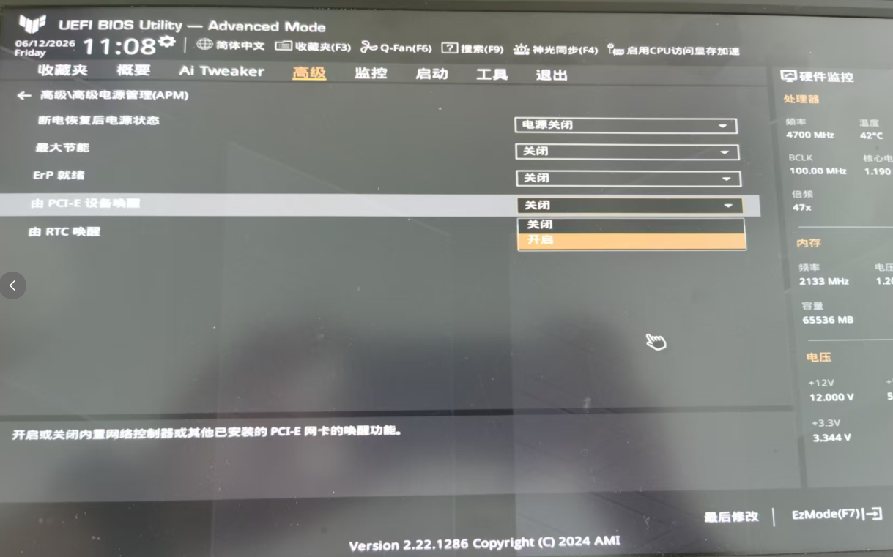

# 准备

首先查看自己的主板型号，看是否支持WOL功能

```cmd
wmic baseboard get product,manufacturer
```

```
>wmic baseboard get product,manufacturer
Manufacturer           Product
ASUSTeK COMPUTER INC.  TUF GAMING B760M-PLUS D4
```

我的主板是：

**ASUS TUF GAMING B760M-PLUS D4**

👉 **完全支持网线远程开机（Wake-on-LAN, WOL）**

而且属于“标准完整支持”的那一类主板。

## 主板

B760 芯片组 + 华硕 TUF 系列：

- 支持 PCI-E 唤醒（WOL 必备）
- 支持 ErP / ACPI 电源管理
- 支持断电后唤醒策略配置

✔ 结论：**主板层面支持 WOL**

------

## 网卡

是：

- Realtek 2.5GbE 网卡

✔ 支持：

- Magic Packet 唤醒
- 关机唤醒（S5 Wake）

------

# 软件/BIOS设置

要实现真正“远程关机后开机”，必须确认下面 3 点：

------

### （1）BIOS 设置（最关键）

开机时按`Del`进入 BIOS，找到：

```
Advanced → APM Configuration
```

开启：

- Power On By PCI-E / PCI
- Wake on LAN
- Resume By PCI-E Device

⚠️ 如果有：

- ErP Ready → 必须关闭（Disable）

👉 否则关机后网卡会断电，WOL 失效

我的bios中设置如下所示

 

------

### （2）Windows 设置

设备管理器 → 网络适配器 → 选择对应的网卡：

属性 → 电源管理

勾选：

- ☑ 允许计算机关闭此设备以节约电源
- ☑ 允许此设备唤醒计算机
- ☑ 只允许魔术封包唤醒

# 唤醒

首先需要知道电脑 MAC 地址

在 Windows 里运行：

```
ipconfig /all
```

找到：

```
Physical Address  . . . . . : XX-XX-XX-XX-XX-XX
```

例如：

```
00-11-22-33-44-55
```

------

> 如果电脑本来是关机状态，怎么获取MAC地址？
>
> ## IP → ARP 转 MAC（前提：设备在线过）
>
> ```
> arp -a 192.168.1.10
> ```
>
> 👉 如果缓存还在，可以得到 MAC，然后再 WOL

## 手机或另一台电脑安装 WOL 工具

推荐：

- [WakeMeOnLan（Windows工具）](https://www.nirsoft.net/utils/wake_on_lan.html?utm_source=chatgpt.com)
- [Depicus WOL（网页/工具）](https://www.depicus.com/wake-on-lan/wake-on-lan-gui?utm_source=chatgpt.com)
- 手机 App：Wake On Lan（Android / iOS 都有）

------

### 填入信息

在工具里填：

- MAC 地址：你的网卡地址
- IP：一般填广播地址（如 192.168.0.255）
- Port：9（默认）

------

### 点击 “Wake / Send”

如果配置正确：

👉 电脑会从关机状态直接开机

------

📌 注意：
 手机必须连同一个局域网 WiFi

## 路由器 WOL

很多路由器支持：

👉 登录路由器后台 → 找：

- Wake on LAN
- 网络唤醒
- 设备唤醒

直接点按钮就能开机

## 脚本/命令行唤醒

### PowerShell 脚本

可以自己写脚本：

```
$mac = "00-11-22-33-44-55"
$broadcast = "192.168.0.255"
$port = 9

$macBytes = $mac -split '[:-]' | ForEach-Object { [Convert]::ToByte($_,16) }
$packet = ([byte[]](,0xFF * 6)) + ($macBytes * 16)

$udp = New-Object System.Net.Sockets.UdpClient
$udp.Connect($broadcast,$port)
$udp.Send($packet,$packet.Length)
$udp.Close()
```

保存为`wol.ps1`，然后右键`使用PowerShell 运行`

---

### linux系统

Ubuntu 自带命令

1️⃣ 安装工具

```
sudo apt update
sudo apt install wakeonlan -y
```

------

2️⃣ 直接唤醒

```
wakeonlan 00:11:22:33:44:55
```

👉 这一步就可以唤醒电脑。
