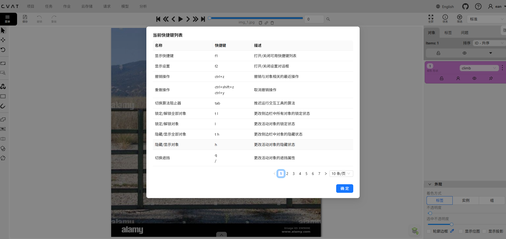

中文版cvat项目地址：[YQisme/cvat: 计算机视觉标注工具（CVAT）是一个领先的平台，用于为视觉人工智能构建高质量的视觉数据集。它提供开源、云端和企业级产品，以及标注服务，支持图像、视频和3D标注，具备AI辅助标注、质量保证、团队协作、分析和开发者API等功能。](https://github.com/YQisme/cvat)

 

# 安装

CVAT 官方推荐使用 Docker Compose 部署，这是最简单、最稳定的方式。

如果是 Ubuntu 服务器（包括物理机、虚拟机、云服务器），按照下面步骤即可。

## 1. 安装 Docker

Ubuntu 22.04：

```
sudo apt update

sudo apt install -y \
    ca-certificates \
    curl \
    gnupg \
    lsb-release

curl -fsSL https://download.docker.com/linux/ubuntu/gpg | \
sudo gpg --dearmor -o /usr/share/keyrings/docker.gpg

echo \
"deb [arch=$(dpkg --print-architecture) \
signed-by=/usr/share/keyrings/docker.gpg] \
https://download.docker.com/linux/ubuntu \
$(lsb_release -cs) stable" | \
sudo tee /etc/apt/sources.list.d/docker.list

sudo apt update

sudo apt install -y docker-ce docker-ce-cli containerd.io docker-compose-plugin
```

验证：

```
docker --version
docker compose version
```

------

## 2. 下载 CVAT

CVAT 开源项目：

[CVAT GitHub 仓库](https://github.com/cvat-ai/cvat?utm_source=chatgpt.com)

克隆代码：

```
git clone https://github.com/cvat-ai/cvat.git

cd cvat
```

## 3.指定访问地址

然后修改 .env

找到或添加：

CVAT_HOST=本机的ip

## 4.启动

直接执行：

```
docker compose up -d
```

首次启动会下载：

- PostgreSQL
- Redis
- CVAT Server
- CVAT UI
- Traefik

大约需要几分钟。

查看状态：

```
docker ps
```

正常会看到：

```
cvat_server
cvat_ui
cvat_db
cvat_redis
traefik
```

------

## 5. 创建管理员账号

启动完成后：

```
docker exec -it cvat_server \
bash -ic 'python3 ~/manage.py createsuperuser'
```

输入：

```
Username
Email
Password
```

创建管理员账号。

------

## 6. 登录系统

浏览器打开：

```
http://服务器IP:8080
```

例如：

```
http://192.168.1.100:8080
```

登录刚创建的管理员账号即可。

------

# 开启 YOLO/SAM 自动标注

CVAT 支持：

- YOLOv7
- SAM
- Mask-RCNN
- OpenVINO模型
- Tracking模型

启动 Serverless 组件：

```
docker compose \
-f docker-compose.yml \
-f components/serverless/docker-compose.serverless.yml \
up -d
```

然后部署对应模型。

## 1. CVAT serverless 是什么关系？

CVAT 结构是这样的：

```
CVAT 主系统
  ├── cvat_server（必须）
  ├── cvat_ui（必须）
  ├── postgres / redis（必须）
  └── serverless（可选 AI 推理）
        ├── YOLO
        ├── SAM
        ├── OpenVINO
```

👉 serverless 只是“AI能力插件层”

它**依赖 CVAT 主服务存在**

------

## 2. 两种启动方式对比

### 正确方式（官方推荐）

```
docker compose -f docker-compose.yml \
-f components/serverless/docker-compose.serverless.yml \
up -d
```

👉 一次性启动完整系统（推荐）

------

### 先主系统，再 serverless

#### Step 1

```
docker compose up -d
```

#### Step 2（后面再加）

```
docker compose -f components/serverless/docker-compose.serverless.yml up -d
```

👉 这样是 **可以的**

✔ CVAT 已运行
 ✔ serverless 再补上
 ✔ 不会冲突

# 快速入门

## 概念

在 CVAT 里，这三个概念是一个层级关系：

```text
Project（项目）
 ├─ Task（任务）
 │    ├─ Job（作业）
 │    ├─ Job（作业）
 │    └─ Job（作业）
 ├─ Task（任务）
 │    ├─ Job（作业）
 │    └─ Job（作业）
 └─ Task（任务）
```

官方定义中：

- **Project**：管理多个任务，共享标签体系（Labels）
- **Task**：一次具体的数据标注任务（图片集或视频）
- **Job**：Task 自动切分后的实际标注工作单元 ([docs.cvat.ai](https://docs.cvat.ai/docs/workspace/projects/?utm_source=chatgpt.com))

------

### 1. Project（项目）

Project 相当于一个数据集工程。

例如你要训练一个安全帽检测模型：

```text
项目名称：
Helmet Detection
```

标签：

```text
person
helmet
no_helmet
```

这些标签只需要在 Project 中定义一次。

然后可以创建多个 Task：

```text
Helmet Detection
├─ Task1：工地A视频
├─ Task2：工地B视频
├─ Task3：工地C图片集
```

所有 Task 自动继承这些标签。 ([docs.cvat.ai](https://docs.cvat.ai/docs/workspace/projects/?utm_source=chatgpt.com))

------

### 2. Task（任务）

Task 是实际上传的数据。

例如：

Task 1

上传：

```text
siteA.mp4
```

CVAT：

```text
Task: SiteA
Frames: 0~10000
```

或者：

Task 2

上传：

```text
001.jpg
002.jpg
...
1000.jpg
```

CVAT：

```text
Task: SiteB
Images: 1000
```

一个 Task 对应：

- 一个视频
- 或一批图片
- 或一个点云数据集

Task 是数据管理单位。 ([docs.cvat.ai](https://docs.cvat.ai/docs/workspace/tasks-page/?utm_source=chatgpt.com))

------

### 3. Job（作业）

Job 是 Task 的切片。

当 Task 太大时：

```text
Task
10000 帧视频
```

CVAT 可以自动切分：

```text
Job1
0~1999

Job2
2000~3999

Job3
4000~5999

Job4
6000~7999

Job5
8000~9999
```

这样：

- 标注员A做 Job1
- 标注员B做 Job2
- 标注员C做 Job3

多人并行工作。 ([docs.cvat.ai](https://docs.cvat.ai/docs/workspace/tasks-page/?utm_source=chatgpt.com))

------

### 实际例子

假设你有 30 个监控视频。

#### 建立项目

```text
Project
└─ Forklift Detection
```

标签：

```text
forklift
person
truck
```

------

#### 创建任务

```text
Task1
camera01.mp4

Task2
camera02.mp4

Task3
camera03.mp4
...
Task30
camera30.mp4
```

------

#### 自动切分作业

例如：

```text
camera01.mp4
5000帧
```

设置：

```text
Segment Size = 1000
```

CVAT 会生成：

```text
Task1
├─ Job1 (0~999)
├─ Job2 (1000~1999)
├─ Job3 (2000~2999)
├─ Job4 (3000~3999)
└─ Job5 (4000~4999)
```

每个 Job 可以分配给不同标注员。 ([docs.cvat.ai](https://docs.cvat.ai/v2.21.3/docs/manual/basics/task-details/?utm_source=chatgpt.com))

------

### 对 YOLO 数据集制作的建议

#### 小项目（几百张）

直接：

```text
Task
└─ 全部图片
```

不一定需要 Project。

------

#### 正式项目（几千~几万张）

推荐：

```text
Project
└─ Industrial Defect

    Task1
    └─ 原始图片批次1

    Task2
    └─ 原始图片批次2

    Task3
    └─ 视频抽帧批次1
```

这样：

- 标签统一管理
- 导出数据方便
- 后期增加数据批次容易

这是 CVAT 官方推荐的使用方式。 ([docs.cvat.ai](https://docs.cvat.ai/docs/workspace/projects/))

简单记忆：

| 层级    | 含义                   | 类比               |
| ------- | ---------------------- | ------------------ |
| Project | 整个数据集工程         | 一个 YOLO 项目     |
| Task    | 一批待标注数据         | 一个视频或一批图片 |
| Job     | 分配给标注员的工作单元 | Task 的切片        |

最常见的生产环境结构：

```text
Project
 ├─ Task（一个视频）
 │    ├─ Job
 │    ├─ Job
 │    └─ Job
 ├─ Task（一个视频）
 └─ Task（一个视频）
```

# 开始

如果你的 **CVAT 已经部署完成并能正常访问 Web 页面**，最快的入门路线是：

## 1. 创建项目（Project）

进入 CVAT 后：

**Projects → Create Project**

例如：

- Name：YOLO11 Training
- Labels：
  - person
  - car
  - bicycle

如果后续训练 YOLO，建议先把所有类别定义好。

例如：

```text
person
car
truck
bus
motorcycle
```

### Label

CVAT 新版本（尤其是 2.x 以后）创建 Label 时，通常会看到：

- **Raw（原始）**
- **Constructor（构造器）**

这两个是创建标签的两种方式。

#### 方法一：Raw（推荐新手）

点击 **Raw** 后，直接填写标签定义。

例如：

```yaml
person
car
truck
```

或者带属性：

```yaml
[
  {
    "name": "person",
    "attributes": [
      {
        "name": "gender",
        "input_type": "select",
        "values": ["male", "female"]
      }
    ]
  },
  {
    "name": "car"
  }
]
```

对于 YOLO 标注，最简单的是：

```yaml
[
  {"name":"person"},
  {"name":"car"},
  {"name":"truck"}
]
```

保存后会生成对应类别。

------

#### 方法二：Constructor（图形界面）

这是大多数用户使用的方法。

点击：

```text
Labels
→ Constructor
```

然后：

##### 添加类别

点击：

```text
+ Label
```

填写：

```text
Name: person
Type: Rectangle
```

保存。

继续添加：

```text
car
truck
bus
```

------

#### Shape Type 选择

如果训练 YOLO 检测模型：

选择：

```text
Rectangle
```

对应目标检测框。

如果做实例分割：

选择：

```text
Polygon
```

如果做人脸关键点：

选择：

```text
Points
```

如果做姿态估计：

选择：

```text
Skeleton
```

------

### YOLO11 检测推荐配置

假设你做人员检测：

#### Label

```text
person
```

#### Type

```text
Rectangle
```

------

假设做安全帽检测：

#### Labels

```text
person
helmet
no_helmet
```

全部选择：

```text
Rectangle
```

------

### Attributes 要不要填？

新手可以先不填。

例如：

```text
person
├── gender
├── age
└── occluded
```

这些属性：

- 不会进入 YOLO 训练
- 只用于数据管理

所以 YOLO 项目一般：

```text
Label Name
Shape Type
```

即可。

------

## 2. 创建任务（Task）

进入：

**Tasks → Create New Task**

填写：

```text
Name: yolo_train
Project: YOLO11 Training
```

> 最好不要选择子集，统一标注完后最后再划分训练集和验证集

然后上传图片：

```text
jpg
png
jpeg
```

支持：

- 本地上传
- ZIP上传
- 共享目录
- 云存储

对于第一次使用：

直接上传几十张图片即可。

------

## 3. 开始标注

点击任务进入 Job。

最常用的是：

### 矩形框（Bounding Box）

快捷键：

```text
N
```

或点击左侧：

```text
Draw Rectangle
```

操作：

```text
1. 选择类别 person
2. 鼠标拖框
3.右侧选择类别
4.下一张
```

------

## 4. 常用快捷键

| 功能     | 快捷键       |
| -------- | ------------ |
| 下一张   | F            |
| 上一张   | D            |
| 画框     | N            |
| 保存     | Ctrl+S       |
| 删除     | Del          |
| 放大     | 鼠标滚轮     |
| 平移画布 | 鼠标中键拖动 |

建议记住：

```text
N
F
Ctrl+S
```

基本够用了。

------

## 5. 自动标注（推荐）

如果图片很多，不要纯手工标。

CVAT 支持：

- YOLO
- SAM
- Grounding DINO
- Segment Anything

如果你部署了 Serverless：

```bash
docker compose -f docker-compose.yml -f components/serverless/docker-compose.serverless.yml up -d
```

进入任务后：

```text
Actions
→ AI Tools
→ Automatic Annotation
```

选择模型：

```text
YOLO
SAM
GroundingDINO
```

自动生成标注后人工修正。

通常：

```text
自动标注 90%
人工修正 10%
```

效率最高。

------

## 6. 导出 YOLO 数据集

标完后：

```text
Task
→ Export Task Dataset
```

选择：

```text
Ultralytics YOLO Detection 1.0
```

同时“保存图像”

导出得到：

```text
dataset.zip
├── images
│   ├── train
├── labels
│   ├── train
└── data.yaml
```

> 默认只导出train，需要手动划分val，然后data.yaml也需要微调，下面使用一个脚本直接处理完
> ```python
> import os
> import random
> import shutil
> import yaml
> 
> # =========================
> # 配置
> # =========================
> IMAGE_DIR = "images/train"
> LABEL_DIR = "labels/train"
> DATA_YAML = "data.yaml"
> 
> VAL_RATIO = 0.2
> SEED = 42
> # =========================
> 
> random.seed(SEED)
> 
> def load_yaml(path):
>     with open(path, "r", encoding="utf-8") as f:
>         return yaml.safe_load(f)
> 
> def save_yaml(data, path):
>     with open(path, "w", encoding="utf-8") as f:
>         yaml.dump(data, f, sort_keys=False, allow_unicode=True)
> 
> # =========================
> # 1. 读取 data.yaml（保留类别）
> # =========================
> cfg = load_yaml(DATA_YAML)
> 
> if "names" not in cfg:
>     raise ValueError("❌ data.yaml 缺少 names")
> 
> names = cfg["names"]
> 
> # =========================
> # 2. 获取图片
> # =========================
> images = [f for f in os.listdir(IMAGE_DIR)
>           if f.lower().endswith((".jpg", ".png", ".jpeg"))]
> 
> images.sort()
> random.shuffle(images)
> 
> val_count = int(len(images) * VAL_RATIO)
> val_images = images[:val_count]
> train_images = images[val_count:]
> 
> print(f"Total images: {len(images)}")
> print(f"Train: {len(train_images)}")
> print(f"Val: {len(val_images)}")
> 
> # =========================
> # 3. 创建目录
> # =========================
> os.makedirs("images/val", exist_ok=True)
> os.makedirs("labels/val", exist_ok=True)
> 
> # =========================
> # 4. 移动函数
> # =========================
> def move_files(img_list, split):
>     for img in img_list:
>         name = os.path.splitext(img)[0]
> 
>         img_src = os.path.join(IMAGE_DIR, img)
>         lbl_src = os.path.join(LABEL_DIR, name + ".txt")
> 
>         img_dst = os.path.join(f"images/{split}", img)
>         lbl_dst = os.path.join(f"labels/{split}", name + ".txt")
> 
>         shutil.move(img_src, img_dst)
> 
>         if os.path.exists(lbl_src):
>             shutil.move(lbl_src, lbl_dst)
>         else:
>             print(f"⚠️ missing label: {lbl_src}")
> 
> # 执行移动
> move_files(train_images, "train")
> move_files(val_images, "val")
> 
> print("✅ split done")
> 
> # =========================
> # 5. 自动修 data.yaml
> # =========================
> cfg["path"] = "."
> cfg["train"] = "images/train"
> cfg["val"] = "images/val"
> 
> # （可选）删除 test 避免干扰
> cfg.pop("test", None)
> 
> save_yaml(cfg, DATA_YAML)
> 
> print("✅ data.yaml updated")
> print("🎯 Ready for YOLO training!")
> ```
>
> 

最后用于训练：

```bash
yolo detect train model=yolo11n.pt data=data.yaml epochs=100
```

------

## 7. 最推荐的新手流程

假设你有 1000 张图片：

### 第一步

上传图片

```text
Task -> Upload Images
```

------

### 第二步

手工标注 50 张

```text
person
car
```

------

### 第三步

导出 YOLO 数据集

训练一个初始模型：

```bash
yolo detect train
```

------

### 第四步

将训练好的模型导入 CVAT 自动标注

CVAT 自动预测：

```text
剩余950张
```

------

### 第五步

人工修正

效率通常能提升：

```text
5~20倍
```

## 或者

###  外部推理 + 导入 CVAT

```
YOLO模型 → 批量推理图片 → 生成 YOLO txt → 导入 CVAT
```

------

#### Step 1：跑模型批量推理

```
from ultralytics import YOLO
import cv2
import os

model = YOLO("best.pt")

imgs = "images/"
out = "labels/"

results = model(imgs)

for r in results:
    r.save_txt(out)
```

------

#### Step 2：导入 CVAT

在 CVAT：

```
Task → Dataset → Import annotations
```

选择：

- YOLO 1.1 format
- 或 Ultralytics YOLO Detection 1.0

------

#### Step 3：CVAT 自动加载结果

模型已经帮你画好框
只需要人工修正
