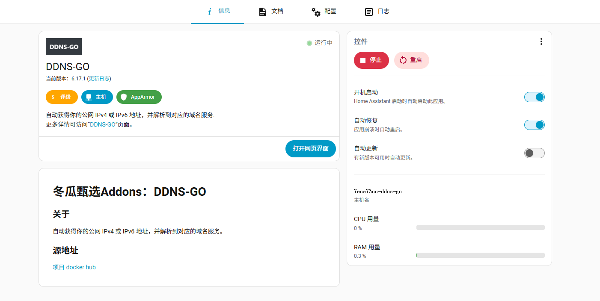

## 远程访问

在设置中的应用中安装ddns-go

 

打开ip:9876的web端配置页面
默认

用户名：admin

密码：admin1

我使用的是阿里云，所以填上了AccessKey ID和AccessKey Secret，然后在IPv6中指定了域名

最后需要在ha的设置—>网络中配置好Home Assistant 网址为http://域名:8123

## 安卓app

手机端app下载链接https://github.com/home-assistant/android/releases/
因为我的是华为手机，下载app-minimal-release.apk，核心功能精简版。不依赖 Google Play 服务。

## 语音助手

整体流程分三步：**安装必要插件 → 获取 DeepSeek API 密钥并配置 → 创建并使用语音助手**。

### 🛠️ 第一步：安装必要的插件

首先需要安装两个插件，这需要在 **HACS（Home Assistant Community Store）** 里完成。如果还没安装 HACS，需要先安装它。

1. **安装 Extended OpenAI Conversation 插件**
   - 这个插件是核心，它让 Home Assistant 能够与 DeepSeek 这类兼容 OpenAI 格式的模型对话。
   - 在 HACS 中搜索 `Extended OpenAI Conversation` 进行安装。如果搜不到，需要在 HACS 的自定义仓库中添加它的 GitHub 地址：`https://github.com/jekalmin/extended_openai_conversation`。
2. **安装 Environment Variable 插件**
   - 这个插件用来设置环境变量，告诉 HA 去哪个地址找 DeepSeek 的 API。
   - 同样在 HACS 中搜索 `Environment Variable for Home Assistant` 并安装。如果搜不到，添加它的仓库地址：`https://github.com/Athozs/hass-environment-variable`。

> 两个插件安装完成后，**都需要重启 Home Assistant** 才能生效。

### ⚙️ 第二步：配置 DeepSeek 连接

1. **获取 DeepSeek API 密钥**

   - 访问 DeepSeek 官网平台，注册或登录后，在 API Keys 页面创建一个新的密钥。**复制并妥善保存这个密钥**，配置时需要用到。

2. **设置环境变量**

   - 在 Home Assistant 的 `configuration.yaml` 文件中，添加以下配置，告诉系统 DeepSeek API 的访问地址：

     yaml

     ```
     environment_variable:
       OPENAI_BASE_URL: "https://api.deepseek.com/v1"
     ```

   - 保存文件并再次重启 Home Assistant 使配置生效。

3. **添加 Extended OpenAI Conversation 集成**

   - 进入 **设置 → 设备与服务 → 添加集成**，搜索并选择 **Extended OpenAI Conversation**。
   - 在弹出的配置窗口中，根据你的需求填写：
     - **Name**: 可随意填写，比如 `DeepSeek`。
     - **API Key**: 粘贴你在第一步获取的 DeepSeek API 密钥。
     - **Base URL**: 如果之前的环境变量配置正确，这里通常会自动填充 `https://api.deepseek.com/v1`。如果没有，请手动填写。

### 🎤 第三步：创建并使用 DeepSeek 语音助手

完成上述配置后，就可以创建属于你的 DeepSeek 语音助手了。

1. **创建新助手**
   - 进入 **设置 → 语音助手**，点击 **添加助手**。
   - 在“对话代理”的下拉菜单中，选择你刚刚创建的 **Extended OpenAI Conversation** 集成（名称就是你刚才填写的，比如 `DeepSeek`）。
   - 为你的助手起个名字，然后点击创建。
2. **开始对话**
   - 创建完成后，在语音助手页面就可以找到你新建的助手，点击 **开始对话** 即可通过文字或语音（需要配置STT）与 DeepSeek 进行交互了。
   - 你可以像和人说话一样给它指令，例如“打开客厅的灯”或“现在室内温度是多少？”。

> 对话时报错
> ```
> Sorry, I had a problem talking to OpenAI: Error code: 400 - {'error': {'message': 'The supported API model names are deepseek-v4-pro or deepseek-v4-flash, but you passed gpt-4o-mini.', 'type': 'invalid_request_error', 'param': None, 'code': 'invalid_request_error'}}
> ```
>
> 进入 **设置 → 设备与服务**，找到你之前添加的 **Extended OpenAI Conversation** 集成，点击“配置”重新编辑。
>
> 在 **Chat Model（聊天模型）** 这个输入框里，把 `gpt-4o-mini` 改成 DeepSeek 支持的模型名称。
>
> 最大token可以设置为1000

