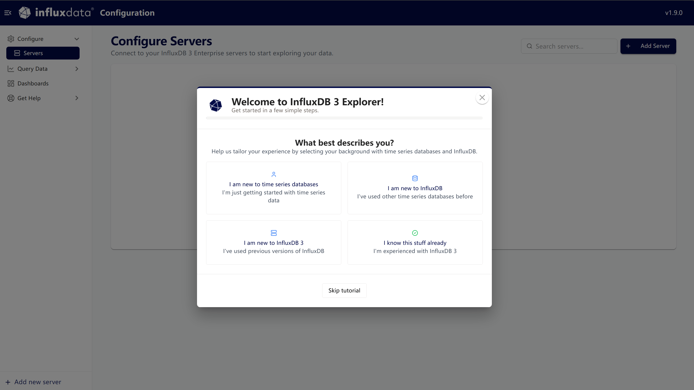

# influxdb

## 一、windows安装

influxdb 3.10.5版本

https://dl.influxdata.com/influxdb/releases/influxdb3-core-3.10.5-windows_amd64.zip


## 二、测试运行

在当前文件夹下打开cmd

```
.\influxdb3.exe --version
```

应该显示：

```
influxdb3 3.10.5
```

------

## 三、创建数据目录

InfluxDB 3 使用新的存储方式，不再是 v2 的：

```
bolt
engine
```

而是类似：

```
Parquet
Object Storage
```

本地文件也可以存储。

例如：

```
D:\influxdb3
 ├── data
 └── wal
```

------

## 四、启动 InfluxDB

示例：
（取消认证token）

```
.\influxdb3.exe serve --node-id node01 --object-store file --data-dir D:\influxdb3\data --without-auth
```

启动后默认监听：

```
8181
```

检查：

```
curl http://127.0.0.1:8181/ping
```

正常会返回版本信息，例如：

```
{"product_name":"InfluxDB 3 Core","version":"3.10.5","revision":"df21654049","process_id":"c8ef660e-ae38-41d1-835f-81ac14376d24"}
```

------

## 五、创建数据库

InfluxDB 3 不叫 bucket，而叫：

```
database
```

例如：

```
influxdb3 create database sensor
```

查看：

```
influxdb3 show databases
```

------

## 六、写入测试数据

例如：

```
influxdb3 write --database sensor "temperature,device=001 value=25.6"
```

>## 各部分含义
>
>| 部分                                  | 含义                            |
>| :------------------------------------ | :------------------------------ |
>| `influxdb3 write`                     | InfluxDB 3.0 的写入子命令       |
>| `--database sensor`                   | 指定要写入的数据库名为 `sensor` |
>| `"temperature,device=001 value=25.6"` | **Line Protocol** 格式的数据行  |
>
>## Line Protocol 数据解析
>
>text
>
>```
>temperature,device=001 value=25.6
>│          │          │
>│          │          └── 字段（Field）：value=25.6（实际数值）
>│          │
>│          └── 标签（Tag）：device=001（索引属性，用于过滤）
>│
>└── 测量名称（Measurement）：temperature
>```
>
>
>
>### 完整含义
>
>这条命令向 `sensor` 数据库中写入一条测量数据：
>
>- **测量名称**：`temperature`（温度）
>- **标签**：设备编号为 `001`（用于快速查询过滤）
>- **字段**：温度值为 `25.6`
>
>### 默认行为
>
>- **时间戳**：未指定，默认使用服务器当前时间
>- **如果没有 `--host` 参数**：默认连接本地 `http://localhost:8080`

查询：

```
influxdb3 query --database sensor "select * from temperature"
```

## 快速入门

InfluxDB是专门用来处理**随时间变化的数据**（比如温度、CPU使用率、股票价格）的数据库。

用一个**“天气预报监测系统”**的例子来理解这4个概念，会直观很多：

------

### 1. Tables（表/测量）

> **是什么**：相当于一个**分类文件夹**，用来存放同一类主题的数据。
> **例子**：你有一个文件夹叫 `weather`（天气数据），专门存放所有与天气相关的记录。

------

### 2. Tags（标签）

> **是什么**：相当于**文件的标签属性**，用来描述“谁”或“哪个设备”产生的数据。它会被建立索引，所以查询速度非常快。适合存放**变化很少**的属性。
> **例子**：记录天气时，你会打上标签 `city=成都` 和 `sensor_id=S001`。这样你要查“成都的所有温度记录”时，瞬间就能过滤出来。

------

### 3. Fields（字段）

> **是什么**：相当于**文件的具体内容**，也就是你真正关心的测量数值。它是数据的主体，会随时间变化，适合做算术运算（如求平均值、求和）。
> **例子**：你关心的实际数据是 `temperature=26.5`（温度26.5度）和 `humidity=80`（湿度80%）。这些数值就是Fields。

------

### 4. Timestamp（时间戳）

> **是什么**：记录这笔数据是**什么时候**生成的。InfluxDB对时间精度要求很高，支持到纳秒级别。
> **例子**：这条数据的时间戳是 `2026-08-04 14:30:00.123456789`，记录了这一刻的天气情况。

------

### 把它们组合在一起看

假如在2026年8月4日下午2点30分，成都的传感器S001测到温度26.5度，湿度80%。在InfluxDB里，这条数据长这样：

| 概念                    | 对应这条数据的值                   |
| :---------------------- | :--------------------------------- |
| **Table（表名）**       | `weather`                          |
| **Tag（标签）**         | `city="成都"` , `sensor_id="S001"` |
| **Field（字段）**       | `temperature=26.5` , `humidity=80` |
| **Timestamp（时间戳）** | `2026-08-04T14:30:00Z`             |

------

### 为什么要区分Tags和Fields？

这是InfluxDB最巧妙的设计：

| 对比             | **Tags（标签）**                      | **Fields（字段）**                           |
| :--------------- | :------------------------------------ | :------------------------------------------- |
| **数据类型**     | 字符串（如地名、编号）                | 数值/布尔值/字符串（如温度、百分比）         |
| **是否建立索引** | ✅ **是**（查询极快）                  | ❌ **否**（避免索引过大拖慢写入速度）         |
| **用途**         | 做**过滤条件**（`WHERE city='成都'`） | 做**数值计算**（`SELECT mean(temperature)`） |
| **是否必填**     | 可选                                  | **必须有至少一个**                           |

# grafana可视化

## 安装

https://grafana.com/grafana/download?platform=windows

## 启动 Grafana

```
cd D:\grafana\bin

.\grafana-server.exe server
```

看到：

```
HTTP Server Listen
address=[::]:3000
```

说明启动成功。

------

## 浏览器访问

服务器本机：

```
http://localhost:3000
```

局域网：

```
http://服务器IP:3000
```

默认账号：

```
用户名:
admin

密码:
admin
```

第一次登录会要求修改密码。

## 开放防火墙

Grafana默认：

```
3000
```

管理员 PowerShell：

```
New-NetFirewallRule `
-DisplayName "Grafana" `
-Direction Inbound `
-Port 3000 `
-Protocol TCP `
-Action Allow
```

------

## 添加 InfluxDB 3 数据源

登录 Grafana：

```
http://服务器IP:3000
```

进入：

```
Connections
    ↓
Data sources
    ↓
Add data source
```

选择：

```
InfluxDB
```

------

## 配置 InfluxDB 3

URL：

```
http://127.0.0.1:8181
```

如果 Grafana 和 InfluxDB 同服务器：

```
http://localhost:8181
```

------

数据库：

例如：

```
sensor
```

------

Query Language：

选择：

```
SQL
```

------

如果你的 InfluxDB 启动：

```
--without-auth
```

则：

Token：

留空。

------

如果启用了 token：

填写：

```
Token
```

------

>`Insecure Connection`需要选上

点击：

```
Save & Test
```

成功：

```
Data source is working
```

------

## 创建第一个监控面板

在创建的`Data sources`中，可以直接`Build a dashboard`

# InfluxDB 3 Explorer

Grafana只能看，不能写，试一试influxdb3 explorer

https://docs.influxdata.com/influxdb3/explorer/install/

```
docker run --detach --name influxdb3-explorer --publish 8888:8080 influxdata/influxdb3-ui:1.9.0
```

访问 http://localhost:8888/

 