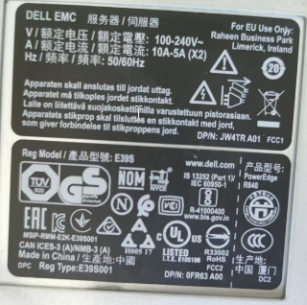
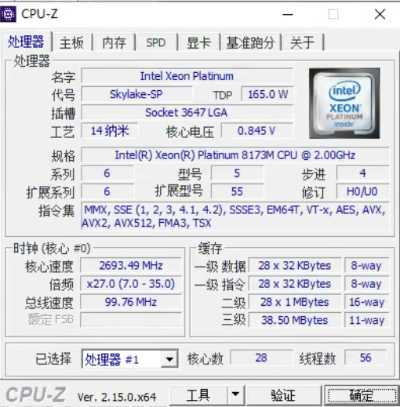
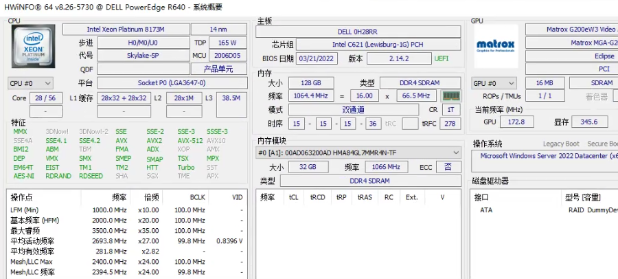
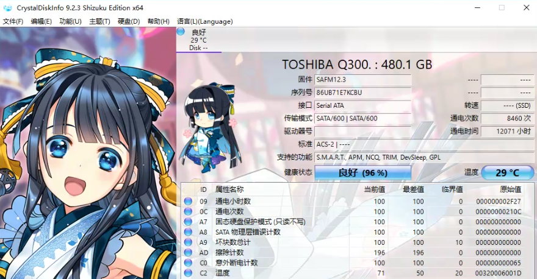
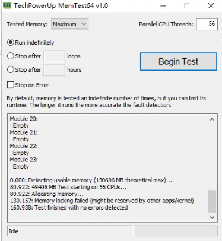
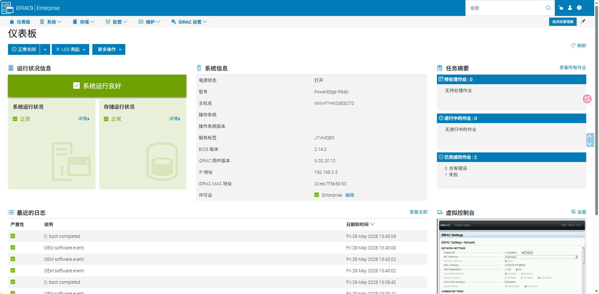

弄来了一台windows server 2022的服务器，5400左右，配置如下

| 机器型号 | 戴尔R640  2.5寸8盘位 1U机架式                                |
| :------- | :----------------------------------------------------------- |
| 处理器   | intel 铂金8173M*2颗，主频2.0G，单颗28核56线程，共56核112线程，正式版 |
| 内存     | SK 16G*8条 ECC内存                                           |
| 固态     | 东芝企业级SSD 480G*1块                                       |
| 硬盘     | 日立SAS企业级1.2T*4块                                        |
| 阵列卡   | 戴尔H730 1G缓存RAID卡，支持RAID0 1 5 10等阵列                |
| 电源     | 戴尔原厂750W EPP高功率电源                                   |
| 其他     | 风扇，主板，机箱均为戴尔原厂正品原装                         |

这台是比较典型的二手企业级服务器配置，核心目标是确认：

- 配件是不是和宣传一致
- 有没有“ES/QS测试版CPU”
- 硬盘是否有大量通电或坏道
- 内存是否混插/降频
- 阵列卡、电源、风扇是否正常
- 有没有隐藏故障（掉盘、报警、过热、啸叫）

这台配置里最关键的是：

- 双路 Intel Xeon Platinum 8173M
- Dell PowerEdge R640
- Dell PERC H730

其中 8173M 很多人会卖 ES/QS 测试版，所以 CPU 必须重点验。

------

# 一、先看外观（到货第一时间）

## 1. 看机箱和标签

重点：

- 服务标签（Service Tag）
- SN序列号
- 是否有撬痕
- 风扇是否齐全
- 电源是否双电源
- 硬盘托架是否原装

R640 正常前面类似：

- 8个2.5寸盘位
- 左耳朵有信息标签

 

------

# 二、先不要装业务

先做：

- 裸机测试
- 压力测试
- 硬盘检测

不要直接上线。

------

# 三、进 BIOS 验配置

开机按：

- F2 → BIOS
- F10 → Lifecycle Controller

重点检查：

## CPU

确认：

- 两颗CPU都识别
- 型号是：
  - Platinum 8173M
- 频率正常
- 没显示：
  - ES
  - QS
  - Engineering Sample

如果出现：

- Genuine Intel(R) CPU 0000
- ES
- QLxx

那就是测试版。

------

## 内存

检查：

- 总容量：
  - 128GB
- 是否全部识别
- 频率是否正常

8173M 一般支持：

- DDR4 ECC RDIMM
- 2666MHz

如果只跑 2133：
可能有混插。

### 实际情况

```
> wmic memorychip get manufacturer,partnumber,speed,capacity
Capacity     Manufacturer  PartNumber        Speed
34359738368  00AD063200AD  HMA84GL7MMR4N-TF  2133
34359738368  00AD063200AD  HMA84GL7MMR4N-TF  2133
34359738368  00AD063200AD  HMA84GL7MMR4N-TF  2133
34359738368  00AD063200AD  HMA84GL7MMR4N-TF  2133
```

> 16x8变32x4了,问了卖家说因为价格波动

整体上属于：

- 内存一致性很好
- 不是混插
- 但确实是老一代2133 ECC服务器内存

其中：

```
HMA84GL7MMR4N-TF
```

是：

SK hynix 的企业级服务器内存。

### 性能会差多少

对于：

Intel Xeon Platinum 8173M

理论最佳：

```
DDR4-2666
```

你现在：

```
DDR4-2133
```

内存带宽大概会低：

```
15%~25%
```

------

### 对哪些场景影响大

#### 影响明显

- 大量虚拟机
- 数据库
- AI训练
- 高并发缓存
- NUMA重负载

------

#### 影响不大

- NAS
- Docker
- HomeLab
- 轻量虚拟化
- 工业控制
- 网关
- 视频转发
- ZLMediaKit
- OPC UA
- 数字孪生中低负载

#### 真正的问题其实是“只插4条”

这个比2133更值得注意。

## 

双路：

- 2颗CPU

每颗CPU：

- 6通道内存

理论：

```
2 × 6 = 12通道
```

但现在：

```
只有4条内存
```

大概率：

- 每CPU只用了2通道

内存带宽损失会比较明显。

> ```
> > wmic MEMORYCHIP get BankLabel,DeviceLocator,Capacity BankLabel Capacity DeviceLocator 
> 34359738368 A1 
> 34359738368 A2 
> 34359738368 B1 
> 34359738368 B2
> ```
>
> 目前内存布局是正常的，没有明显翻车。
>
> 现在是：
>
> | 插槽 | 容量 |
> | ---- | ---- |
> | A1   | 32GB |
> | A2   | 32GB |
> | B1   | 32GB |
> | B2   | 32GB |
>
> 这说明：
>
> - 双CPU都有内存
> - 不是只插单路
> - 至少做了基础均衡

------

#### 最佳方案

```
32GB × 8
```

更豪华方案。

------

## 阵列卡

确认：

- H730 是否识别
- RAID状态正常
- 没有 Foreign Configuration

------

# 四、进 Windows Server 2022 后验机

推荐图吧工具箱

建议先安装：

## 1. CPU-Z

查看：

- CPU型号
- 主板
- 内存频率

重点：

Specification规格 必须正规。

 

------

## 2. HWiNFO

推荐，非常适合验服务器。

查看：

- CPU温度
- 风扇
- 内存ECC
- 电源状态
- SAS盘健康

 

------

# 五、重点：检查CPU是不是正式版

最关键。

Windows PowerShell：

```powershell
wmic cpu get name
```

正常应该类似：

```text
Intel(R) Xeon(R) Platinum 8173M CPU @ 2.00GHz
```

再用：

```powershell
cpu-z
```

看：

- Stepping步进
- Revision修订

如果是 ES/QS：
通常会标：

- ES
- QL1K
- QL28
- Engineering Sample

------

# 六、检查硬盘健康（重点）

你这个：

- 480G SSD
- 4块1.2T SAS

很多二手盘通电时间很长。

建议安装：

## CrystalDiskInfo

检查：

- 通电时间
- 健康度
- 坏块
- 温度

 

------

## 企业级 SAS 盘建议

用：

- smartctl
- HWiNFO

因为有些 SAS 盘：
CrystalDiskInfo 看不全。

------

# 七、检查 RAID

打开：

- Dell OpenManage
  或者
- PERC BIOS

看：

- RAID是否正常
- 是否降级
- 是否有 Predictive Failure

重点：

不能有：

- Degraded
- Foreign
- Failed

------

# 八、做压力测试（非常重要）

二手服务器必须压测。

------

## CPU压力测试

推荐：

- Prime95
- AIDA64

测试：

- 30分钟~2小时

观察：

- 是否死机
- 是否降频
- 温度是否过高

------

## 内存测试

推荐：

- MemTest86

至少跑：

- 1轮完整测试

不能有 Error。

 

------

## 硬盘测试

推荐：

- HD Tune
- CrystalDiskMark

看：

- 是否掉速
- 是否有坏块

------

# 九、检查 iDRAC

R640 自带：

Dell iDRAC

这个非常重要。

浏览器访问：

```text
https://服务器IP
```

> 默认账号密码
>
> 如果没改过：
>
> 老版本（常见）
> 用户名：root
> 密码：calvin

检查：

- 风扇报警
- CPU报警
- 电源报警
- RAID报警
- SEL日志

重点查看：

- Lifecycle Log
- System Event Log

如果有：

- CPU CATERR
- ECC Error
- PCIe Error

要小心。

 

------

# 十、检查噪音和散热

R640 是 1U。

正常现象：

- 开机风扇暴转
- 待机后回落

不正常：

- 长期飞机起飞声
- 风扇锁满速
- 温度90℃+

可能：

- 风扇缺失
- 非原装配件
- BIOS策略异常

------

# 十一、检查许可证

Windows Server 2022：

确认：

```powershell
slmgr /dlv
```

看：

- 是否激活
- 是否为批量许可证
- 是否有时间限制

------

# 十二、这套配置实际情况

这配置适合：

- Proxmox VE
- VMware ESXi
- Microsoft Hyper-V
- Docker/K8s
- 工业数字孪生
- AI推理
- 私有云
- NAS
- 多虚拟机

56核112线程 + 128G：
跑几十个轻量VM没问题。

但注意：

8173M 单核性能一般，
更偏：

- 虚拟化
- 多任务
- 并发

不是高频低延迟场景。

------

# 十三、建议重点排查的风险

## 高风险项

### 1. ES/QS CPU

最常见。

### 2. SAS盘寿命

很多是数据中心退役盘。

### 3. 风扇噪音

1U服务器非常吵。

### 4. 电源老化

看是否报警。

### 5. H730缓存电池

容易坏。

------

# 十四、最推荐的一套验机流程（实际）

顺序建议：

1. 外观检查
2. BIOS看CPU/内存
3. iDRAC日志
4. Windows启动
5. CPU-Z验CPU
6. CrystalDiskInfo验盘
7. MemTest86测内存
8. Prime95压CPU
9. RAID状态检查
10. 连续运行24小时

只要：

- 不死机
- 不报ECC
- 不掉盘
- 不过热

基本就稳了。