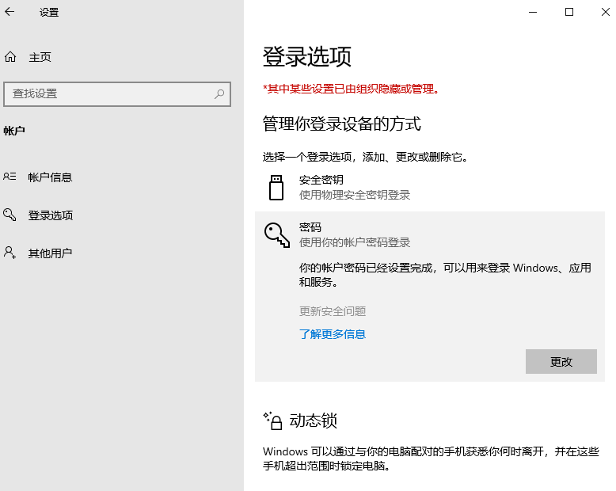
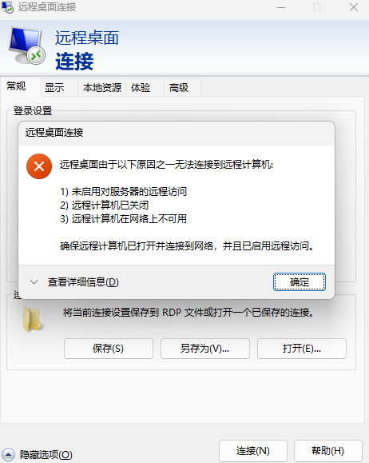
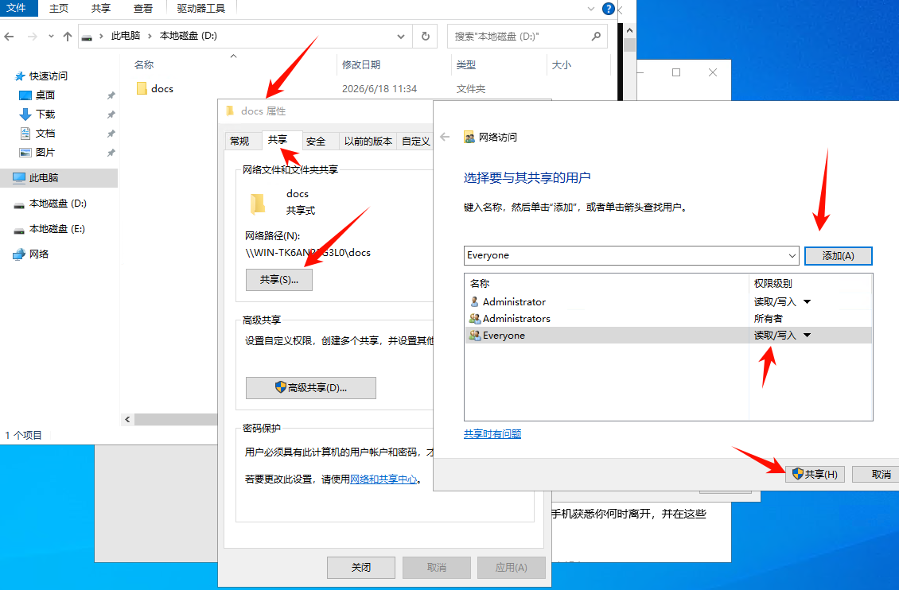

根据自己最近的项目，总结了一些对自己适用的流程以及套路模板

# windows

## 更改默认密码

 

## 桌面远程

远程时出现下面的问题

 

**开启该功能**

按 `Win + I` 打开“设置” -> “系统” -> “远程桌面”，确保“启用远程桌面”的开关处于**开启**状态。

### 注意

如果发生卡顿，是因为当 Windows 服务器检测不到物理显示器时，为了省电，它会**停止渲染图形界面（GUI）**，把帧率锁死在极低状态（比如 1-2 FPS）。此时你用远程桌面连上去，操作会感觉像“幻灯片”一样，拖动窗口都有拖影。

**方法一：购买 HDMI 虚拟显示器诱骗器（推荐，效果最好）**
这是一个像 U 盘一样的小东西，插在服务器的 HDMI 或 DP 接口上。

- **原理**：它向系统发送一个“4K/1080P 显示器已连接”的硬件信号。
- **效果**：显卡会满血工作，远程桌面瞬间丝滑，甚至能开启 60Hz 刷新率。
- **价格**：淘宝或京东上大概 20-30 元，性价比极高。

**方法二：修改组策略（强制启用硬件加速，软件方案）**
如果暂时买不到诱骗器，可以尝试在服务器上修改策略，强制让系统不关闭图形渲染。

- 按 `Win + R`，输入 `gpedit.msc` 并回车（家庭版可能没有此功能）。
- 依次找到：**计算机配置** -> **管理模板** -> **Windows 组件** -> **远程桌面服务** -> **远程桌面会话主机** -> **远程会话环境**。
- 在右侧找到：**使用硬件图形适配器进行所有远程桌面会话**。
- 双击，设置为 **“已启用”**。
- 重启服务器生效。

### 关闭解锁组合键

在远程的时候，Ctrl + Alt + Delete解锁时会和本机冲突，所以关闭掉。

1. 按 `Win + R` 键打开运行窗口，输入 `secpol.msc` 并回车，打开“本地安全策略”。
2. 在左侧导航栏依次展开：“安全设置” -> “本地策略” -> “安全选项”。
3. 在右侧的列表中找到并双击 **“交互式登录: 无需按 Ctrl+Alt+Del”**。
4. 在弹出的属性窗口中，选择 **“已启用”**，然后点击“确定”保存。

## 共享文件夹

创建一个共享文件夹，以便在局域网中可以方便快捷的传输文件。

 


## WOL

详情可以查看[WOL开机唤醒 | Ean7的小站](https://ean7.top/posts/wol开机唤醒/)

## IIS

详情可以查看[windows server 2022 部署前后端项目 | Ean7的小站](https://ean7.top/posts/windows-server-2022-部署项目/)

## BMC/IPMI

判断一台服务器是否支持 **BMC / IPMI**，可以从“硬件 + 系统 + 网络表现”三层来确认，最可靠的是硬件层验证。

### 最直接方法：看硬件是否有 BMC

### 看主板/服务器型号

去查服务器型号（非常关键）：

- Dell：iDRAC（本质 BMC/IPMI）
- HPE：iLO
- Lenovo：XClarity Controller
- 超微 Supermicro：IPMI/BMC（最典型）

👉 如果是这些品牌的“服务器级主板”，基本 100% 有 BMC/IPMI。

------

### 看物理接口（最简单判断）

在机器背面找：

- 独立管理网口（常见标记）
  - “iDRAC”
  - “IPMI”
  - “MGMT”
  - “BMC”

👉 有“单独一个 RJ45 管理口” = 几乎肯定有 BMC/IPMI

###  BIOS / UEFI 里检查

进 BIOS/UEFI，看：

- “Server Management”
- “BMC Settings”
- “IPMI Configuration”
- “iDRAC / iLO / XClarity”

如果有这些菜单：

👉 说明一定支持 BMC

------

### 确定ip地址

#### 扫描局域网

```
nmap -sn 192.168.1.0/24
```

重点找：

- 多出来一个未知设备
- 或 MAC 属于：
  - Dell
  - HPE
  - Supermicro

> 拔插前后对比扫描出来的结果，增加的那一个ip就是了

## 推荐的软件安装

### 微软运行库

https://aka.ms/vs/17/release/vc_redist.x64.exe

### RustDesk

[RustDesk：开源远程桌面与自建服务器解决方案](https://rustdesk.com/zh-cn/)

虽然windows自带远程桌面，但有时不怎么好用，可以试一试RustDesk

1. **下载安装客户端**：在两台电脑上分别从官方网站（https://rustdesk.com/）下载并安装 RustDesk 客户端。
2. **被控端设置（关键一步）**：在**被控制**的那台电脑上，打开 RustDesk 的右上角设置，找到“安全”选项，然后“解锁安全设置”，最后勾选 **“允许IP直接访问”**。
   1. 同时把固定密码设置了
3. **获取被控端 IP 地址**：在被控端电脑上，按 `Win + R` 键，输入 `cmd` 打开命令提示符，再输入 `ipconfig` 并回车。在输出信息中找到它的 **IPv4 地址**，格式通常类似 `192.168.x.x`。
4. **控制端发起连接**：在控制端的 RustDesk 主界面，不要输入 ID，直接在输入框中输入刚才记下的 IP 地址（例如 `192.168.1.105`），然后点击“连接”即可。

**验证成功：** 如果连接成功，说明你已经在用“局域网直连”模式了。可以拔掉路由器连接外网的网线，或者断开 WiFi 的互联网连接后再次测试，会发现连接依然稳定。

### 图吧工具箱

[图吧工具箱官方网站 - DIY爱好者的必备工具合集](https://www.tbtool.cn/)

### 7z

[Download](https://7-zip.org/download.html)

### Everything

[Everything - voidtools](https://www.voidtools.com/zh-cn/support/everything/)

### 搜狗输入法

[搜狗输入法-官网](https://shurufa.sogou.com/windows) 

# Ubuntu

## 防火墙

### 查看当前防火墙状态

先确认是不是 UFW：

```
sudo ufw status
```

- `Status: active` → 防火墙开启
- `Status: inactive` → 防火墙关闭

------

### 关闭防火墙（UFW）

#### 立即关闭

```
sudo ufw disable
```

执行后会显示：

```
Firewall stopped and disabled on system startup
```

------

#### 完全关闭 + 开机不启动

```
sudo systemctl disable ufw
sudo systemctl stop ufw
```

------

## ssh

### 安装 SSH 服务端

```
sudo apt update
sudo apt install openssh-server -y
```

------

### 启动 SSH 服务

```
sudo systemctl enable ssh
sudo systemctl start ssh
```

------

### 检查是否成功

```
sudo systemctl status ssh
```

你应该看到：

```
Active: active (running)
```

------

### 确认 22 端口监听

```
sudo ss -tlnp | grep ssh
```

正常应该输出：

```
0.0.0.0:22
```

------

### 放行 SSH

```
sudo ufw allow ssh
```

或：

```
sudo ufw allow 22/tcp
```

## Miniconda

### 下载

进入终端：

```bash
cd ~
```

下载最新版（Linux x86_64）：

```bash
wget https://repo.anaconda.com/miniconda/Miniconda3-latest-Linux-x86_64.sh
```

如果你的机器是 ARM（例如 Orange Pi、RK3588）：

```bash
uname -m
```

如果输出：

```
aarch64
```

则下载：

```bash
wget https://repo.anaconda.com/miniconda/Miniconda3-latest-Linux-aarch64.sh
```

如果输出：

```
x86_64
```

则下载：

```bash
wget https://repo.anaconda.com/miniconda/Miniconda3-latest-Linux-x86_64.sh
```

------

>下载太慢，可以访问https://repo.anaconda.com/miniconda/Miniconda3-latest-Linux-x86_64.sh手动下载。
>
>下载好了 `Miniconda3-latest-Linux-x86_64.sh`后
>
>先添加权限，然后直接安装
>
>```bash
>chmod +x Miniconda3-latest-Linux-x86_64.sh
>./Miniconda3-latest-Linux-x86_64.sh
>```

### 运行安装程序

x86：

```bash
bash Miniconda3-latest-Linux-x86_64.sh
```

ARM：

```bash
bash Miniconda3-latest-Linux-aarch64.sh
```

安装过程中：

```
Press ENTER to continue
```

一直按 Enter。

然后：

```
Do you accept the license terms? [yes|no]
```

输入：

```
yes
```

安装目录建议直接默认：

```
/home/user/miniconda3
```

最后会问：

```
Do you wish the installer to initialize Miniconda3?
```

输入：

```
yes
```

------

### 刷新环境

关闭终端重新打开，或者执行：

```bash
source ~/.bashrc
```

------

### 验证安装

```bash
conda --version
```

例如：

```
conda 25.5.1
```

查看安装位置：

```bash
which conda
```

例如：

```
/home/user/miniconda3/bin/conda
```

------

### 创建开发环境

例如创建一个 Python 3.12 环境：

```bash
conda create -n yolo python=3.10
```

激活：

```bash
conda activate yolo
```

提示符会变成：

```
(yolo) user@ubuntu:~$
```

此时：

```bash
python --version
pip --version
```

都会指向这个环境。

以后：

```bash
pip install -r requirements.txt
```

## 镜像源

### conda镜像源

```bash
conda config --add channels https://mirrors.tuna.tsinghua.edu.cn/anaconda/pkgs/main/
conda config --add channels https://mirrors.tuna.tsinghua.edu.cn/anaconda/pkgs/r/
conda config --set show_channel_urls yes
```

### pip 镜像源

创建配置文件：

```
mkdir -p ~/.pip
nano ~/.pip/pip.conf
```

写入：

```
[global]
index-url = https://pypi.tuna.tsinghua.edu.cn/simple
trusted-host = pypi.tuna.tsinghua.edu.cn
```

保存退出（Ctrl + X → Y → Enter）

验证是否生效：

```
pip config list
```

## pytorch

指定安装链接

```bash
pip install torch torchvision torchaudio --index-url https://download.pytorch.org/whl/cu121
```

验证cuda

```bash
python -c "import torch; print(torch.cuda.is_available())"
```

应该输出True

## WOL远程唤醒

使用`ifconfig`查看网卡名称以及对应的ip

如果没有先安装
```bash
sudo apt install net-tools
```

### 检查是否支持WOL

```bash
ethtool <正确网卡名> | grep Wake-on
```

>ethtool工具也需要安装
>
>```bash
>sudo apt install ethtool
>```

如果输出

`Supports Wake-on: pumbg`或者

`Supports Wake-on: g`，则表示支持WOL

其中的`g`表示 Magic Packet（魔术包 ），是标准 WOL 唤醒方式

### 设置

```bash
# 1. 设置
nmcli connection modify netplan-enp3s0 802-3-ethernet.wake-on-lan magic

# 2. 立即生效验证
nmcli connection up netplan-enp3s0

# 3. 检查
ethtool enp3s0 | grep Wake-on

# 4. 最终验证
reboot
```

其中`enp3s0`替换为对应的网卡名

### 唤醒

一行命令

```powershell
$mac="00-11-22-33-44-55";$macBytes=($mac -split '[:-]'|%{[Convert]::ToByte($_,16)});$b=([byte[]](,0xFF*6))+([byte[]]($macBytes*16));$u=New-Object Net.Sockets.UdpClient;$u.Send($b,$b.Length,"192.168.0.255",9);$u.Close()
102
```

替换其中的mac地址和网段即可

## 其他工具推荐

### btop

安装

```
sudo apt install btop
```

`btop` 是一个在 Linux / macOS / WSL 上用的 **终端系统监控工具**，可以理解为：

> 👉 `top / htop` 的高级美化增强版

打开 `btop` 后，你会看到一个实时仪表盘，包括：

#### 🧠 CPU

- 每个核心的使用率
- 温度（如果支持）
- 频率

#### 🧮 内存

- RAM 使用
- Swap 使用

#### 💽 磁盘

- 读写速度
- 分区使用情况

#### 🌐 网络

- 上下行速度
- 实时流量

#### 🔥 进程管理

- 类似 htop
- 可 kill / sort / filter 进程

### git

`sudo apt install git`

### nodejs

#### 使用 NodeSource 仓库

这个方法会将 Node.js 官方维护的仓库添加到你的系统中，之后用 `apt` 安装的就是较新的特定大版本（如 18.x、20.x 或 22.x），适合需要特定稳定版本的生产环境或开发环境。

操作步骤如下（以安装 Node.js 20.x（当前活跃的 LTS 版本）为例）：

1. **更新包列表并安装 `curl`（如果未安装）**：

   bash

   ```
   sudo apt update
   sudo apt install curl -y
   ```

   

2. **添加 NodeSource 仓库**：运行以下命令，脚本会自动配置好 APT 源。

   bash

   ```
   # 将 setup_22.x 中的 22 替换为你想要的版本号，例如 setup_18.x 或 setup_20.x
   curl -fsSL https://deb.nodesource.com/setup_22.x | sudo -E bash -
   ```

   

3. **安装 Node.js（包含 `npm`）**：

   bash

   ```
   sudo apt install -y nodejs
   ```

   

4. **验证安装**：

   bash

   ```
   node -v  # 例如，会显示 v20.x.x
   npm -v   # 显示对应的 npm 版本
   ```

### ffmpeg

```bash
sudo apt-get update
sudo apt-get install -y ffmpeg
```


