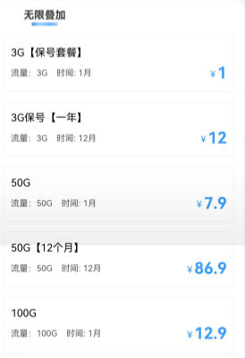
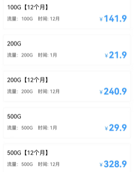
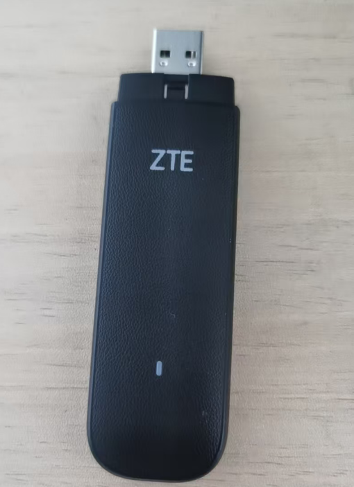
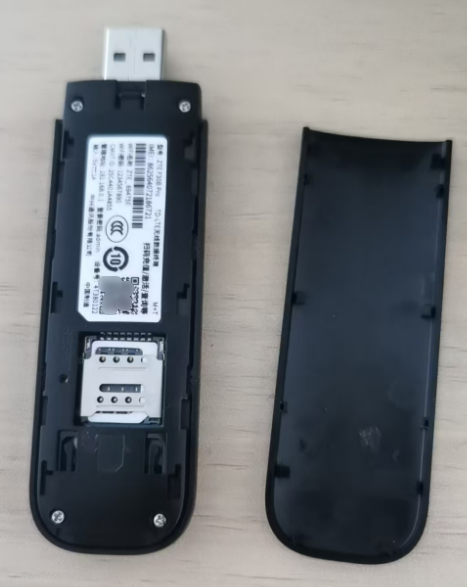
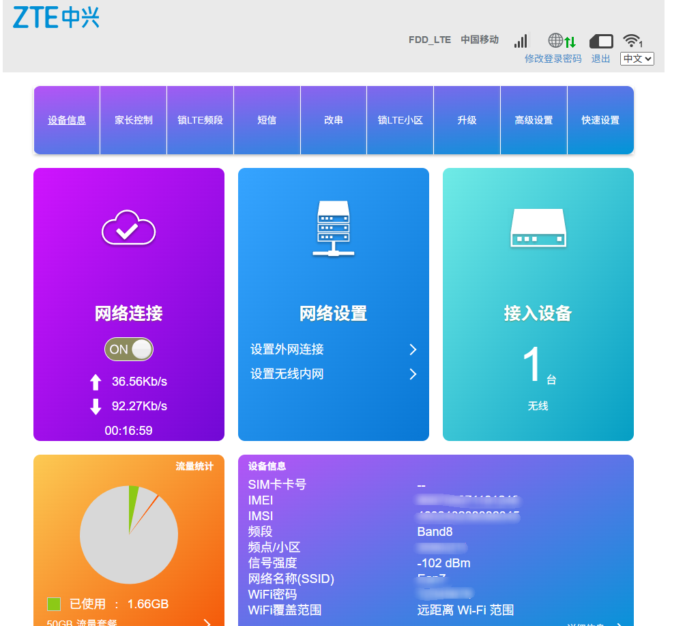
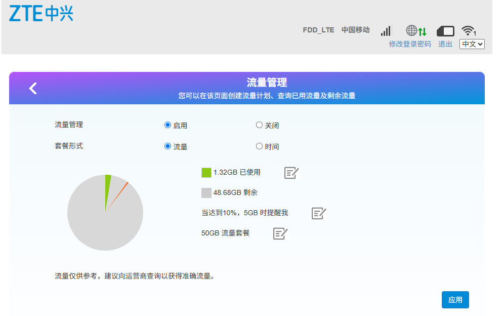
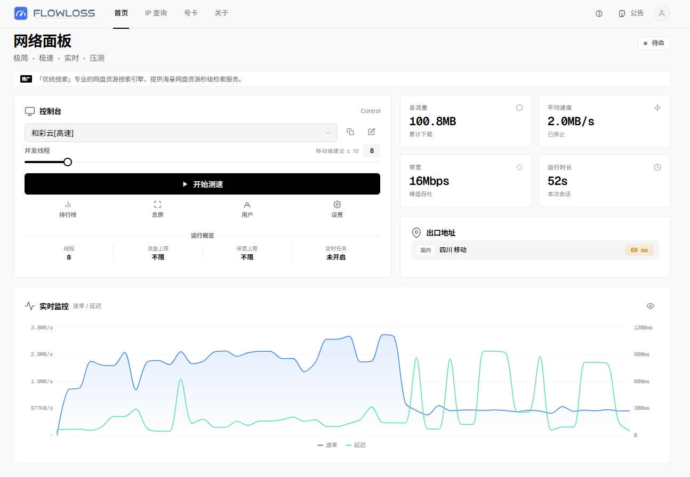
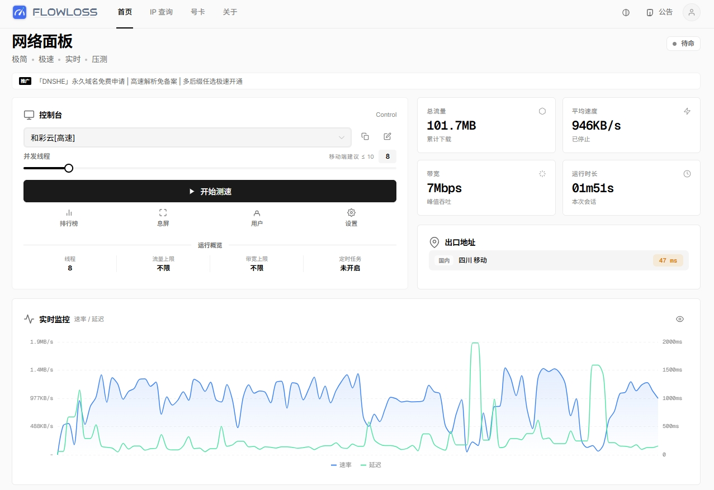
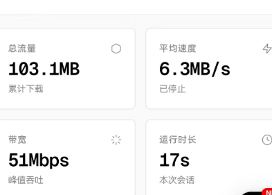

## 使用背景

在家里和公司都有wifi，在外面才使用流量，使用的场景不多。所以手机套餐一直是4g的资费，每个月有10g的流量，基本上够用。但有时出差，这时候流量基本上不够用了，因为需要手机给电脑开热点。所以现在有了尝试一下随身wifi的想法，听说资费要便宜点。

经过多方对比和性价比权衡，考虑自己对网速的需求不是很高，1~3MB/s都是可以接受的，所以选择了一款4g的随身wifi——**中兴ZTE F30B PRO**。

## 资费

我是在闲🐟上买的去控款，45元，内置的小鲸智联。

无预存，随时充随时用，可以无限叠加，这样即使跑路了也不会心疼。也支持插自己的sim卡。

小鲸智联的资费如下，我买了7.9元50g试试水。（性价比挺高，手机流量价格可是10元5GB）

 

## 外观

   

## 管理界面详情

**信号强度 -102 dBm**

- 信号强度用 dBm（分贝毫瓦）表示，数值越接近 0 越强。
- **-102 dBm** 表示信号比较弱，一般来说：
  - -50 ~ -70 dBm → 信号很好
  - -70 ~ -90 dBm → 信号一般
  - -90 ~ -110 dBm → 信号弱
  - <-110 dBm → 信号非常弱，可能会掉线

##  流量管理

 

## 测试

测试网页：[FlowLoss - 实时感知网络质量，精准定位连接异常](https://net.arsn.cn/)

速度和信号强弱有很大的关系。

---

直插充电宝，连接wifi

有波动，影响不大 

---

usb口插入电脑

 

按理说应该更快，怎么实际这么拉跨

---

在开阔的地点

 

牛的，速度基本上拉满

## 吐槽

+ 在造型上太长条了，插在笔记本上，不小心碰到碰着可能会损伤USB口。

+ 插在USB口的时候可能会挡住其他接口的正常使用。

## 总结 

👍这款产品和资费完美的契合了我现在的需求。

现在就是看看能不能经得起时间的考验了，比如流量是不是虚标，资费会不会涨价，以后会不会跑路等。