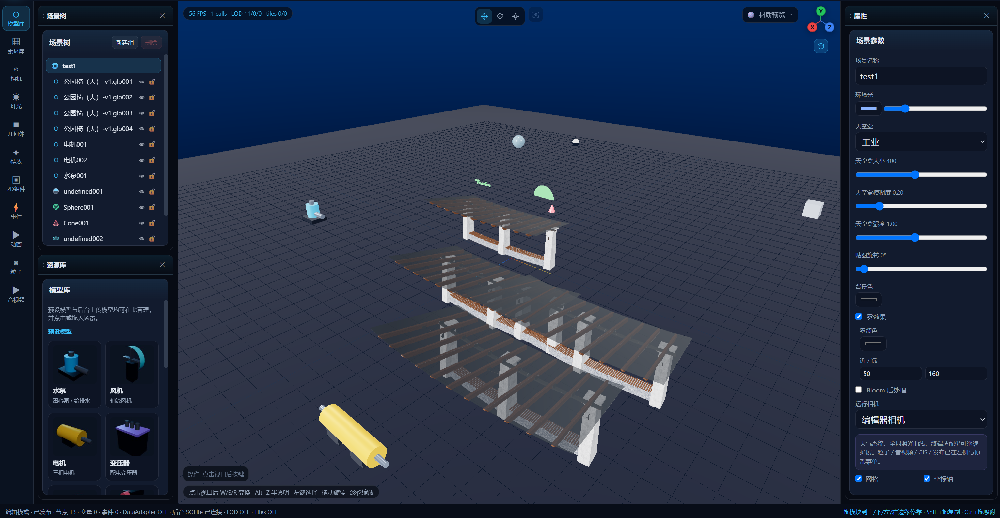

---
title: "数字孪生建模及场景搭建平台"
date: 2026-08-20
description: "基于 Vue 3 + Three.js 的 Web 端数字孪生编辑器：场景搭建、模型导入、数据绑定、事件联动与预览发布，浏览器内即可完成，无需客户端插件。"
cover:
  image: image-20260820174908591.png

---

 

# 孪生智造 · 数字孪生 3D 可视化建模平台

项目地址：[YQisme/TwinCraft](https://github.com/YQisme/TwinCraft)

基于 **Vue 3 + Three.js** 的 Web 端数字孪生编辑器（MVP）。浏览器内即可完成场景搭建、模型导入、数据绑定、事件联动与预览发布，无需安装客户端插件。

当前版本面向演示与原型验证，核心编辑与渲染链路可运行。
轻量化、协同、大文件解析、真实 IoT 等为演示级实现，接入生产前需对接自有后端与数据源。

---

## 功能概览

### 场景编辑

- **编辑 / 预览双模式**：编辑态提供完整工具栏与变换器；预览态隐藏编辑面板并启动孪生运行时（数据源、事件、脚本）。
- **可停靠布局**：场景树、资源库、属性为独立模块，可分别隐藏、拖动悬浮、调整大小，并停靠到视口 **上 / 下 / 左 / 右**；布局写入 `localStorage`，刷新后保持。
- **层级树**：节点树浏览、拖拽调整父子关系、重命名、显隐与锁定；支持 **Ctrl 多选**、**Shift 连续多选**，删除作用于全部选中项。
- **变换控制器**：视口正上方图标工具栏切换移动 / 旋转 / 缩放（W / E / R 或 1 / 2 / 3），以及聚焦选中（F）；风格对齐 Blender 精简图标。
- **标准视图**：视口右上角导航 gizmo（透视立方体 + X/Y/Z 轴点）切换透视图、顶视图、左视图、正视图；正交视图下锁定旋转，左键平移。
- **着色模式**：右上角下拉选择线框 / 实体 / 材质预览 / 渲染预览（默认材质预览），对齐 Blender 视口着色。
- **半透明（X-Ray）**：Alt+Z 快速开关，或在着色下拉菜单中切换；开启后物体半透明以便观察遮挡关系。
- **Shift + 拖 gizmo**：在原位生成副本并拖动新物体（关联复制手势）。
- **Ctrl + 拖移动**：吸附到网格、其它物体包围盒边 / 面 / 中心、角点与枢轴，便于对齐。
- **属性面板**：位置 / 旋转 / 缩放、几何体参数、材质（颜色、金属度、粗糙度）、灯光与相机参数；数值可在参数上 **左右拖动** 调节（Shift 精细 / Alt 粗调）。
- **撤销 / 重做**：Ctrl+Z / Ctrl+Y（或 Ctrl+Shift+Z）；连续拖动变换等会合并为一步。
- **复制粘贴**：Ctrl+C / Ctrl+V，Ctrl+D 复制节点。

### 资产与建模

- **模型库**：管理预设设备模型与用户上传（含后台同步）的 GLB / glTF / OBJ；可在库中导入、替换、删除、重命名，并点击或拖入场景。FBX / STL 入口预留（第一阶段暂不解析）。
- **预设模型**：水泵、风机、电机、变压器、机器人、摄像头等工业设备占位模型。
- **素材库**（不含 3D 模型）包含四个子库，条目均可**拖入场景**：
  - **材质库**：预设材质 + 自定义材质；点击应用到选中物体，或拖到物体上应用；拖到空地生成材质样板立方体。
  - **图片库**：导入并管理图片；拖入场景生成立式贴图平面。
  - **视频库**：导入并管理视频；拖入场景在落点生成视频平面。
  - **序列帧库**：导入并管理序列帧图片；拖入场景生成贴图平面。
- **几何体**：空节点、平面、立方体、球、圆柱、圆锥、圆盘、圆环、地形、3DText、环形结、线条；左侧可点击或拖入场景，悬浮卡片可查看说明；右侧按类型编辑尺寸、精度等参数（详见「使用说明 → 几何体」）。
- **灯光**：平行光、点光源、聚光灯、半球光；左侧灯光库可点击或拖入场景，悬浮卡片可查看说明。平行光 / 点光 / 聚光支持阴影；半球光为天空色 + 地面色的柔和环境光，不投射阴影。
- **相机**：多相机、FOV / 近远裁剪面，场景可指定活动相机。
- **自动轻量化（演示）**：导入模型后走网格简化 + Draco / KTX2 管线演示，报告压缩率与三角面变化。

### 视觉与大场景

- **视口着色（Blender 风格）**：
  - **线框**：只显示边线，便于观察拓扑，性能开销最低。
  - **实体**：简单光照的实体表面，适合摆放与建模。
  - **材质预览**（默认）：显示材质与纹理，使用环境光预览，不依赖场景灯。
  - **渲染预览**：使用场景真实灯光、阴影与 Bloom 等后期，接近成片效果。
- **半透明模式**：与上述着色模式独立叠加；Alt+Z 切换。
- **环境特效**：天空盒（工业蓝 / 摄影棚 / 黄昏 / 纯色）、雾、Bloom、描边、暗角、FXAA、阴影。
- **粒子**：烟雾、火花、雪、火焰发射器。
- **音视频**：场景内视频 / 音频节点（循环、音量、播放控制）。
- **LOD**：按相机距离切换 LOD0 / LOD1 / LOD2。
- **3D Tiles 演示**：按视野加载 / 卸载网格瓦片，适合园区级场景。
- **GIS 坐标**：设置场景原点经纬度，局部坐标与地理坐标换算。
- **性能面板**：FPS、DrawCall、三角面、几何体 / 纹理数量、LOD 分布与已加载瓦片。
- **演示场景**：空场景、演示工厂、园区大场景（文件菜单一键加载）。

### 数字孪生运行时

数据不直接绑到网格，而是走 **数据源 → 全局变量 → 绑定 / 事件 / UI / 脚本**：

| 模块 | 说明 |
|------|------|
| 全局变量 | 场景内共享数据，如 `Global.Temperature`；UI 可用 `{{Temperature}}` |
| 数据源 | 模拟序列、HTTP、WebSocket、MQTT；支持 `mock://equipment` 联调 |
| 属性绑定 | 变量驱动节点 / UI 的颜色、显隐、透明度、自发光、进度等 |
| 事件 | 点击、双击、悬停、离开、数据阈值、定时器；动作包括改色、显隐、动画、报警、跑脚本 |
| 2D HUD | 文本、标签、面板、按钮、进度条、仪表、图表，叠加在视口上 |
| 动画 | 位移动画片段（位置 / 旋转 / 缩放 / 透明度），可循环与自动播放 |
| 时间轴 | 预览时播放场景时间线 |
| 低代码脚本 | JavaScript 沙箱，可读写 `Global`、调用 `scene.setColor` / `setVisible`、`alarm()` |

进入 **预览模式** 后自动启动 DataAdapter；底部状态栏会显示 `DataAdapter ON`。

### 协同、版本与发布

- **项目中心**：`/admin` 登录后可创建 / 重命名 / 删除项目，并打开编辑器；可查看项目发布记录。
- **多人协同（演示）**：房间 ID、在线用户、操作流（加入 / 选择 / 变换 / 导入等）。
- **版本管理**：提交快照、打标、恢复；节点级 Diff（新增 / 修改 / 删除）。
- **权限**：管理员 / 编辑者 / 只读预览；只读角色无法进入编辑模式。
- **分享**：预览模式下生成只读链接 `/s/:shareId`，仅携带场景外观。
- **发布**：高级菜单将完整孪生工程上线为 `/p/:publishId` 运行页（数据、HUD、事件）；可配置公开、允许复制、水印，支持更新同一链接与下线。
- **导出**：PNG 视口截图、场景 JSON、GLB 模型。

### 工程与持久化

- **本地**：场景 JSON 存 `localStorage`，模型二进制存 IndexedDB；脏数据约 1.2s 自动保存，Ctrl+S 立即保存。
- **后台**：Express + Node 内置 SQLite（`server/data/twin.sqlite`），保存项目 JSON 与模型 BLOB。
- **离线降级**：后台不可用时仍可本机编辑，状态栏提示「后台离线 · 仅本机」。

---

## 技术栈

| 层 | 技术 |
|----|------|
| 前端 | Vue 3、TypeScript、Vite 8、Vue Router、Pinia、Sass |
| 3D | Three.js（GLTFLoader / OBJLoader / TransformControls / 后处理） |
| 工具 | VueUse、uuid |
| 后端 | Express 5、Node.js 内置 `node:sqlite` |
| 包管理 | Yarn 1 |

---

## 环境要求

- **Node.js 22+**（后端使用 `node:sqlite` 的 `DatabaseSync`）
- Yarn 1.22（仓库已指定 `packageManager`）
- 现代浏览器（Chrome / Edge / Firefox 等，需 WebGL）

---

## 快速开始

```bash
yarn
yarn dev
```

`yarn dev` 会同时启动：

- 前端 Vite：`http://localhost:5173`（`host: true`，局域网可访问）
- 后端 API：`http://127.0.0.1:8787`，Vite 将 `/api` 代理到该地址

浏览器打开终端提示的本地地址即可。首次进入编辑器 / 项目中心需登录：

- 项目中心：`/admin`
- 默认账号：`admin` / `123456`（API 首次启动自动创建）

仅启动某一侧：

```bash
yarn dev:web    # 只跑前端（无后台时走 IndexedDB / localStorage）
yarn dev:api    # 只跑 SQLite API
yarn server     # 同 yarn dev:api
```

生产构建：

```bash
yarn build      # vue-tsc 类型检查 + Vite 打包
yarn preview    # 预览 dist
```

---

## 界面与操作

### 布局

```
┌────────── 顶栏：品牌 · 文件 · 孪生菜单 · 编辑/预览 · 分享/导出 ──────────┐
│ 工具 │ [可停靠：场景树 / 资源库 / 属性 · 上·下·左·右 / 悬浮]              │
│      │     [移动/旋转/缩放/聚焦]     Three.js 视口                        │
│      │                          [着色▼] [视图 gizmo]                      │
│      │              HUD / 时间轴 / 输入提示                               │
└────────── 状态栏：模式 · 节点数 · 变量 · 后台连接 · LOD / Tiles ─────────┘
```

- **场景树 / 资源库 / 属性** 各自独立：拖顶栏撕下为悬浮窗，靠近边缘松开即停靠；同一边可叠放多个，松手位置决定插入顺序。
- 停靠后拖面板边缘可改宽（左/右）或高（上/下）；✕ 隐藏后右上角可一键恢复。
- 左侧工具栏仍用于切换资源库当前类型（模型、灯光、几何体等）。
- **视口正上方**：变换模式图标（移动 / 旋转 / 缩放）与聚焦。
- **视口右上角**：着色模式下拉（线框 / 实体 / 材质预览 / 渲染预览 + 半透明）；右侧为透视 / 顶 / 左 / 正视图 gizmo（X 红 / Y 绿 / Z 蓝）。

### 左侧工具栏

模型库、素材库、相机、灯光、几何体、特效、2D 组件、事件、动画、粒子、音视频。

### 顶栏菜单

- **文件**：新建、打开 JSON、保存、导出 JSON、空场景、演示工厂、园区大场景。
- **程序 / 全局变量 / 全局接口 / 模拟数据 / IoT / LOD / 3DTiles**：打开对应抽屉。
- **高级**：GIS、性能、权限、协作、发布上线。

### 快捷键

| 按键 | 作用 |
|------|------|
| W / E / R 或 1 / 2 / 3 | 移动 / 旋转 / 缩放（仅编辑模式；建议先点视口再按） |
| F | 聚焦选中节点 |
| Alt + Z | 开关半透明模式（X-Ray，可透视遮挡） |
| Delete / Backspace | 删除选中节点（支持多选）或 2D 组件 |
| Ctrl / ⌘ + 左键（层级树） | 点选 / 取消点选，自定义多选 |
| Shift + 左键（层级树） | 从锚点到当前项连续多选 |
| Shift + 拖 gizmo | 原位复制并拖动新物体 |
| Ctrl / ⌘ + 拖移动轴 | 吸附对齐（网格 / 物体边面中心等） |
| Ctrl / ⌘ + Z | 撤销 |
| Ctrl / ⌘ + Y 或 Ctrl+Shift+Z | 重做 |
| Ctrl / ⌘ + S | 保存（优先后台 SQLite，否则本机） |
| Ctrl / ⌘ + C / V | 复制 / 粘贴节点 |
| Ctrl / ⌘ + D | 复制选中节点 |
| Esc | 关闭导出菜单等浮层 |

在输入框中按快捷键不会触发场景操作。属性面板数值可在输入框上左右拖动调节。

### 视口视图与着色

编辑模式下可用视口叠加控件（预览模式自动隐藏）：

| 控件 | 位置 | 说明 |
|------|------|------|
| 变换工具栏 | 视口正上方 | 图标切换移动 / 旋转 / 缩放，以及聚焦选中 |
| 着色下拉 | 视口右上（gizmo 左侧） | 线框 / 实体 / 材质预览 / 渲染预览；菜单内可开关半透明 |
| 视图 gizmo | 视口右上 | 透视立方体；Y 顶视、Z 正视、X 左视（正交，不可旋转） |

着色模式差异简述：

| 模式 | 用途 |
|------|------|
| 线框 | 只看边线与拓扑，不看材质灯光 |
| 实体 | 简单光照实体面，日常摆放默认工作感 |
| 材质预览 | 材质纹理 + 预设环境光（本项目默认） |
| 渲染预览 | 场景真实灯光、阴影与后期，偏最终效果检查 |

### 灯光

左侧工具栏打开「灯光」，可点击添加或拖到视口地面放置。卡片上有简短描述，**鼠标悬浮**可查看完整说明。平行光 / 聚光灯沿箭头方向照射，可用旋转工具对准；场景级环境光在右侧属性面板的场景参数中调节。

| 类型 | 说明 |
|------|------|
| 平行光 | 模拟从无限远处的光源发出的光线，投射阴影均为平行，常用于模拟太阳光 |
| 点光源 | 从空间中一点向各个方向均匀发射光线，工作原理类似现实中的灯泡 |
| 聚光灯 | 从圆锥形中的单点发出光照，类似手电筒或舞台照明灯 |
| 半球光 | 光照强度与朝向有关：朝向天空最强，靠近地面为漫反射，用于柔和自然的环境光 |

属性面板可调颜色、强度；点光 / 聚光另有范围，聚光另有角度与半影；半球光可分别设置**天空色**与**地面色**（不支持阴影）。

### 几何体

左侧工具栏打开「几何体」，可点击添加或拖到视口地面放置。卡片上有简短描述，**鼠标悬浮**可查看完整说明；场景中已有几何体会列在面板下方，点击可选中。尺寸写在几何参数里（单位：米），节点缩放默认为 1；选中后可在右侧改几何参数与材质。空节点作为可变换的组，适合做层级父物体。

| 类型 | 说明 |
|------|------|
| 空节点 | 仅支持变换，不渲染实体网格，常用作模型层级中的父物体 |
| 平面 | 可调长度、宽度与细分的三维平面，适合地面、墙面或贴图载体 |
| 立方体 | 支持体积模式或长宽高模式定义尺寸的长方体 / 正方体 |
| 球 | 支持统一直径或 XYZ 分向直径（椭球），以及精度、弧度、切割等参数 |
| 圆柱 | 可设直径 / 上下径、高度、精度与细分；上下直径不同时形成圆台 |
| 圆锥 | 上部直径为 0 的圆柱变化而来，参数与圆柱类似 |
| 圆盘 | 可调半径、精度与弧度的圆形平面 |
| 圆环 | 由直径与厚度定义的三维圆环（甜甜圈） |
| 地形 | 程序化高度场生成起伏地形，可调范围、细分与起伏强度 |
| 3DText | 可自定义文字内容、字体、厚度与体积的三维文字 |
| 环形结 | 可调半径、厚度、绕组数 p / q 与精度的 TorusKnot |
| 线条 | 由控制点生成的虚拟路径或管道，可调管道半径与是否闭合 |

**属性面板（按类型显示）**

| 类型 | 可调参数 |
|------|----------|
| 平面 | 长度、宽度、细分 |
| 立方体 | size 切换（体积 / 长宽高）；体积，或长度、宽度、高度 |
| 球 | 精度；size 切换（直径 / 分向）；直径，或 X/Y/Z 方向直径；弧度、切割点 |
| 圆柱 | size 切换（直径 / 上下径）；直径或上部/下部直径；高度、精度、细分、开启面切分 |
| 圆锥 | 下部直径、高度、精度、细分、开启面切分 |
| 圆盘 | 半径、精度、弧度 |
| 圆环 | 直径、厚度、精度、环向分段 |
| 地形 | 长度、宽度、细分、起伏强度 |
| 3DText | 文字内容、字体文件、深度、文字体积、差值、提取范围 |
| 环形结 | 半径、厚度、半径精度、厚度精度、绕组数 p、绕组数 q |
| 线条 | 管道半径、闭合路径、控制点（可增删，每点 X/Y/Z） |

3DText 字体文件位于 `public/fonts/`（Helvetiker Regular / Bold、Optimer）；首次加载会异步解析字体并替换占位网格。

### 导入模型

1. 打开左侧「模型库」。
2. 在「上传模型」区域点击或拖入 `.glb` / `.gltf` / `.obj`。
3. 导入后写入模型库、生成缩略图，并跑一遍轻量化报告（演示数据）；后台在线时同步到数据库。
4. 在列表中点「添加」或拖到场景即可置入；预设模型同样支持点击或拖入。

### 素材库

左侧「素材库」切换四个子库（**不含 3D 模型**，模型请用「模型库」）：

| 子库 | 管理 | 置入场景 |
|------|------|----------|
| 材质库 | 预设材质；可新建 / 重命名 / 删除自定义材质 | 点击「应用」到当前选中物体；或拖到物体上应用；拖到空地生成样板立方体 |
| 图片库 | 导入 PNG / JPG / WebP 等，支持重命名与删除 | 拖入视口生成立式贴图平面 |
| 视频库 | 导入 MP4 / WebM 等 | 拖入视口在落点生成视频平面 |
| 序列帧库 | 导入序列帧图片 | 拖入视口生成贴图平面 |

操作提示：列表与预设卡片均可拖拽；拖到 3D 视口松开即可。

### 做一个最小孪生 Demo

1. 文件 → 加载演示工厂（或自行摆放设备）。
2. **全局变量** 中添加 `Temperature`（number）。
3. **模拟数据** 中新建 sim 源，映射到该变量（序列 / 随机 / 正弦）。
4. 给设备加 **属性绑定** 或 **事件**（例如温度 > 80 改红色并报警）。
5. 左侧 **2D 组件** 放一个仪表，绑定 `Temperature`。
6. 切到 **预览**，观察 HUD、报警与设备状态随数据变化。

### 分享与发布

- **分享**（预览顶栏）：生成 `/s/:shareId` 只读页，只带场景图，适合给人看一眼布局。
- **发布**（高级 → 发布，或预览顶栏「发布」）：生成 `/p/:publishId` 运行页，带数据适配器、HUD 与事件。同一发布 ID 更新不会改链接；下线后链接失效。
- 导出可选 PNG、场景 JSON、GLB。

---

## 目录结构

```
platform/
├── index.html
├── package.json
├── vite.config.ts          # 端口 5173，/api 代理到 8787
├── server/
│   ├── index.mjs           # Express + SQLite API
│   └── data/               # twin.sqlite（gitignore）
├── public/
│   └── fonts/              # 3DText 字体（helvetiker / optimer typeface.json）
└── src/
    ├── main.ts
    ├── App.vue
    ├── router/             # / 工作台，/s/:shareId 分享预览，/p/:publishId 发布运行页
    ├── types/              # 场景、孪生、高级能力类型（含 PrimitiveProps）
    ├── data/catalog.ts     # 模型库、预设材质、灯光、几何体、菜单等静态目录
    ├── stores/             # Pinia：scene / twin / history / layout / advanced / collab / version …
    ├── engines/            # Three.js 引擎、对象工厂、几何生成、字体加载、LOD/瓦片、吸附与变换
    ├── runtime/            # DataAdapter、脚本沙箱、孪生运行时
    ├── services/           # 导入、导出、持久化、API、项目加载
    ├── views/              # Workspace、SharePreview、PublishPreview、Admin
    └── components/         # 布局（可停靠面板）、编辑器、资源库、孪生抽屉、协同、预览
```

---

## 架构说明

```
用户操作 / 数据源
        │
        ▼
  Pinia Stores（场景图、孪生项目、高级配置、撤销历史、面板布局）
        │
        ├── engines/threeEngine     → WebGL 渲染、拾取、变换器、标准视图、着色/半透明、Shift 复制、Ctrl 吸附
        ├── stores/history          → 场景快照撤销 / 重做
        ├── stores/layout           → 模块停靠 / 悬浮 / 尺寸（localStorage）
        ├── runtime/twinRuntime     → 预览态轮询适配器、事件、脚本
        └── services/persistence    → localStorage + IndexedDB
                    │
                    ▼ (后台在线)
              PUT /api/projects/:id
              PUT /api/projects/:id/assets/:assetId
                    │
                    ▼
              SQLite  (projects.json + assets.blob)
```

- **场景图**：节点树（group / primitive / model / light / camera）+ 场景设置；几何体节点携带 `primitiveProps`（尺寸、精度、文字等）。
- **孪生项目**：变量、数据源、绑定、事件、动画、HUD、脚本，随场景一起保存。
- **数据适配器**：sim / HTTP / WebSocket / MQTT 统一产出 JSON，再按 `FieldMapping.path` 写入变量，不直接改 3D 网格。

### 脚本沙箱 API

```js
// 预览或手动运行时可用
if (Global.Temperature > 80) {
  scene.setColor('node-id', '#ef4444')
  alarm('温度过高', 'danger')
}
scene.setVisible('node-id', true)
scene.getNode('装配线-A')
```

---

## 后端 API

默认监听 `127.0.0.1:8787`，数据文件 `server/data/twin.sqlite`。

| 方法 | 路径 | 说明 |
|------|------|------|
| GET | `/api/health` | 健康检查，返回 db 路径 |
| POST | `/api/auth/login` | 登录，返回 token 与用户 |
| POST | `/api/auth/logout` | 退出 |
| GET | `/api/auth/me` | 当前用户（需登录） |
| GET | `/api/projects` | 项目列表（需登录） |
| POST | `/api/projects` | 新建空白项目（需登录） |
| GET | `/api/projects/:id` | 读取项目 JSON（需登录） |
| PUT | `/api/projects/:id` | 保存项目（需登录，JSON 上限 50MB） |
| PATCH | `/api/projects/:id` | 重命名项目（需登录） |
| DELETE | `/api/projects/:id` | 删除项目及其资产（需登录） |
| GET | `/api/projects/:id/publications` | 项目发布记录（需登录） |
| GET | `/api/projects/:id/assets` | 资产元数据列表（需登录） |
| PUT | `/api/projects/:id/assets/:assetId` | 上传模型二进制（需登录，上限 512MB） |
| GET | `/api/projects/:id/assets/:assetId` | 下载模型（公开，供运行页） |
| DELETE | `/api/projects/:id/assets/:assetId` | 删除资产（需登录） |
| GET | `/api/publications/:id` | 读取已发布工程（已下线返回 404） |
| PUT | `/api/publications/:id` | 发布或更新运行页快照（需登录） |
| DELETE | `/api/publications/:id` | 下线发布（需登录；加 `?hard=1` 永久删除） |
| POST | `/api/publications/:id/republish` | 重新上线已下线发布（需登录） |

端口被占用时进程会退出并提示先关闭旧的 API 进程。可用环境变量 `PORT` 修改监听端口。

---

## 路由

| 路径 | 说明 |
|------|------|
| `/admin/login` | 项目中心登录 |
| `/admin` | 项目管理（需登录） |
| `/` | 主工作台（编辑 / 预览，需登录） |
| `/s/:shareId` | 只读分享预览，仅 3D 场景 |
| `/p/:publishId` | 已发布运行页，含孪生数据与 HUD |

---

## 现状与后续对接

当前为可运行 MVP。下列能力已有界面与数据流，生产环境建议替换为真实实现：

| 能力 | 现状 | 生产建议 |
|------|------|----------|
| 轻量化 | 前端模拟压缩率与耗时 | 服务端网格简化 / Draco / gltf-transform |
| 协同 | 前端模拟房间与操作流 | WebSocket 或 CRDT 后端 |
| 版本 | 内存 / 本地快照 | 对象存储 + 版本表持久化 |
| FBX / STL | 格式入口，暂不解析 | 服务端转 glTF 再下发 |
| MQTT / 真实 IoT | 适配器骨架 + mock | 消息网关与鉴权 |
| 权限 | 前端角色切换 | 登录与后端鉴权 |

