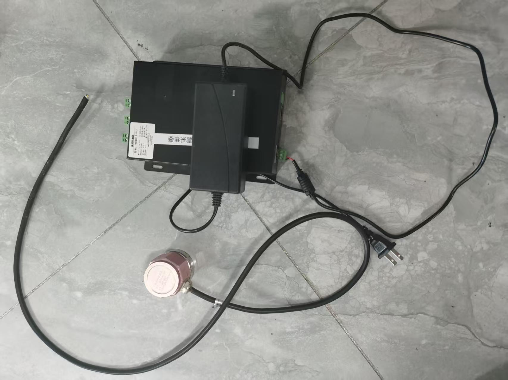

# 震动采集通道读取（Python 版）

 

## 应用场景

**地质灾害现场监测**：边坡、滑坡、危岩体等长期震动采集，PGA 超阈值自动报警并保存前后片段供事后分析
**地震动 / 震动强度评估**：多轴实时峰值与波形，支撑震感判定与监测报表
**多仪多通道接入**：单采集器、多台物理终端或同 IP 多逻辑设备，统一配置与 Web 监控
**离线边缘采集**：弱网 / 无网环境 Windows 便携部署，本地落盘后批量导入 InfluxDB 或经 MQTT 回传中心
**开发联调与演示**：`--dev` 回放历史数据，无硬件即可验证报警、存储与前端

## 原理

通过 JSON 配置连接一台或多台采集器，经 UDP 接收 `TXDZ` 波形帧解析多通道实时数据；主循环按配置频率读取内存缓存，完成 **PGA 分级报警**、**报警前后片段录制**，以及 **本地 Line Protocol / InfluxDB 3 / MQTT** 等多路输出。内置 **FastAPI + WebSocket 前端** 用于实时监控、在线设置与报警回放，并支持 **Windows 离线便携打包**，便于无网环境部署。**通道勾选和命名**在 JSON 中配置，**通道数值**来自 UDP 波形（帧头 `TXDZ`），不是 Modbus 寄存器。

**启动入口**（二者等价）：

```bash
python main.py …          # 推荐：根目录薄入口
python -m vibration …     # 等价：包入口
```

---

## 目录

- [功能概览](#功能概览)
- [环境要求](#环境要求)
- [快速开始](#快速开始)
- [前端 UI](#前端-uiwebsocket)
- [value 与 peak](#value-与-peak)
- [目录结构](#目录结构)
- [系统架构](#系统架构)
- [配置文件](#配置文件)
- [Windows 便携打包](#windows-便携打包项目--环境面向离线目标机)
- [部署场景](#部署场景)
- [命令行参数](#命令行参数)
- [本地数据导入 InfluxDB 3](#本地数据导入-influxdb-3)
- [输出示例](#输出示例)
- [通信协议](#通信协议)
- [与原程序对比](#与原程序对比)
- [常见问题](#常见问题)
- [单位换算](#单位换算)

---

## 功能概览

| 功能         | 说明                                                         |
| ------------ | ------------------------------------------------------------ |
| 多设备采集   | 单采集器 / 多台物理终端 / **同 IP 多逻辑设备**（见[部署场景](#部署场景)） |
| 通道勾选     | `run.json` 的 `lastDisplay` 位掩码，对应物理通道 1–16        |
| 通道命名     | `channelConfig` 配置 X/Y/Z 等别名与单位                      |
| 实时数值     | UDP 波形后台持续接收；`value`=最新采样点，`peak`=本帧 `|a|` 最大值 |
| PGA 报警     | 峰值加速度分级报警，支持持续判定与多轴确认防误报             |
| 报警片段录制 | 报警触发时保存「前 N 秒 + 后 N 秒」本地数据，可设空间上限    |
| 本地时序存储 | Line Protocol (`.lp`) + JSONL，支持目录空间上限自动删旧      |
| InfluxDB 3   | 可选在线写入（`influxdb3-python`）                           |
| MQTT 上传    | 按间隔向 Broker 发布通道峰值（`paho-mqtt`）                  |
| Web 实时监控 | `--ui`：实时数值、分图波形、报警记录、实时日志、设置页       |
| 波形调试     | `--debug-wave` 诊断 UDP 收包与帧解析                         |
| 定时运行     | `--duration 60` 采集指定秒数后自动退出                       |
| 离线便携包   | 开发机 `pack.bat` 一键打包，目标机无网运行                   |

已提供 WebSocket 前端（`vibration/ui/web_server.py` + `static/index.html`），可查看实时波形与已保存报警片段。

**仍未实现**（原 C++ 程序有）：FFT/主频、常规时序历史回放交互。

---

## 环境要求

- Python **3.10+**
- **核心采集**：仅标准库（`socket`、`threading`、`struct`、`json` 等）
- **可选依赖**（见 `requirements.txt`）：
  - Web 前端：`fastapi`、`uvicorn`
  - InfluxDB 3：`influxdb3-python`
  - MQTT：`paho-mqtt`
- 操作系统：Windows / Linux（**离线便携包仅 Windows x64**）
- 网络：PC 需与采集器 IP 互通

```bash
pip install -r requirements.txt
# 或使用 conda（便于便携打包）
# conda env create -f environment.yml
```

---

## 快速开始

```bash
cd python

# 1. 编辑 config.json（采集器 IP、端口、channels）
# 2. 编辑 run.json（通道勾选、报警、storage、alarmCapture、mqtt）
#    或启动 --ui 后在页面「设置」中修改并保存

python main.py --show-config          # 查看完整配置
python main.py                        # 持续采集 + 报警 + 存储
python main.py --ui                   # 同时开 Web（默认隐藏控制台通道值）
python main.py --ui --print           # UI + 控制台打印
python main.py --ui --ui-port 9000    # 指定首选 UI 端口（占用则自动顺延）
python main.py --duration 60          # 采集 1 分钟后退出
python main.py --once                 # 读一轮后退出
python main.py --dev                  # 开发回放 data/*.jsonl（无采集器）
python main.py --dev --ui             # 回放 + 前端
python main.py --disable-alarm        # 临时关报警
python main.py --calibrate-zero       # 静止零点校准（默认 3s）
python main.py --calibrate-zero --calibrate-sec 10
```

本地存储示例（`run.json` 中 `storage.enabled: true`、`mode: local`）：

```bash
python main.py --duration 60
# 退出后生成:
#   data/vibration_YYYYMMDD_HHMMSS.lp     ← 可导入 InfluxDB
#   data/vibration_YYYYMMDD_HHMMSS.jsonl  ← 人工查看 / --dev 回放
```

---

## 前端 UI（WebSocket）

```bash
pip install -r requirements.txt
python main.py --ui
# 浏览器打开 http://127.0.0.1:8765（端口占用时控制台会打印实际地址）
```

### 监控页

- 各设备通道实时表：`value`(g) / `peak`(g) / `peak_ms2`(m/s²)
- **两幅滚动波形**（约 20Hz 推送）：上图 `value`，下图 `peak`
- 按报警等级显示设备当前状态
- 工具栏可开启 **校准前后对比**：实线校准后，虚线校准前
- **报警记录**：浏览 `alarmCapture` 已保存片段，查看 meta 与波形
- **实时日志**：镜像控制台输出（报警、错误等）

### 设置页（右上角「设置」）

通过 `GET/PUT /api/settings` 读写 `config.json` / `run.json`：

| 分区            | 可配置项                                                    |
| --------------- | ----------------------------------------------------------- |
| 地震仪 / 采集器 | 启用、IP、Modbus/波形端口；绑定物理通道；轴名与是否采集     |
| 零点校准        | 自定义采样时长；写入 `offsetG`，**立即生效**                |
| 预警阈值        | 开关、连续确认、多轴确认、各级阈值 (g)                      |
| 数据保存        | 开关、local / influxdb、目录/格式、Influx 连接、空间上限 MB |
| 报警片段        | 开关、目录、前/后秒数、格式、空间上限 MB                    |
| MQTT 上传       | 开关、Broker、认证、间隔、主题模板、各设备 device_name/site |

保存后写入磁盘。**IP、通道、报警阈值、存储、报警录制、MQTT 等需重启采集进程后生效**；零点校准完成后会立刻刷新实时换算。

### 报警记录 API

| 方法     | 路径                     | 说明                                      |
| -------- | ------------------------ | ----------------------------------------- |
| GET      | `/api/alarms`            | 列出已保存片段（含 meta 摘要）            |
| GET      | `/api/alarms/{filename}` | 读取指定 `.jsonl`：meta + value/peak 序列 |
| GET/POST | `/api/calibrate-zero`    | 零点校准状态 / 触发                       |

仅 `.jsonl` 可在页面中查看波形；若只有 `.lp` 则列表可见但不可画图。

---

## value 与 peak

| 字段       | 含义                                                   | 用途                     |
| ---------- | ------------------------------------------------------ | ------------------------ |
| `value`    | 通道缓存中**最新一个采样点**（g）                      | 实时波形、瞬时显示       |
| `peak`     | **当前 UDP 帧**（约 `waveGroup` 点）内 `max(|a|)`（g） | PGA 报警、强度监控、MQTT |
| `peak_ms2` | `peak × 9.81`                                          | 前端展示（可选）         |

说明：

- `peak` **不是**按主循环 256 Hz 计算，而是每收到一帧波形刷新一次
- 主循环 `poll.pollSampleHz`（默认 256）只决定多久读一次缓存并推送/落库
- 报警判定直接使用各轴的 `peak`(g)，与阈值配置比较

---

## 目录结构

```
python/
├── main.py                      # 薄入口（python main.py）
├── pack.bat                     # 开发机一键离线打包
├── config.json                  # 设备连接
├── run.json                     # 运行 / 通道 / 报警 / 存储 / MQTT
├── requirements.txt             # 可选依赖
├── environment.yml              # conda 环境（可选）
├── vibration/                   # 业务包
│   ├── __main__.py              # python -m vibration
│   ├── app.py                   # CLI、主循环、校准、开发回放编排
│   ├── config/                  # 配置加载、通道掩码与命名
│   ├── acquisition/             # Modbus、UDP 波形、终端池、设备会话、dev 回放
│   ├── alarm/                   # PGA 引擎、片段录制、归档列表
│   ├── storage/                 # 本地 / Influx / MQTT / 工厂 / 空间清理
│   └── ui/                      # FastAPI、LiveHub、设置服务、控制台镜像
├── static/index.html            # Web 前端
├── tools/
│   └── import_local_to_influx.py
├── scripts/
│   ├── pack_release.ps1         # 打包实现
│   └── templates/               # install/start 批处理与 DEPLOY.txt
├── test/                        # 独立试验脚本（不参与正式打包）
├── data/                        # 常规时序（运行时生成）
└── data/alarms/                 # 报警片段（开启 alarmCapture 后）
```

配置、`data/`、`static/` 始终相对**项目根目录**（`vibration.config` 中的 `BASE_DIR`），与包内模块位置无关。

---

## 系统架构

```
                    ┌─────────────────────────────────┐
                    │  主线程 (pollSampleHz / 间隔)    │
                    │  读缓存 → 显示 / 报警 / 存储      │
                    │  → WebSocket / 报警录制 / MQTT   │
                    └───────────────┬─────────────────┘
                                    │ 只读内存
              ┌─────────────────────┴─────────────────────┐
              ▼                                           ▼
┌──────────────────────────┐              ┌──────────────────────────┐
│  ModbusWorker 线程        │              │  WaveUdpReceiver 线程     │
│  读寄存器 1-20 / 65-66    │              │  解析 TXDZ → 采样缓存     │
│  写寄存器 90 + 波控 UDP   │              │  本帧维护 peak            │
└────────────┬─────────────┘              └────────────┬─────────────┘
             │ Modbus UDP :8001                           │ 波形 UDP → 本机
             ▼                                          ▼
        ┌────────────────────────────────────────────────────┐
        │                    震动采集器                          │
        └────────────────────────────────────────────────────┘
                              │
                              ▼
                    ┌──────────────────┐
                    │  本地 .lp/.jsonl  │
                    │  报警片段 / Influx │
                    │  MQTT Broker      │
                    └──────────────────┘
```

**开波流程（对齐 C++ `writeRegist(90)`）**：

1. Modbus 上线后优先读取寄存器 1–20（含 reg 18 波控端口）和 65–66（ch/grp）
2. 确认参数后写寄存器 90 = 100（Modbus 端口）
3. **同时**经波形套接字将同一帧发到 `设备IP:reg18`，设备据此回传波形到本机 `wave端口`

本地端口（与 C++ 一致）：

| 类型   | 端口规则                         |
| ------ | -------------------------------- |
| Modbus | `10000 + devIndex×10` 起自动绑定 |
| 波形   | `10005 + devIndex×10` 起自动绑定 |

---

## 配置文件

### config.json — 设备连接

| 字段                   | 说明                           | 示例                     |
| ---------------------- | ------------------------------ | ------------------------ |
| `devArray`             | 设备名称列表                   | `["采集器1", "采集器2"]` |
| `{设备名}.devIP`       | 采集器 IP                      | `192.168.100.97`         |
| `{设备名}.modbusPort`  | Modbus UDP 端口                | `8001`                   |
| `{设备名}.devEnable`   | 是否启用                       | `true`                   |
| `{设备名}.waveChanNum` | 通道数默认值                   | `16`                     |
| `{设备名}.waveGroup`   | 每组点数默认值（应与设备一致） | `28`                     |
| `{设备名}.wavePort`    | reg18 读不到时的波控端口回退   | `9001`                   |
| `{设备名}.channels`    | **归属该地震仪的物理通道列表** | `[1, 2, 3]`              |

同一 IP 多台逻辑设备时，用不同 `channels` 区分（如采集器1=`[1,2,3]`，采集器2=`[6,7,8]`），共享一套 Modbus/波形连接。

### run.json — 轮询参数：`poll`

```json
"poll": {
  "pollSampleHz": 256,
  "pollIntervalMs": 10,
  "modbusIntervalMs": 10,
  "modbusRefreshMs": 50,
  "autoEnableWave": true,
  "waveEnableValue": 100,
  "startupWaitSec": 3.0,
  "printIntervalMs": 1000,
  "waveDebug": false
}
```

| 字段              | 默认  | 说明                                     |
| ----------------- | ----- | ---------------------------------------- |
| `pollSampleHz`    | 256   | 主循环采样频率；优先于 `pollIntervalMs`  |
| `pollIntervalMs`  | 10    | 未配置 Hz 时的主循环间隔（ms）           |
| `printIntervalMs` | 1000  | **控制台打印**间隔（ms），与采集频率独立 |
| `autoEnableWave`  | true  | 自动写寄存器 90 并双通道开波             |
| `startupWaitSec`  | 3.0   | 启动等待就绪最长时间（秒）               |
| `waveDebug`       | false | 波形 UDP 调试输出                        |

### run.json — 时序存储：`storage`

#### 模式 A：本地文件（默认，无需第三方库）

```json
"storage": {
  "enabled": true,
  "mode": "local",
  "localDir": "data",
  "localFile": "",
  "format": "both",
  "measurement": "vibration",
  "intervalMs": 1000,
  "maxSizeMb": 2048
}
```

| 字段         | 说明                                                         |
| ------------ | ------------------------------------------------------------ |
| `mode`       | `"local"` 本地文件                                           |
| `localDir`   | 输出目录（相对项目根）                                       |
| `localFile`  | 固定文件名（不含扩展名）；留空则自动加时间戳                 |
| `format`     | `"both"` / `"line_protocol"` / `"jsonl"`                     |
| `intervalMs` | 写入间隔（ms），默认 1000                                    |
| `maxSizeMb`  | 目录空间上限（MB）；`0` = 不限制。超限后按修改时间删除最旧的 `.lp`/`.jsonl`（正在写入的文件会保护） |

**输出文件**：

- `*.lp` — InfluxDB Line Protocol，可直接导入
- `*.jsonl` — 每行一条 JSON，便于查看与 `--dev` 回放

**记录字段**：

| 类型   | 字段                                                   |
| ------ | ------------------------------------------------------ |
| tags   | `device`, `device_ip`, `channel`, `unit`               |
| fields | `physical_ch`, `value`(g), `peak`(g), `peak_ms2`(m/s²) |

#### 模式 B：InfluxDB 3 在线写入

```json
"storage": {
  "enabled": true,
  "mode": "influxdb",
  "host": "http://127.0.0.1:8181",
  "database": "vibration",
  "token": "你的token",
  "measurement": "vibration",
  "intervalMs": 1000
}
```

安装依赖：`pip install influxdb3-python`

`maxSizeMb` 仅对 **本地文件模式** 生效；Influx 远端空间由数据库侧管理。

**推荐 InfluxDB 服务端版本**：InfluxDB 3 Core **3.9.x**（稳定）或 **3.10.x** 补丁版；Docker 请固定版本标签，避免误跟 `latest`。

### run.json — 报警片段录制：`alarmCapture`

独立于常规 `storage`。开启后，报警触发时把「报警前缓冲 + 报警后一段时间」的采样写入本地：

```json
"alarmCapture": {
  "enabled": true,
  "localDir": "data/alarms",
  "preSec": 5,
  "postSec": 15,
  "maxSizeMb": 1024,
  "format": "jsonl",
  "measurement": "alarm_vibration"
}
```

| 字段          | 说明                                               |
| ------------- | -------------------------------------------------- |
| `enabled`     | 是否启用报警片段录制                               |
| `localDir`    | 输出目录（相对项目根）                             |
| `preSec`      | 报警前保留的秒数（内存环形缓冲）                   |
| `postSec`     | 报警后继续写入的秒数；报警解除后也会录完该窗口     |
| `maxSizeMb`   | 该目录空间上限（MB）；`0` = 不限制，超限删最旧片段 |
| `format`      | `"jsonl"` / `"line_protocol"` / `"both"`           |
| `measurement` | 写入记录中的 measurement 名                        |

输出示例：`data/alarms/alarm_采集器1_一级报警_YYYYMMDD_HHMMSS.jsonl`  
文件首行（jsonl）含 `alarm_meta`（等级、阈值、超阈轴、峰值等）。

### run.json — 峰值报警：`alarm`

```json
"alarm": {
  "enabled": true,
  "levels": [
    {"name": "强震危险报警", "thresholdG": 1.0, "level": 3},
    {"name": "二级报警", "thresholdG": 1.0, "level": 2},
    {"name": "一级报警", "thresholdG": 0.5, "level": 1},
    {"name": "轻微有感预警", "thresholdG": 0.3, "level": 0}
  ],
  "antiFalseAlarm": {
    "continuousCount": 3,
    "holdMs": 50,
    "intervalMs": 4,
    "multiAxisMinCount": 2,
    "multiAxisRequired": true,
    "axisNames": ["X", "Y", "Z"]
  }
}
```

| 字段                  | 说明                                                |
| --------------------- | --------------------------------------------------- |
| `levels[].thresholdG` | 阈值，单位 **g**（与 `peak` 直接比较）              |
| `holdMs`              | 持续超阈达到该毫秒数才确认报警；**>0 时优先**       |
| `continuousCount`     | 连续 N 次超阈才确认（仅当 `holdMs` 为 0）           |
| `multiAxisRequired`   | 是否要求多轴同时超阈                                |
| `multiAxisMinCount`   | 至少几轴超阈                                        |
| `axisNames`           | 参与判定的轴名（需与 `channelConfig` 中 name 一致） |

命令行临时覆盖：`--enable-alarm` / `--disable-alarm`

### run.json — MQTT 上传：`mqtt`

按间隔向 MQTT Broker 发布各设备通道峰值（优先 `peak`，否则 `value`）。需安装 `paho-mqtt`。

```json
"mqtt": {
  "enabled": true,
  "host": "192.168.100.41",
  "port": 1883,
  "username": "",
  "password": "",
  "client_id": "wave_data_publisher",
  "keepalive": 60,
  "intervalSec": 60,
  "topic_prefix": "Device",
  "topic_format": "{topic_prefix}/{site}/DZ/{device_name}",
  "devices": {
    "采集器1": { "device_name": "001", "site": "Site012A" },
    "采集器2": { "device_name": "002", "site": "Site012A" }
  }
}
```

| 字段                    | 说明                                                         |
| ----------------------- | ------------------------------------------------------------ |
| `enabled`               | 是否启用                                                     |
| `host` / `port`         | Broker 地址                                                  |
| `username` / `password` | 可选认证                                                     |
| `client_id`             | MQTT 客户端 ID（多实例请保持唯一，否则会互踢）               |
| `intervalSec`           | 发布间隔（秒），最小 1                                       |
| `topic_format`          | 主题模板，可用 `{topic_prefix}` `{site}` `{device_name}`     |
| `devices`               | 键为 `config.json` 中的采集器名；值为 MQTT 侧 `device_name` / `site` |

`device_id` 形如 `{site}_DZ_{device_name}`。也可在设置页「MQTT 上传」中配置；**保存后需重启采集进程**。

### run.json — 通道：`channelConfig`

```json
"channelConfig": {
  "采集器1": {
    "lastDisplay": 7,
    "1": {"name": "X", "unit": "g", "offsetG": 0},
    "2": {"name": "Y", "unit": "g", "offsetG": 0},
    "3": {"name": "Z", "unit": "g", "offsetG": 0}
  }
}
```

- `lastDisplay`：位掩码，**bit(i) 对应物理通道 i+1**（与 acc_wave 一致）。例：`7` = 通道 1+2+3；`224` = 通道 6+7+8
- 通道键可用物理通道号（推荐）或逻辑 slot
- `offsetG`：静止零点（`mean(|a|)`），运行时正减负加做幅度门限

### run.json — 开发回放：`dev`

```json
"dev": {
  "dataDir": "data",
  "dataFile": "",
  "loop": true
}
```

| 字段       | 说明                                            |
| ---------- | ----------------------------------------------- |
| `dataDir`  | jsonl 目录，默认 `data`                         |
| `dataFile` | 指定文件；留空则自动选最新 `*.jsonl`            |
| `loop`     | 保留字段；开发模式默认始终循环（`--once` 除外） |

开发模式**不写入**常规本地/Influx 存储，仅控制台、报警逻辑、前端推送与 MQTT（若开启）；播完 jsonl 后自动从头循环，直到 Ctrl+C 或 `--duration` 超时。

---

## Windows 便携打包（项目 + 环境，面向离线目标机）

将程序与精简 conda 运行环境打成可拷贝的发布包。**目标机完全离线即可运行**，无需预装 Python / Conda，也无需 `pip install`。

### 一键打包（仅开发机需要联网）

**首次准备**（只需做一次）：

```bash
conda create -n eq-runtime python=3.10 pip -y
conda run -n eq-runtime python -m pip install -r requirements.txt
conda run -n eq-runtime python -m pip freeze > requirements-lock.txt
conda install -n base -c conda-forge conda-pack -y
```

**日常打包**：在项目根目录双击 **`pack.bat`**，或：

```bash
pack.bat
# 等价于
powershell -ExecutionPolicy Bypass -File scripts\pack_release.ps1
```

产物：

| 路径                                        | 说明                 |
| ------------------------------------------- | -------------------- |
| `dist/vibration-python-win64/`              | 可直接拷贝的发布目录 |
| `dist/vibration-python-win64-offline-*.zip` | U 盘分发用压缩包     |

发布目录结构：

```
vibration-python-win64/
├── install.bat
├── start.bat / start-ui.bat
├── DEPLOY.txt
├── eq-runtime-env.zip      # 自带 Python 环境
└── app/
    ├── main.py
    ├── vibration/          # 业务包
    ├── tools/
    ├── static/
    ├── config.json
    ├── run.json
    └── data/ / data/alarms/
```

> 若已存在 `dist/eq-runtime-env.zip`，脚本会**复用**该环境包以加快打包；改依赖后请删除该 zip 再打包。

### 离线目标机部署

1. 用 U 盘 / 内网把 zip 或整个文件夹拷到目标机（建议短路径，如 `D:\vibration-python-win64`）
2. 双击 **`install.bat`**（本地解压 `eq-runtime-env.zip` + `conda-unpack`，**不访问网络**）
3. 编辑 `app/config.json`、`app/run.json`
4. 双击 `start-ui.bat`，浏览器打开 http://127.0.0.1:8765

若以后**整体移动**了文件夹，删除 `env\.offline_ready` 后再运行一次 `install.bat`。

约束：仅适用于 **Windows x64**（Win10 / Server 2016+ 自带 `tar` 即可离线解压）。

---

## 部署场景

### 场景 A：单采集器

`config.json` 可不写 `channels`（默认 1–16），`run.json` 中 `lastDisplay: 7` 勾选通道 1、2、3。

### 场景 B：同 IP 多逻辑设备（多台地震仪）

相同 `devIP`，不同 `channels`（如 `[1,2,3]` 与 `[6,7,8]`），程序共享一套 Modbus/波形连接。

每台逻辑设备用各自的 `channelConfig.<设备名>.lastDisplay` 勾选要采集的物理通道。前端设置页也可勾选「绑定物理通道」来维护 `channels`。

---

## 命令行参数

| 参数                  | 说明                                                         |
| --------------------- | ------------------------------------------------------------ |
| （无）                | 持续运行                                                     |
| `--ui`                | 启动 Web 前端（默认 8765，占用则自动换端口）；默认隐藏控制台通道数值 |
| `--ui-port PORT`      | Web UI 首选端口                                              |
| `--print`             | 即使开启 `--ui` 也打印通道数值                               |
| `--once`              | 读取一轮后退出                                               |
| `--show-config`       | 显示通道、轮询、报警、存储、报警录制、MQTT 配置              |
| `--duration SEC`      | 运行指定秒数后退出                                           |
| `--dev [FILE]`        | 开发模式：回放 `data/*.jsonl`，无需 Modbus/UDP               |
| `--debug-wave`        | 波形 UDP 调试（或 `poll.waveDebug: true`）                   |
| `--enable-alarm`      | 临时开启报警                                                 |
| `--disable-alarm`     | 临时关闭报警                                                 |
| `--calibrate-zero`    | 静止采样，写入各通道 `offsetG`                               |
| `--calibrate-sec SEC` | 零点校准采样时长（默认 3，范围 0.5–120）                     |

---

## 本地数据导入 InfluxDB 3

部署好 InfluxDB 3 后：

```bash
pip install influxdb3-python

python tools/import_local_to_influx.py data/vibration_20260709_174500.lp \
  --host http://127.0.0.1:8181 \
  --database vibration \
  --token 你的token
```

`.lp` 为原生 Line Protocol，无需格式转换。

**SQL 查询示例**：

```sql
SELECT time, device, channel, value, peak, peak_ms2
FROM vibration
WHERE device = '采集器1'
  AND time > now() - interval '1 hour'
ORDER BY time DESC
LIMIT 100
```

---

## 输出示例

```
[震动采集配置系统] 通道读取与报警启动 (后台线程模式)
轮询: 256Hz (~3.91ms) | Modbus: 10ms / 刷新50ms | 打印: 1000ms
报警: 开启 | 连续3次 / 4ms, 多轴>=2 (X, Y, Z)
本地存储: 开启 | data/vibration_....lp, ...jsonl | 上限2048MB
报警录制: 开启 | data/alarms 前5s/后15s | 上限1024MB
MQTT 上传: 开启 | 192.168.100.41:1883 每60s | client_id=... | 目标数=2
前端 UI 已启动: http://127.0.0.1:8765
定时运行: 60s 后自动退出 (--duration)

等待设备就绪 (最多 3.0s)...
  采集器1: 就绪(有波形) modbus=在线 物理通道=[1, 2, 3]

[2026-07-09 17:41:56.255]
  采集器1 (192.168.100.97)  X=0.000092g(峰值:0.000214g/0.002m/s2)  Y=...  Z=...  [modbus:在线 pkts:1204]

已保存报警片段 N 条记录 -> .../data/alarms
已保存 360 条时序记录
  .../python/data/vibration_....lp
  .../python/data/vibration_....jsonl
```

说明：

- **采集/报警**：主循环频率（默认约 256 Hz）
- **控制台打印**：约每 `printIntervalMs`（默认 1 秒）一行
- **时序写入**：约每 `storage.intervalMs`（默认 1 秒）一批
- **MQTT**：约每 `mqtt.intervalSec`（默认 60 秒）一批
- `pkts` 为 UDP 波形包累计数，应持续增长

---

## 通信协议

### Modbus UDP

- Modbus TCP MBAP 帧 over UDP（非 TCP 502）
- 关键寄存器：

| 寄存器 | 用途                                  |
| ------ | ------------------------------------- |
| 18     | 设备波控 UDP 端口（开波二次发送目标） |
| 65     | 波形通道数                            |
| 66     | 每组采样点数                          |
| 90     | 波形开关（写 100 = 开启）             |

### UDP 波形

- 帧头：`TXDZ`
- 每点 3 字节有符号数，先 `g0 = 原始值 / calibration.scaleDivisor × gain`，再按 `offsetG=mean(|a|)` 做幅度门限：正减负加，`|g0|<=offsetG` 归零
- 静止时运行 `python main.py --calibrate-zero` 或设置页校准写零点
- 帧长：`8 + ch × grp × 3`；若 Modbus 尚未读到 grp，会尝试从包长自动推断

---

## 与原程序对比

| 功能           | acc_wave.exe      | Python 版                            |
| -------------- | ----------------- | ------------------------------------ |
| 设备配置       | config.json       | config.json + Web 设置页             |
| 通道勾选       | UI → lastDisplay  | run.json / Web 设置页                |
| 开波方式       | Modbus + 波控 UDP | **已对齐**                           |
| 数据刷新       | 10ms              | `pollSampleHz`（默认 256 Hz）        |
| PGA 分级报警   | 无                | **有**                               |
| 报警片段录制   | 无                | **有**                               |
| 时序存储       | 无                | **本地 .lp / InfluxDB 3** + 空间上限 |
| MQTT 上传      | 无                | **有**                               |
| 波形绘图 / FFT | 有                | 实时波形有；FFT 无                   |

---

## 常见问题

### 有 Modbus 但 pkts 为 0 / X=--

1. 确认 **acc_wave.exe 未同时占用** 10000/10005 端口或抢波形
2. 运行 `python main.py --debug-wave` 查看 `原始UDP`、`设备波控端口`
3. 确认 `autoEnableWave: true`，防火墙放行本机 UDP 入站

### 控制台几秒才打印一行？

- 打印由 `printIntervalMs` 控制（默认 1000ms），与主循环采集无关
- 修改 `run.json` → `poll.printIntervalMs` 调整打印频率

### 与其他程序同时读 Modbus？

- **只读** Modbus：影响较小
- **同时开波形 / 占端口**：会抢数据，建议同一时刻只运行一个波形接收程序

### waveGroup 与设备不一致导致丢包？

- 将 `config.json` 中 `waveGroup` 设为设备实际值（如 `28`）
- 程序会从 Modbus reg 66 读取，并在包长不匹配时自动推断 grp

### 如何切换存储模式 / 限制磁盘占用？

| 需求          | 配置                                |
| ------------- | ----------------------------------- |
| 本地文件      | `"mode": "local"`                   |
| InfluxDB 在线 | `"mode": "influxdb"` + 配置 `token` |
| 关闭存储      | `"enabled": false`                  |
| 本地空间上限  | `"maxSizeMb": 2048`（`0` = 不限制） |

### 如何只保存报警时段数据？

1. 常规 `storage.enabled` 可按需关闭
2. 设置 `alarmCapture.enabled: true`，并配置 `preSec` / `postSec` / `maxSizeMb`
3. 或在 Web「设置 → 报警片段本地保存」中开启

### MQTT 连不上 / 经常断线？

1. 确认已 `pip install paho-mqtt`（便携包环境应已含）
2. 检查 `host`/`port`/账号密码；看启动日志中的 `MQTT 上传` 行
3. **多实例不要共用同一 `client_id`**，否则会被 Broker 互踢
4. 修改 MQTT 配置后需重启 `python main.py`

### 设置页改完不生效？

配置已写入 JSON，但采集进程在启动时加载；**请重启** `python main.py --ui`（或对应命令）。零点校准除外，完成后立即生效。

### 无采集器时如何调试？

```bash
python main.py --dev              # 循环回放 data/ 最新 jsonl，不写常规存储
python main.py --dev --ui         # 回放 + 前端
python main.py --dev --once       # 只看第一帧
python main.py --dev --duration 60
```

开发模式不连接 Modbus/UDP，数据来自先前采集保存的 jsonl；报警逻辑与正式运行一致。

### 打包失败：找不到 conda / eq-runtime？

1. 在 **Anaconda Prompt** 中运行，或确保 `conda` 在 PATH 中
2. 确认已创建 `eq-runtime` 并安装 `requirements.txt`
3. base 环境需已安装 `conda-pack`
4. 改完依赖后删除 `dist/eq-runtime-env.zip` 再重新 `pack.bat`

---

## 单位换算

| 单位     | 换算      |
| -------- | --------- |
| g → m/s² | × 9.81    |
| 0.5 m/s² | ≈ 0.051 g |
| 1.0 m/s² | ≈ 0.102 g |